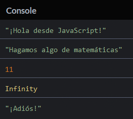

# 3, 2, 1... ¡Arranca!

¡Comencemos! Este capítulo te introducirá a los fundamentos de la programación incluyendo valores, tipos de valores y la estructura de un programa.

## TL;DR

* El comando `console.log()` de JavaScript muestra un mensaje en la **consola**, una zona de información disponible en la mayoría de entornos JavaScript.

* Un **valor** es una pieza de información. El **tipo** de un valor define su rol y las operaciones aplicables al mismo.

* El lenguaje JavaScript usa el tipo **numérico** para representar un valor numérico (con o sin decimales) y el tipo **cadena** para representar texto.

* Un valor de tipo cadena se encierra por un par de comillas simples (`'...'`) o un par de comillas dobles (`"..."`).

* Las operaciones aritméticas entre numéros están a cargo de los operadores  `+`, `-`, `*` y `/`. Aplicados a dos cadenas, el operador + las une. Está operación se denomina **concatenación**.

* Un programa de computadora está hecho de varias **líneas de código** leído secuencialmente durante la ejecución.

* Los **comentarios** (`// ...` o` /* ... */`) son partes no ejecutables del código. Conforman una documentación útil del programa.

## Tu primer programa

Aquí está nuestro primer programa JavaScript.

```js
console.log("¡Hola desde JavaScript!");
```

Este programa muestra el texto `"¡Hola desde JavaScript!"` en la **consola**, una zona que muestra información  en forma de texto disponible en la mayoría de entornos JavaScript, como los navegadores.

Para lograr esto, usa un comando JavaScript llamado `console.log()`, cuyo rol es mostrar información. El texto a mostrar se coloca entre paréntesis seguido por un punto y coma, lo que marca el final de la línea.

Mostrar un texto en la pantalla (el famoso [Hola mundo](https://es.m.wikipedia.org/wiki/Hola_mundo) que todos los programadores conocen) a menudo es la primera cosa que harás cuando aprendes un lenguaje de programación nuevo. Es el ejemplo clásico. ¡Ya has dado ese primer paso!

## Valores y tipos de valores

Un **valor** es información usada en un programa de computación. Los valores existen en diferentes formas llamados tipos. El **tipo** de un valor determina su rol y operaciones disponibles para si mismo.

Cada lenguaje de cómputo tiene sus propios valores y tipos de valores. Veamos dos tipos de valores disponibles en JavaScript.

### Número

Un **número** es un valor numérico (gracias Capitan Obvio). ¡Pero vayamos las allá de eso! Como en matemáticas, puedes usar números enteros tales como 0, 1, 2, 3, etc, o números con décimales para una mayor exactitud.

Los números son usados principalmente para contar. Las principales operaciones que verás estén resumidas en la siguiente tabla. Todas ellas producen un resultado numérico.

|Operador|Rol|
|---------|----|
|`+`|Suma|
|`-`|Resta|
|`*`|Multiplicación|
|`/`|División|

### Cadena

Una **cadena** en JavaScript es texto rodeado por comillas, como `"Esto es una cadena"`

También puedes establecer cadenas con un par de comillas simples: `'Está es otra cadena'`. La práctica más idónea sobre las comillas simples o dobles es una cuestión totalmente política. Usa cualquiera que gustes, ¡pero no mezcles ambas en el mismo programa!


W> Recuerda siempre cerrar una cadena con el mismo tipo de comillas con las que la iniciaste.

Para incluir carácteres especiales en una cadena, usa el carácter `\` (*diagonal invertida*) antes del carácter. Por ejemplo, escribe `\n` para añadir una nueva línea dentro de una cadena:
`"Esto es\nuna cadena multilinea"`.

No puedes sumar o restar valores de tipo cadena como lo harías con números. Sin embargo, el operador `+` tiene un significado especial cuando se aplica a dos valores de tipo cadena. Unirá las dos cadenas y esta operación es denominada **concatenación**. Por ejemplo, `"Ho" + "la"` produce el resultado `"Hola"`.

## Estructura de un programa

Ya definimos un programa de computación como una lista de comandos diciéndole a la computadora qué hacer. estas órdenes son escritas como archivos de texto y conforman lo que se llama el "código fuente" de un programa. Las líneas de texto en un archivo de código fuente son llamadas **líneas de código**.

El código fuente podría incluir líneas vacías: estás serán ignoradas cuando el programa se ejecute.

### Declaraciones

cada instrucción dentro de un programa es llamada una **declaración**. Una declaración en javascript generalmente termina con un **punto y coma** (aunque no es estrictamente obligatorio). Tu programa estará conformado de varias de estas declaraciones.

I> Generalmente sólo escribes una declaración por línea.

### Flujo de ejecución

Cuando un programa es ejecutado, las declaraciones dentro de él son "leídas" una después de otra. Es la combinación de estos resultados individuales lo que produce el resultado final de un programa.

Aquí está un ejemplo de un programa javascript que incluye varias declaraciones, seguidas del resultado de su ejecución.

```js
console.log("¡Hola desde JavaScript!");
console.log("Hagamos algo de matemáticas");
console.log(4 + 7);
console.log(12 / 0);
console.log("¡Adiós!");
```



Dependiendo de tu entorno de desarrollo, el resultado de ejecución podría no incluir comillas alrededor del texto.


I> como era de esperar, una división entre cero  l (`12/0`) resulta en un valor `Infinito`.

### Comentarios

De forma predeterminada, cada línea de texto en los archivos fuente de un programa es considerada una declaración que debe ser ejecutada. Puedes evitar que ciertas líneas se ejecuten colocando dos diagonales al inicio: `//`. Esto convierte al código en un **comentario**.

```js
console.log("¡Hola desde JavaScript!");
//console.log("Hagamos algo de matemáticas");
console.log(4 + 7);
//console.log(12 / 0);
console.log("¡Adiós!");
```

Durante la ejecución, las líneas puestas como comentarios ya no producen resultados.  Como esperábamos, no fueron ejecutadas. 


Los comentarios son excelentes para los desarrolladores, así que puedes escribir comentarios para ti mismo, explicaciones sobre tu código y más, sin que la computadora ejecute nada de eso. 

También puedes escribir comentarios  tecleando `/*  */` alrrededor del código que quieres poner como comentario.

```js
/* Un comentario 
escrito en 
varias líneas 
*/

// Un comentario de una línea 
```
Los comentarios son una gran fuente de información acerca del propósito o estructura de un programa. Agregar comentarios a secciones complicadas o críticas es un buen hábito que ¡deberías desarrollar ahora mismo! 

## ¡Hora de programar! 

Pongamos tus habilidades de programación recién adquiridas en práctica.

### Presentación 

Escribe un programa que muestra tu nombre y edad. Aquí está el resultado del mío. 


### Calculadora minimalista

Escribe un programa que muestra los resultados de sumar, restar, multiplicar y dividir 6 entre 3.

### Predicción de valores 

Observa el siguiente programa e intenta predecir los valores que muestra. 

```js
console.log(4 + 5);
console.log("4 + 5");
console.log("4" + "5");
```

Revisa tu predicción ejecutandolo. 
