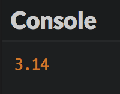
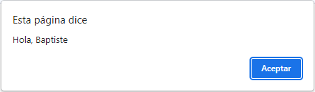

# Juega con variables

Sabes como usar JavaScript para mostrar valores. Sin embargo, para que un programa sea realmente útil, debe ser capaz de almacenar datos, como información introducida por un usuario. Vamos a comprobarlo.

## TL;DR

* Una *variable* es un área de almacenamiento de información. Cada variable tiene un *nombre, un **valor* y un*tipo. En JavaScript el tipo de variable es deducido del valor almacenado en el mismo: JavaScript es un lenguaje de **clasificación dinámica*.

* Una variable se declara usando la palabra clave `let` seguida del nombre de la variable. Para declarar una *constante* (una variable cuyo valor inicial nunca cambiará), es mejor usar la palabra clave `const`.

* Para darle un valor a una variable, usamos el *operador de asignación* `=`. Para variables numéricas, el operador `+=` puede aumentar un valor y el operador `++` puede *incrementarlo*. 

* El *alcance* de una variable es la parte del programa donde la variable es visible. Las variables declaradas con `let` or `const` son de *alcance limitado. Un **bloque de código* es una porción de un programa delimitada por un par de llaves, una de apertura y una de cierre `{ ... }`.

* Una *expresión* es un fragmento de código que combina variables, valores y operadores. Evaluar una expresión produce un valor, el cual pertenece a una categoría.

* Las expresiones pueden incluirse en cadenas de caracteres delimitadas por un par de comillas invertidas (\`). Dicha cadena es denominada *plantilla literal*.

* *Cambio de tipo de variable* podría suceder de forma implícita durante la evaluación de una expresión, o explícitamente cuando se usan los comandos `Number()` y `String()`, para obtener un número o carácter respectivamente.

* Los comandos `prompt()` y `alert()` se ocupan de la entrada y visualización de información mediante cuadros de diálogo.

* El nombrado de las variables es escencial para la claridad de un programa. Seguir una convención para el nombrado como [camelCase](https://en.wikipedia.org/wiki/Camel_case) es una buena práctica.

## Variables

### Rol de una variable

Un programa de computadora alacena datos usando variables. Una *variable* es un área de almacenamiento de información. ¡Podemos imaginarlo como una caja en la cual puedes poner y almacenar cosas!

### Propiedades de una variable

Una variable tiene tres propiedades principales:

* Su *nombre* que lo identifica. El nombre de una variable puede contener letras mayúsculas y minúsculas, números (no en la primera posición) y caracteres como signo de dólares (`$`) o un guión bajo (`_`).
* Su *valor*, which is the data stored in the variable.
* Su *tipo*, que determina el rol y acciones disponibles para la variable.

I> No tienes que definir un tipo de variable explícitamente en JavaScript. Su tipo es deducido del valor almacenado en la variable y podría cambiar mientras el problema se ejecuta. Es por eso que decimos que JavaScript es un lenguaje de *clasificación dinámica. Otros lenguajes, como C o Java, requieren que los tipos de variables siempre sean definidos. Esto se denomina **clasificación estática*.

### Declarar una variable

Antes de que puedas almacenar información en una variable, ¡tienes que crearla! A esto se le llama declarar una variable. *Declarar* una variable significa que la computadora reserva memoria en la cual almacenar la variable. Luego entonces el programa puede leer o escribir datos en esta área de memoria al manipular la variable.

Aquí hay un código de ejemplo que declara una variable y muestra sus contenidos:

```js
let a;
console.log(a);
```

En JavaScript, declaras una variable con la palabra clave `let` seguido del nombre de la variable. En este ejemplo, la variable creada se llama `a`.

I> Previamente, las variables JavaScript eran declaradas usando la palabra clave `var`. Aún es posible, pero en la mayoría de los casos es más simple usar `let` y `const` en su lugar.

He aquí el resultado de ejecución para este programa.


Observa que el resultado es `undefined`. Este es un tipo especial de valor en JavaScript indicando que no hay valor. Declaré la variable, llamándola `a`, ¡pero no le dí un valor!

### Asignar valores a variables

Mientras un programa se esta ejecutando el valor almacenado en una variable puede cambiar. Para darle un nuevo valor a una variable, usa el operador `=` llamado *operador de asignación*.

Checa el siguiente ejemplo:

```js
let a;
console.log(a);
```



Modificamos la variable asignándole un valor. `a = 3.14` se lee como " a recibe el valor 3.14".

E> ¡Ten cuidado de no confundir al operador de asignación con igualdad matemática! Pronto verás cómo expresar igualdad en JavaScript.

También puedes combinar declarar una variable y asignarle un valor en una línea. Solo recuerda que, dentro de este línea, estás haciendo dos cosas diferentes a la vez:

```js
let a = 3.14;
console.log(a);
```

### Declarar una variable constante

Sí el valor inicial de una variable no cambiará jamás durante la ejecución del resto del programa, está variable es llamada una *constante*. Esta constancia puede ser aplicada usando la palabra clave `const` en lugar de `let` para declararla. Así, el programa es más expresivo y posteriores intentos para modificar la variable pueden ser detectados como errores.

```js
const a = 3.14; // El valor de a no puede ser modificado
a = 6.28;       // ¡Imposible!
```


### Incrementar una variable numérica

También puedes aumentar el valor de un número con `+=` y `++`. Esté último es llamado *operador de incremento*, dado que permite el incremento (un incremento de 1) del valor de una variable.

En el siguiente ejemplo, cada una de las líneas 2 y 3 incrementan el valor de la variable b en 1.

```js
let b = 0;      // b contiene 0
b += 1;         // b contiene 1
b++;            // b contiene 2
console.log(b); // Muestra 2
```

### Alcance de una variable

El *alcance* de una variable es la parte del programa donde la variable es visible y usable. Las variables declaradas con `let` o `const` son de *alcance limitado: su visibilidad es limitada al bloque donde son declaradas (y en cada sub-bloque, si los hubiere). En JavaScript y varios otros lenguajes de programación, un **bloque de codigo* es una porción de un programa delimitada por una de llave de apertura y otra de cierre. Por defecto, un programa JavaScript forma un bloque de codigo.  


```js
let num1 = 0;
{
  num1 = 1; // OK : num1 es declarado en el bloque principal
  const num2 = 0;
}
console.log(num1); // OK : num1 es declarado en el bloque actual

is declared in the current block
console.log(num2); // Error! num2 no es visible aqui
```

## Expresiones

Una *expresión* es un fragmento de codigo que produce un valor. Una expresión es creada combinando variables, valores y operadores. Cada expresión tiene un valor y por lo tanto un tipo de valor. El calcular el valor de una expresión se denomina *evaluacion*. Durante la evaluación, las variables son reemplazadas por sus valores.

```js
// 3 es una expresíón cuyo valor es 3 
const c = 3;
// c es una expresión cuyo valor es el valor de c (3 aquí) 
let d = c;
// (d + 1) es una expresión cuyo valor es el de d + 1 (4 aquí)
d = d + 1; // d ahora contiene el valor 4
console.log(d); // muestra 4
```

La prioridad de operadores dentro de una expresión es la misma que en las matematicas. Sin embargo, una expresión puede incluir *parentesis* que modifiquen estas prioridades.

```js
let e = 3 + 2 * 4; // e contains 11 (3 + 8)
e = (3 + 2) * 4;   // e contains 20 (5 * 4)
```

Es posible incluir expresiones en una cadena usando *comillas invertidas* (\`) para delimitar la cadena de caractereres. A dicha cadena se le llama *patrón literal*. Dentro de un patrón literal, las expresiones se identifican con la sintaxis `${expresión}`.

Esto es usado frecuentemente para crear cadenas de caracteres que contienen valores de algunas variables. 

```js
const pais = "Francia";
console.log(`Vivo en ${country}`); // Muestra "Vivo en Frnacia"
const x = 3;
const y = 7;
console.log(`${x} + ${y} = ${x + y}`); // Muestra "3 + 7 = 10"
```

## Conversiones de tipo de valor

La evaluación de una expresión puede resultar en conversiones de tipo de valor. Estas son llamadas conversiones *implicitas* dado que ocurren automaticamente sin la intervención del programador. Por ejemplo, usar el operador `+` entre un caracter (o cadena de caracteres) y un numero provoca la concatenación de los dos valores en una cadena de caracteres como resultado.

```js
const f = 100;
// Mostrar "La variable f contiene el valor 100"
console.log("La variable f contiene el valor " + f);
```

JavaScript es extremadamente tolerante en terminos de conversiones de tipo de valor. Aun así, en ocasiones la conversión no es posible. Si un valor no se puede convertir en un numero, obtendras el resultado `NaN` (No es un número o Not a Number en inglés).

```js
const g = "cinco" * 2;
console.log(g); // Muestra NaN
```

A veces querras convertir un valor en otro tipo. Esto se llama conversión *explicita*. JavaScript tiene los comandos `Number()` y `String()` que convierten el valor entre parentesis a un numero o a caracteres.

```js
const h = "5";
console.log(h + 1); // Concatenación: muestra los caracteres  "51"
const i = Number("5");
console.log(i + 1); // Suma numerica: muestra el numero 6
```

## Interacciones del usuario

### Insertar información

Una vez que comienzas a usar variables, puedes escribir programas que intercambien información con el usuario.

```js
const nombre = prompt("Introduce tu nombre:");
alert(`Hola, ${nombre}`);
```

Durante la ejecución, una ventana de dialogo emerge, preguntando tu nombre.


Este es el resultado del comando JavaScript `prompt("Introduce tu nombre:")`.

Teclea tu nombre y da click en *OK*. Entonces recibiras un saludo personalizado.



El valor que ingresaste en la primera ventana de dialogo se ha almacenado en una cadena de caracteres en la variable `name`. Despues el comando JavaScript `alert()` desencadenó el despliegue de la segunda ventana, con el resultado de la concatenación de la cadena de caracteres `"Hola, "` con el valor de la variable `nombre`.

### Presentar información

Tanto `console.log()` (visto en el capitulo previo) y `alert()` pueden ser usados para mostrar información al usuario. A diferencia de `alert()`, `console.log()` no detiene la ejecución del programa y a menudo es una mejor opción.

`console.log()` tambien puede mostrar valores a la misma vez, separados por una coma.

```js
const temp1 = 36.9;
const temp2 = 37.6;
const temp3 = 37.1;
console.log(temp1, temp2, temp3); // Muestra "36.9 37.6 37.1"
```

### Insertar un numero

Independientemente de los datos ingresados, el comando `prompt()` siempre devuelve un valor tipo caracter o cadena de caracteres. Si este valor se utilizara en expresiones numericas, debe ser convertido a un numero con el comando `Number()`.

```js
const dato = prompt("Ingresa un numero:"); // el tipo de valor de dato es caracter o cadena de caracteres 
const nm = Number(dato); // el tipo de valor de nm es número
```

Ambas operaciones pueden combinarse en una linea para ontener el mismo resultado.

```js
const nm = Number(prompt("Ingresa un numero:")); // el tipo de valor de nm es número
```

En este ejemplo, la información introducida por el usuario es directamente convertida a un valor numerico por el comando `Number()` y almacenado en la variable `nm`.

## Nombrar variables

Para cerrar este capitulo, examinemos el nombramiento de variables. A la computadora no le importan los nombres de las variables. Puedes nombrar tus variables usando el clasico ejemplo de una sola letra (`a`, `b`, `c`...) o escoger nombres absurdos como `burrito` o `gatitospequeños90210`.

No obstante, nombrar bien las variables puede hacer a tu codigo mucho mas facil de leer. Revisa estos dos ejemplos:

```js
const a = 5.5;
const b = 3.14;
const c = 2 * a * b;
console.log(c);
```

```js
const radio = 5.5;
const pi = 3.14;
const perimetro = 2 * pi * radio;
console.log(perimetro);
```

Funcionan de la misma forma, pero la segunda versión es mucho mas facil de entender.

Nombrar cosas es una parte importante del trabajo de un programador. Consulta el apendice para algunos consejos utiles.

## ¡Hora de programar!

Desarrolla el habito de elegir nombres de variables adecuados en todos los ejercicios, comenzando con estos.

### Hola mejorado

Escribe un programa que le pregunte al usuario su nombre y apellido. Despues el programa los muestra en una sola linea.

### Valores finales

Observa el siguiente programa e intenta predecir los valores finales de sus variables.

```js
let a = 2;
a -= 1;
a++;
let b = 8;
b += 2;
const c = a + b * b;
const d = a * b + b;
const e = a * (b + b);
const f = a * b / a;
const g = b / a * a;
console.log(a, b, c, d, e, f, g);
```

Revisa tu predicción ejecutandolo.

### Calculo de IVA

Escribe un programa que le pide al usuario un precio neto. Despues de eso, calcula el precio final correspondiente usando una tasa del IVA del 20.6%.

### De grados Celsius a Fahrenheit 

Escribe un programa que pida una temperatura en grados Celsius, despues la muestra en grados Fahrenheit.

> La conversión entre escals es dada por la formula: [°F] = [°C] x 9/5 + 32.

### Intercambio de variables

Observa el siguiente programa.

```js
let numero1 = 5;
let numero2 = 3;

// POR HACER: escribe tu codigo aqui (¡y en ninguna otra parte!)

console.log(numero1); // Debe mostrar 3
console.log(numero2); // Debe mostrar 5
```

Añade el codigo necesario para intercambiar los valores de las variables `numero1` y `numero2`.

T> Este ejercicio tiene varias soluciones validas. Puedes utilizar mas de dos variables para resolverlo.
