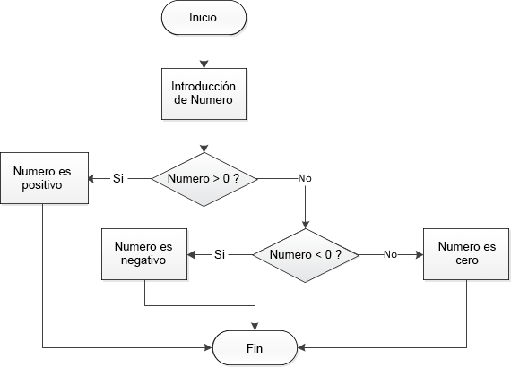

# Agrega condiciones

Hasta ahora, todo el código en nuestros programas se ha ejecutado cronológicamente. ¡Enriquezcamos nuestro código añadiendo ejecución condicional!

## TL;DR

* La palabra clave `if` define una **declaración condicional**, también llamada **prueba**. El bloque de código asociado solo se ejecuta si la **condición** es satisfecha (si su valor es `verdadero`). Por lo tanto, una condición es una expresión cuya evaluación siempre produce un resultado booleano (`verdadero` o `falso`).

```js
if (condición) {
  // Código a ejecutar cuando la condición sea verdadera
}
```

* El bloque de código asociado a un `if` es delimitado por una llave de apertura y una de cierre. Para mejorar la visibilidad, sus declaraciones son generalmente **indentadas** (desplazadas a la derecha).

* Los **operadores de comparación** `===`, `!==`, `<`, `<=`, `>` y `>=` son usados para comparar números dentro de una condición. Todos devuelven un resultado booleano.

* Una declaración `else` puede ser asociada a un `if` para expresar una **alternativa**. Dependiendo del valor de la condición, se ejecutará ya sea el bloque de código asociado al `if` o el asociado al `else`, pero nunca ambos. No hay límites para la profundidad del anidado de condiciones.

```js
if (condición) {
  // Código a ejecutar cuando la condición sea verdadera
}
else {
  // Código a ejecutar cuando la condición sea falsa
}
```

* Pueden crearse condiciones complejas usando los **operadores lógicos** `&&` ("y"), `||` ("o") y `!` ("no").

* La declaración `switch` es usada para iniciar la ejecución de un bloque de código entre varios, dependiendo del valor de una expresión.

```js
switch (expresión) {
case valor1:
  // Código a ejecutar cuando la expresión coincida con el valor1
  break;
case valor2:
  // Código a ejecutar cuando la expresión coincida con el valor2
  break;
...
default:
  // Código a ejecutar cuando ningún caso coincide
}
```

## ¿Qué es una condición? 

Supongamos que queremos escribir un programa que le pida al usuario introducir un número y después muestre un mensaje si el número es positivo. Aquí está el algoritmo correspondiente.

```text
Introduce un número
Si el número es positivo
	Muestra un mensaje
```

El mensaje debe mostrarse solo si el número es positivo; esto significa que esta "sujeto" a una **condición**.

### La declaración if

Así es como traduces el programa a JavaScript.

```js
const numero = Number(prompt("Introduce un número:"));
if (numero > 0) {
  console.log(`${numero} es positivo`);
}
```

El comando `console.log(...)` es ejecutado únicamente *si* el número es positivo. ¡Prueba este programa para que lo veas!

La sintaxis correcta es la siguiente:

```js
if (condición) {
  // Código a ejecutar cuando la condición sea verdadera
}
```

La llave de apertura y la de cierre definen el bloque de código asociado con una declaración `if`. Esta declaración representa una **prueba**. Se traduce en lo siguiente: "Si la condición es verdadera, entonces ejecuta las instrucciones contenidas en el bloque de código".

La condición siempre se coloca entre paréntesis después del `if`. Las declaraciones dentro del bloque de código asociado se mueven a la derecha. A esta práctica se le llama **indentación** y ayuda a hacer tu código más comprensible. A medida que tus programas crezcan en tamaño y complejidad, esto se volverá más y más importante. El tamaño de la indentación a menudo es de 2 o 4 espacios.

I> Cuando el bloque de código tiene una sola declaración, las llaves pueden omitirse. Como principiante, aun así siempre deberías usar llaves cuando escribas tus primeras condiciones.  

### Condiciones

Una **condición** es una expresión que se evalúa ya sea como verdadero o falso: se le llama valor **booleano**. Cuando el valor de una condición es verdadero, decimos que esta condición es satisfecha.

Ya hemos estudiado números y cadenas de caracteres, dos tipos de datos en JavaScript. Los booleanos son otro tipo. Este tipo de dato solo tiene dos valores posibles: `verdadero` y `falso`.

Cualquier expresión que produzca un valor booleano (ya sea `verdadero` o `falso`) puede usarse como una condición en una declaración `if`. Si el valor de esta expresión es `verdadero`, el bloque de código asociado al mismo se ejecuta.

```js
if (true) {
  // La condición para este if siempre es verdadero
  // Este bloque de código siempre será ejecutado
}
if (false) {
  // La condición para este if siempre es falso
  // Este bloque de código nunca será ejecutado
}
```

Las expresiones booleanas pueden crearse usando los operadores comparativos mostrados en la siguiente tabla.

|Operador|Significado|
|---------|----|
|`===`|Igual|
|`!==`|No igual a|
|`<`|Menor que|
|`<=`|Menor que o igual a|
|`>`|Mayor que|
|`>=`|Mayor que o igual a|

En algunos otros lenguajes de programación, los operadores de igualdad y desigualdad son `==` and `!=`. También existen en JavaScript, pero es más seguro usar `===` y `!==` ([mas detalles](https://developer.mozilla.org/es/docs/Web/JavaScript/Equality_comparisons_and_sameness)).

E> Es fácil confundir los operadores de comparación como `===` (o `==`) con el operador de asignación `=`. Son muy, muy diferentes. ¡Ten cuidado!

Ahora modifiquemos el código de ejemplo para reemplazar `>` por `>=` y cambiar el mensaje, después pruébalo con el número 0.

```js
const numero = Number(prompt("Introduce un número:"));
if (numero >= 0) {
  console.log(`${numero} es positivo o cero`);
}
```

Si la entrada del usuario es 0, el mensaje aparece en la consola, lo cual significa que la condición `(numero >= 0)` fue satisfecha.

## Condiciones alternativas

A menudo querrás que tu código se ejecute de una forma cuando algo sea verdadero y de otra forma cuando algo sea falso. 

### La declaración `else`

Enriquezcamos nuestro ejemplo con mensajes diferentes dependiendo de si el número es positivo o no.

```js
const numero = Number(prompt("Introduce un número:"));
if (numero > 0) {
  console.log(`${numero} es positivo`);
}
else {
  console.log(`${numero} es negativo o cero`);
}
```

Prueba este código con un número positivo, número negativo, y cero, y ve viendo el resultado en la consola. El código se ejecuta de forma diferente dependiendo si la condición `(numero > 0)` es verdadera o falsa.

La sintaxis para crear una alternativa es añadir la palabra clave `else` después de un `if` inicial.

```js
if (condición) {
  // Código a ejecutar cuando la condición es verdadera
}
else {
  // Código a ejecutar cuando la condición es falsa
}
```

Puedes traducir una declaración `if`/`else` de esta manera: "Si la condición es verdadera, entonces ejecuta este primer segmento de código; de lo contrario, ejecuta este siguiente segmento de código". Solo uno de los dos bloques de código será ejecutado.

### Anidar condiciones

Vayamos al siguiente nivel y mostremos un mensaje especifico si el número introducido es cero. Observa este ejemplo, que tiene un caso de prueba positivo, un caso de prueba negativo, y un último caso del número siendo cero.


```js
const numero = Number(prompt("Introduce un número:"));
if (numero > 0) {
  console.log(`${numero} es positivo`);
} else {
  // numero <= 0
  if (numero < 0) {
    console.log(`${numero} es negativo`);
  } else {
    // numero === 0
    console.log(`${numero} es cero`);
  }
}
```

Vamos a descifrar esto. Si el bloque de código asociado al primer `else` se ejecuta, entonces el número tiene que ser estrictamente negativo o cero. Dentro de este bloque, una segunda declaración `if` checa si el número es negativo. Si no lo es, sabemos con seguridad que es cero.

I> Cuando estás aprendiendo a escribir condiciones anidadas, deberías añadir comentarios descriptivos a cada condición, tal como en el ejemplo anterior.

El flujo de ejecución del programa anterior puede ser expresado gráficamente usando un **diagrama de flujo**.




Este ejemplo muestra lo esencial de la indentación para comprender el flujo de un programa. No hay límite para la posible profundidad del anidado de condiciones, pero una cantidad excesiva afectará la visibilidad del programa.

Un caso particular ocurre cuando la única declaración en un bloque `else` es un `if`. En ese caso, puedes escribir este `else` en la misma línea que el `if` y sin llaves. He aquí una manera más concisa de escribir nuestro programa ejemplo.

```js
const numero = Number(prompt("Introduce un número:"));
if (numero > 0) {
  console.log(`${numero} es positivo`);
} else if (numero < 0) {
  console.log(`${numero} es negativo`);
} else {
  console.log(`${numero} es cero`);
}
```

## Agrega lógica adicional


### Operador "and"

Supón que quieres checar si un número está entre 0 y 100. Básicamente estás checando si es "mayor que o igual a 0" y "menor que o igual a 100". Ambas subcondiciones deben ser satisfechas al mismo tiempo.

I> La expression `0 <= number <= 100` es correcta desde un punto de vista matemático, pero no puede escribirse en JavaScript (ni en la mayoría de los demás lenguajes de programación).

Veamos cómo podrías traducir esa misma verificación dentro de JS.

```js
if ((numero >= 0) && (numero <= 100)) {
  console.log(`${numero} está entre 0 y 100, ambos incluidos`);
}
```

I> Los paréntesis entre las subcondiciones no son obligatorios, pero te recomiendo agregarlos de cualquier forma, para evitar fallas desagradables en algunos casos especiales. 

El operador `&&` ("lógico and") puede aplicarse a ambos tipos de valores booleanos. El resultado de la declaración solo será `true` si ambas condiciones son verdaderas.

```js
console.log(true && true);   // true
console.log(true && false);  // false
console.log(false && true);  // false
console.log(false && false); // false
```

El resultado previo es la **tabla de la verdad** del operador `&&`.

### Operador "Or" 

Ahora imagina que quieres checar que un número este fuera del rango de 0 y 100. Para cumplir con este requisito, el número debe ser menor a 0 o mayor a 100.

Aquí está, traducido a JavaScript:

```js
if ((numero < 0) || (numero > 100)) {
  console.log(`${numero} no está entre 0 y 100`);
}
```

El operador `||` ("lógico or") convierte las declaraciones en `true` si al menos una de las declaraciones es verdadera. Aquí está su tabla de la verdad:

```js
console.log(true || true);   // true
console.log(true || false);  // true
console.log(false || true);  // true
console.log(false || false); // false
```

### Evaluación de cortocircuito

Ya que las expresiones lógicas son evaluadas de izquierda a derecha, se prueban para una posible evaluación de cortocircuito usando las siguientes reglas:

* `false && expr` devuelve `false`.
* `true || expr` devuelve `true`.

En ambos casos, la expresión `expr` no es evaluada.

### Uso con valores no booleanos

Los operadores `&&` y `||` también pueden aplicarse a valores no booleanos. Es estos casos, puede que no devuelvan un valor booleano.

* `expr1 && expr2` devuelve `expr1` si esta expresión puede convertirse en `false`. De lo contrario, devuelve `expr2`.
* `expr1 || expr2` devuelve `expr1` si esta expresión puede convertirse a `true`. De lo contrario, devuelve `expr2`.

En JavaScript, un valor o una expresión que puede convertirse a `false`, se dice que es *falsy*. Si, al contrario, puede convertirse a `true`, es denominado *truthy*. Todos los valores con considerados *truthy* a excepción de los siguientes *falsy*:

* `false` (¡Obviamente!)
* `undefined`
* `null`
* `NaN` (*Not A Number*)
* `0`
* `""` o `''`

Aquí hay algunos ejemplos ilustrando este comportamiento específico de JS.

```js
console.log(true && "Hello");      // "Hello"
console.log(false && "Hello");     // false
console.log(undefined && "Hello"); // undefined
console.log("" && "Hello");        // ""
console.log("Hello" && "Goodbye")  // "Goodbye"

console.log(true || "Hello");      // true
console.log(false || "Hello");     // "Hello"
console.log(undefined || "Hello"); // "Hello"
console.log("" || "Hello");        // "Hello"
console.log("Hello" || "Goodbye")  // "Hello"
```

### Operador "Not"

Hay otro operador para cuando sabes lo que no quieres: ¡el operador not! Usaras un `!` para esto.
  

```js
if (!(numero > 100)) {
  console.log(`${numero} es menor que o igual a 100`);
}
```

Aquí está la tabla truth del operador `!`.

```js
console.log(!true);  // false
console.log(!false); // true
```

## Múltiples opciones

Escribamos algo de código que le ayude a la gente a decidir qué vestir dependiendo del clima usando `if`/`else`.

```js
const clima = prompt("¿Cómo está el clima?");
if (clima === "caluroso") {
  console.log("¡Tiempo de playeras!");
} else if (clima === "ventoso") {
  console.log("Viva el rompevientos.");
} else if (clima === "lluvioso") {
  console.log("¡Trae ese paraguas!");
} else if (clima === "nevado") {
  console.log("¡El invierno está llegando! ¡Solo quédate en casa!");
} else {
  console.log("Tipo de clima no válido.");
}
```

Cuando un programa debe activar un bloque a partir de varias operaciones dependiendo del valor de una expresión, puedes escribirlo usando la declaración JavaScript `switch` para hacer lo mismo. 

```js
const clima = prompt("¿Cómo está el clima?");
switch (clima) {
  case "caluroso":
    console.log("¡Tiempo de playeras!");
    break;
  case "ventoso":
    console.log("Viva el rompevientos.");
    break;
  case "lluvioso":
    console.log("¡Trae ese paraguas!");
    break;
  case "nevado":
    console.log("¡El invierno está llegando! ¡Solo quédate en casa!!");
    break;
  default:
    console.log("Tipo de clima no válido.");
}
```

Si la pruebas, el resultado será el mismo que el de la versión previa.

La declaración `switch` inicia la ejecución de un bloque de código entre muchos. Solo el bloque de código que coincida con la situación relevante será ejecutado.

```js
switch (expresión) {
  caso valor1:
    // Código a ejecutar cuando la expresión coincida con el valor1
    break;
  caso valor2:
    // Código a ejecutar cuando la expresión coincida con el valor2
    break;
  // ...
  default:
  // Código a ejecutar cuando ninguno de los casos coincida.
}
```

¡Puedes establecer tantos casos como quieras! La palabra `default`, que se pone al final de `switch`, es opcional. Te puede permitir gestionar errores o valores inesperados.

Agregar un `break;` en cada bloque es importante para que puedas salir de la declaración switch.


```js
const x = "abc";
switch (x) {
  case "abc":
    console.log("x = abc");
  // break omitido: el siguiente bloque también es ejecutado
  case "def":
    console.log("x = def");
    break;
}
```

El ejemplo anterior muestra `"x = abc"` (el resultado correcto) pero también `"x = def"`.

## ¡Hora de programar! 

Aquí hay unos consejos sobre estos ejercicios:

* Sigue eligiendo los nombres de tus variables sabiamente, y respeta la indentación al crear bloques de código asociados a las declaraciones `if`, `else` y `switch`.

* Trata de encontrar soluciones alternativas por ejemplo una usando `if` y otra usando `switch`.

* Examina tus programas minuciosamente, sin miedo a encontrar errores. Es una habilidad muy importante.

### Siguiente día 

Escribe un programa que acepte el nombre de un día del usuario, después muestre el nombre del siguiente día. Los datos incorrectos deben ser considerados.

### Comparación numérica

Escribe un programa que acepte dos números, después compare sus valores y muestre un mensaje apropiado en todos los casos.

### Valores finales

Échale un vistazo al siguiente programa.

```js
let nro1 = Number(prompt("Ingresa nro1:"));
let nro2 = Number(prompt("Ingresa nro2:"));
let nro3 = Number(prompt("Ingresa nro3:"));

if (nro1 > nro2) {
  nro1 = nro3 * 2;
} else {
  nro1++;
  if (nro2 > nro3) {
    nro1 += nro3 * 3;
  } else {
    nro1 = 0;
    nro3 = nro3 * 2 + nro2;
  }
}
console.log(nro1, nro2, nro3);
```
Antes de ejecutarlo trata de adivinar los valores finales de las variables `nro1`, `nro2` y `nro3` dependiendo de sus valores iniciales. Completa la siguiente tabla. 

|Valores iniciales    |`nro1` valor final |`nro2` valor final|`nro3` valor final|
|---------------------|------------------|-----------------|-----------------|
|`nro1=nro2=nro3=4`      |                  |                 |                 |
|`nro1=4,nro2=3,nro3=2`  |                  |                 |                 |
|`nro1=2,nro2=4,nro3=0`  |                  |                 |                 |


Verifica tus predicciones ejecutando el programa.

### Cantidad de días en un mes

Escribe un programa que acepte el número de un mes (entre 1 y 12), después muestre el número de días de ese mes. Los años bisiestos quedan excluidos. Los datos incorrectos deben ser considerados.

### Siguiente segundo

Escribe un programa que pregunte por la hora bajo la forma de 3 datos (horas, minutos, segundos). El programa calcula y muestra la hora un segundo después. Los datos incorrectos deben ser considerados.

> Esto no es tan simple como parece… checa los siguientes resultados para verlo por ti mismo(a):
>
> * 14h17m59s => 14h18m0s
> * 6h59m59s => 7h0m0s
> * 23h59m59s => 0h0m0s (medianoche)
