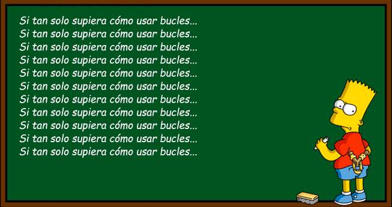
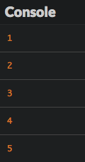

# Repetir declaraciones

En este capítulo, veremos cómo ejecutar código de forma repetitiva.

## TL;DR

* Loa **bucles** son usados para repetir una serie de declaraciones cada repetición es llamada una **iteración** el bloque de código asociado con un bucle es llamado su **cuerpo**.

* El bucle `while` repite declaraciones *mientras* cierta condición es verdadera. El bucle `for` da la habilidad de controlar lo que sucede justo antes de que el bucle comience y después de que cada iteración del bucle se ha ejecutado. 

```js
// Bucle While 
while (condición) {
  // Código ejecutar mientras la condición sea verdadera
}

// Bucle For 
for (inicialización; condición; expresión final) {
  // Código ejecutar mientras la condición sea verdadera
}
```

* La variable asociada con la condición del bucle es llamada el **contador** del bucle y a menudo nombrada `i`.

* ¡Cuidado! La condición de un bucle `while` tiene que convertirse en falsa en algún momento para evitar el riesgo de un **bucle infinito**. Asimismo, actualizar el contador de un bucle `for` dentro de su cuerpo es una mala idea.

Todos los bukles pueden escribirse con `while`, pero sí sabes de antemano cuántas veces quieres que se ejecute el bucle, `for` es la mejor opción.

## Introducción

Si querías escribir código que mostrará números entre el 1 y el 5, podías hacerlo con lo que ya has aprendido:

```js
console.log(1);
console.log(2);
console.log(3);
console.log(4);
console.log(5);
```

Aunque esto es bastante tedioso y podría ser mucho más complejo por ejemplo, para listas de números entre 1 y 100. ¿Cómo puedes conseguir lo mismo de forma más simple?#|¢¢

Javascript te permite escribir código dentro de un **bucle** que se ejecuta repetidamente hasta que se le dice que se detenga. A cada vez que el código se ejecuta, se le llama **iteración**.




## Él bucle `while` 

Un bucle `while` te deja repetir código mientras cierta condición sea verdadera. 

### Ejemplo

Aquí tienes un programa de ejemplo escrito con un bucle `while`.

```js
let numero = 1;
while (numero <= 5) {
  console.log(numero);
  numero++;
}
```

Igual que el anterior, este bloque de código muestra todos los números enteros entre el 1 y el 5.



### Cómo funciona

Usaras la siguiente sintaxis para escribir un bucle `while`.

```js
while (condición) {
  // Código a ejecutar mientras la condición sea verdadera
}
```

Antes de cada iteración del bucle, la condición entre paréntesis es evaluada para determinar si es verdadera o no. El código asociado con un bucle es llamado su **cuerpo**.

* Si el valor de la condición es `verdadero`, el código en el cuerpo del bucle `while` se ejecuta. Posteriormente la condición es reevaluada para ver si aún es verdadera o no. ¡El ciclo continúa!

* Si el valor de la condición es `falso`, el código en el bucle deja de ejecutarse o no se ejecuta.

I> El cuerpo del bucle debe colocarse entre llaves, a menos que sea de una sola declaración. Por lo pronto, siempre usa llaves para tus bucles. 

## Él bucle `for`

A menudo necesitarás escribir bucles con condiciones que esten basadas en el valor de una variable actualizada en el cuerpo del bucle, como en nuestro ejemplo. JavaScript ofrece otro tipo de bucle para dar cuenta de esto: el bucle `for`. 

### Ejemplo

Aquí está el mismo programa de arriba escrito en cambio con un bucle `for`.

```js
let numero;
for (numero = 1; numero<= 5; numero++) {
  console.log(numero);
}
```

Da exactamente el mismo resultado.

### Cómo funciona

Aquí está la sintaxis para un bucle `for`.

```js
for (inicialización; condición; expresión final) {
  // Código ejecutar mientras la condición sea verdadera
}
```

Esta es un poco más complicada que la sintaxis del bucle`while`: 

* **Inicialización** solo sucede una vez, al primer inicio del código. con frecuencia es usado para establecer el valor inicial de la variable asociada a la condición del bucle.

* La **condición** es evaluada una vez antes cada que el bucle se ejecute. Sí es verdadero el código se ejecuta. Sí no, el código no se ejecuta.

* La **expresión final** es evaluada después cada que el bucle se ejecuta. Con frecuencia se usa para actualizar el valor de la variable asociada con la condición del bucle, como vimos en el ejemplo anterior.

### El contador del bucle

La variable usada durante la inicialización, condición y la expresión final de un bucle es llamado **contador** y a menudo se le nombra `i`. Este contador puede ser declarado en la inicialización del bucle para limitar su alcance al cuerpo del bucle.

```js
for (let i = 1; i <= 5; i++) {
  console.log(i); // Bien
}
console.log(i); // Error: la variable i no es visible aquí
```

## Errores comunes

### Bucle infinito `while`

El principal riesgo con los bucles `while` es producir un **bucle infinito**, lo que significa que la condición siempre es verdadera y el código se ejecuta siempre. ¡ Esto bloqueará tu programa! Por ejemplo, digamos que olvidas una línea de código que incremente la variable `numero`.

```js
let numero= 1;
while (numero <= 5) {
  console.log(numero);
  // La variable numero nunca es actualizada: la condición del bucle se mantiene verdadera siempre
}
```

Para protegerte de bucles infinitos, tienes que asegurarte de que la condición del bucle al final se volverá falsa. 

### Manejando un contador de bucle `for`

Imagina que accidentalmente modificas el contador del bucle en el cuerpo del bucle, tal como en el ejemplo siguiente. 

```js
for (let i = 1; i <= 5; i++) {
  console.log(i);
  i++; // La variable es actualizada en el cuerpo del bucle
}
```

Este programa produce el siguiente resultado.


Cada que el bucle se ejecuta, la variable contadora es incrementada *dos veces*: una vez en el cuerpo y una vez en la expresión final después de que el bucle se ejecuta. Cuando estás usando un bucle `for` casi siempre quieres omitir todo lo relacionado con el contador dentro del cuerpo de tu bucle. ¡Solo déjalo en esa primera línea!

## ¿Cuál bucle debería usar?

Los bucles `for` son estupendos porque incluyen la noción de contar por defecto, evitando el problema de bucles infinitos. Sin embargo, eso significa que debes saber cuántas veces quieres que el bucle se ejecute desde el momento en que escribes tu código. Para situaciones donde aún no sabes cuántas veces se debería ejecutar el código, los bucles `while` encajan. Aquí hay un caso de aplicación del bucle `while` en el cual se le pide a un usuario escribir letras una y otra vez hasta introducir una X:

```js
let letra = "";
while (letra  !== "X") {
  letra = prompt("Escribe una letra o X para salir:");
}
```

No puedes saber cuántas veces harán falta para que el usuario introduzca `X`, así que `while` es generalmente bueno para bucles que dependen de la interacción del usuario.

Al final, elegir qué bucle usar depende del contexto. Todos los bucles pueden ser escritos con `while`, pero si sabes de antemano cuántas veces quieres que el bucle se ejecute, `for` es la mejor opción.

## ¡Hora de programar!

Intenta programar cada ejercicio dos veces, una vez con un bucle `while` y la otra con un `for`, para que tú mismo veas cuál es el más apropiado.

### Carrusel

Escribe un programa que ponga en marcha un carrusel de 10 turnos, mostrando el número de turno cada vez.

Cuando esté terminado, mejoralo para que el número de turnos sea proporcionado por el usuario.

### Paridad

Checa el siguiente programa que muestra números pares (divisibles entre dos) entre el 1 y el 10.

```js
for (let i = 1; i <= 10; i++) {
  if (i % 2 === 0) {
    console.log(`${i} es par`);
  }
}
```

Este programa usa el operador módulo `%`, el cual calcula el remanente después de la división de un número entre otro. Con frecuencia es usado para evaluar la paridad de un número.

```js
console.log(10 % 2); // 0 porque 10 = 5 * 2 + 0
console.log(11 % 2); // 1 porque 11 = 5 * 2 + 1
console.log(18 % 3); // 0 porque 18 = 3 * 6 + 0
console.log(19 % 3); // 1 porque 19 = 3 * 6 + 1
console.log(20 % 3); // 2 porque 20 = 3 * 6 + 2
```

Mejora el programa para que también muestre números impares.  Mejoralo de nuevo para reemplazar el número inicial  `1` por un número proporcionado por el usuario.

> Este programa debe mostrar exactamente 10 números incluyendo el primero, ¡no 11 números!

### Validación de información

Escribe un programa que continúe pidiendo un número al usuario hasta que él número introducido sea menor que o igual a 100. 

Cuando hayas terminado con la anterior, mejora el programa para que el número de finalización sea entre 50 y 100.

### Tabla de multiplicación

Escribe un programa que le pida un número al usuario, después muestre la tabla de multiplicación para este número.

Cuando hayas acabado, mejora el programa para que solo acepte números entre 2 y 9 (usa el ejercicio previo como prototipo).

### Ni si, ni no

Escribe un programa que juega "ni si, ni no" con el usuario. Específicamente, el programa le pide al usuario introducir texto hasta que se escribe ya sea "si" o "no", lo cual termina el juego.

### FizzBuzz

Escribe un programa que muestra todos los números entre 1 y 100 con las siguientes excepciones:

* Si el número es divisible entre 3 muestra `"Fizz"` en su lugar.

* Si el número es divisible entre 5 y no entre 3 muestra `"Buzz"` en su lugar.

Cuando esté terminado, mejoralo para que el programa en cambio muestre `"FizzBuzz"` para números divisibles tanto entre 3 y 5.

> Este ejercicio tiene [muchas, muchas soluciones](http://www.tomdalling.com/blog/software-design/fizzbuzz-in-too-much-detail/). Es un [clásico de entrevista de trabajo](http://imranontech.com/2007/01/24/using-fizzbuzz-to-find-developers-who-grok-coding/) que un número significativo de candidatos fallan. ¡Haz tu mejor esfuerzo!
