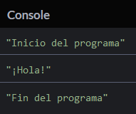
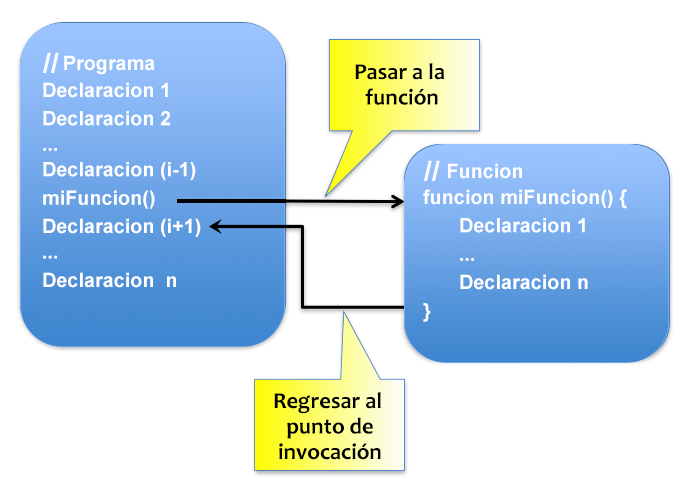

# Escribe funciones

En este capítulo, aprenderás cómo dividir un programa en subpartes llamadas funciones.

## TL;DR

* Una **función** es un grupo de declaraciones que realizan una tarea en particular. Las funciones JavaScript son creadas usando la palabra clave `function`.

* Escrito como una combinación de distintas funciones breves y precisas, un programa generalmente será más fácil de entender y más **modular** que uno monolítico.

* Una **invocación de función** desencadena la ejecución del código de una función. Cuando esto termina, la ejecución  se reanuda en el lugar donde La invocación fue realizada.

* Las variables declaradas dentro de una función son limitadas en alcance al cuerpo de la función. Estas son llamadas **variables locales**.

* Una declaración `return` dentro del cuerpo de una función define el **valor de retorno** de la función. Una función puede aceptar cero, uno o varios parámetros para trabajar. Para una invocación en particular, los valores de los parámetros proporcionados son llamados **argumentos**.

* Hay varias formas de crear una función en JavaScript. Una primera es usar una **declaración de función**.

```js
// Declaración de función
function miFuncion(param1, param2, ...) {
  //  Código de la función usando param1, param2, ...
}

// Invocación de función
miFuncion(arg1, arg2, ...);
```

* Otra forma de crear una función es usar una **expresión de función**. Una expresión de función puede ser asignada a una variable porque en JavaScript, el valor de una variable puede ser una función. Las expresiones de función con frecuencia son usadas para crear **funciones anónimas** (funciones sin nombre).

```js
// Función anónima creada con una expresión de función y asignada a una variable
const miFunc = function(param1, param2, ...) {
  // Código de la función usando param1, param2, ...
};

// Invocación de función
miFunc(arg1, arg2, ...);
```

* Una tercera forma de crear una función anónima es la más reciente **sintaxis de flecha gruesa**.

```js
// Función anónima de flecha gruesa asignada a una variable
const miFunc = (param1, param2, ...) => {
  // Código de la función usando param1, param2, ...
};

// Invocación de función
miFunc(arg1, arg2, ...);
```

* Sin importar como sea creada, cada función debe tener un **propósito** preciso y un **nombre** bien elegido (a menudo incluyendo un verbo de acción). JavaScript ofrece muchas **funciones predefinidas** cubriendo distintas necesidades.

## Introducción: el rol de las funciones

Para comprender porque las funciones son importantes, checa nuestra ejemplo de un capítulo previo: el algoritmo del burrito :)

```text
Inicio
  Saca la arrocera
  Llenala con arroz
  Llenala con agua
  Cuece el arroz
  Pica las verduras
  Saltea las verduras
  Prueba las verduras
    Si las verduras están buenas
      Sácalas de la estufa
    Si las verduras no están buenas      
      Agrega más pimienta y especies
    Si las verduras no están suficientemente cocidas
      Sigue salteando las verduras
  Calienta la tortilla
  Añade arroz a la tortilla
  Añade verduras a la tortilla
  Enrolla la tortilla
Fin
```
Aquí está la misma idea general, escrita de una forma diferente.

```text
Inicio
  Cuece el arroz
  Saltea los vegetales
  Añade los rellenos
  Enrolla todo
Fin
```

La primera versión detalla todos las acciones individuales que integran el proceso de preparación. La segunda desglosa la receta en **etapas más generales** e introduce conceptos que pueden ser reusados para otros platillos también cómo *coser*, *saltear*, *añadir* y *enrollar*.

Nuestros programas hasta ahora han invitado al primer ejemplo, pero es tiempo de empezar a modularizar nuestro código en subetapas para que podamos reusar fragmentos y piezas cuando sea necesario. En JavaScript, ¡estás subetapas son llamadas **funciones**!

## Descubriendo las funciones

Una **función** son  un grupo de declaraciones que realizan una tarea en particular.

Aquí está un ejemplo básico de una función.

```js
function diHola() {
  console.log("¡Hola!");
}

console.log("Inicio del programa");
diHola();
console.log("Fin del programa");
```



Examinemos lo que acaba de suceder.

### Declarar una función

Revisa las primeras líneas del ejemplo anterior.

```js
function diHola() {
  console.log("¡Hola!");
}
```

Esto crea una función llamada `diHola()`. Consta de una sola declaración que hará aparecer un mensaje en la consola: `"¡Hola!"`.

Este es un de ejemplo de una **declaración** de función.

```js
// Declara una función llamada miFuncion
function miFuncion () {
  // Código de la función
}
```

La declaración de una función es realizada usando la palabra clave de JavaScript `función`, seguida del nombre de la función y un par de paréntesis. Las declaraciones que componen la función constituyen el **cuerpo** de la función. Estás declaraciones son encerradas entre llaves e indentadas.

### Invocar una función

Las funciones deben ser invocadas para que se ejecuten de hecho. Aquí está la segunda parte de nuestro programa ejemplo.

```js
console.log("Inicio del programa");
diHola();
console.log("Fin del programa");
```

La primera y tercera declaración explícitamente muestran mensajes en la consola. La segunda línea hace una **invocación** a la función `diHola()`.

Puedes invocar una función escribiendo el nombre de la función seguido de un par de paréntesis.

```js
// ...
miFuncion(); // Invocación a miFuncion
// ...
```

Invocar una función desencadena la ejecución de las acciones listadas ahí dentro (el código en su cuerpo). Cuando esto termina, la ejecución se reanuda en el lugar donde la invocación fue hecha.



### Utilidad de las funciones

Un problema complejo es generalmente más manejable cuando se divide en subproblemas más simples. Los programas informáticos no son la excepción a esta regla. Escritos como una combinación de varias funciones cortas y precisas, un programa será más fácil de entender y de actualizar que uno monolítico. Como un beneficio adicional, ¡algunas funciones pueden ser re usadas en otros programas!

Crear funciones también puede ser una solución al problema de [duplicación de código](https://es.wikipedia.org/wiki/C%C3%B3digo_duplicado); en lugar de estar duplicado en varios lugares, un fragmento de código puede ser centralizado en una función y ser invocado desde cualquier lugar cuando se necesite.

## Contenidos de una función

### Valor de retorno

Aquí hay una variación de nuestro programa ejemplo.

```js
function diHola() {
  return "¡Hola!";
}

console.log("Inicio del programa");
const mensaje = diHola(); // Almacena el valor de retorno de la función en una variable
console.log(mensaje );       // Muestra el valor de retorno
console.log("Fin del programa");
```

Ejecuta este código y verás el mismo resultado que antes.

En este ejemplo, el cuerpo de la función `diHola()` ha cambiado: la declaración `console.log("¡Hola!")` fue reemplazada por return `"¡Hola!"`.

La palabra clave `return` indica que la función retornará un valor, el cual es especificado inmediatamente después de la palabra clave. Este **valor de retorno** puede ser recuperado por la parte invocadora.

```js
// Declaración miFuncion
function miFuncion() {
  let valorRetorno;
  // Cálculo del valor de retorno
  // valorRetorno = ...
  return valorRetorno;
}

// Obtener el valor de retorno de miFuncion
const resultado = miFuncion();
// ...
```

Este valor de retorno puede ser de cualquier tipo (número, carácter, etcétera). Sin embargo, una función puede retornar solo un valor.

W> Recuperar el valor de retorno de una función no es obligatorio, pero en ese caso el valor de retorno es "extraviado".

Si intentas recuperar el valor de retorno de una función que en realidad no tiene uno, obtenemos el valor JavaScript `undefined`.

```js
function miFuncion() {
  // ...
  // Sin valor de retorno 
}

const resultado = miFuncion();
console.log(resultado); // undefined
```

W> Una función deja de correr inmediatamente después de que la declaración `return` es ejecutada. Declaraciones posteriores nunca son ejecutadas. 

Simplifiquemos un poco nuestra ejemplo deshaciendonos de la variable que almacena el valor de retorno de la función.

```js
function diHola() {
  return "¡Hola!";
}

console.log(diHola()); // "¡Hola!"
```

El valor de retorno de la función `diHola()` es directamente impreso a través del comando `console.log()`.

### Variables locales

Puedes declarar variables dentro de una función, como en el siguiente ejemplo.

```js
function diHola() {
  const mensaje = "¡Hola!";
  return mensaje;
}

console.log(diHola()); // "¡Hola!"
```

La función`diHola()` declara una variable llamada `mensaje` y retorna su valor.

Las variables declaradas en el cuerpo de una función son llamadas **variables locales**. Su **alcance** es limitado al cuerpo de la función (de ahí su nombre). Si intentas usar estás variables locales fuera de la función, ¡no podrás hacerlo!

```js
function diHola() {
  const mensaje = "¡Hola!";
  return mensaje;
}

console.log(diHola()); // "¡Hola!"
console.log(mensaje); // Error: la variable mensaje no es visible aquí
```

Cada invocación de función redeclarara las variables locales de la función, haciendo las invocaciones perfectamente independientes entre sí.

No poder usar variables locales fuera de las funciones en las que fueron declaradas podría aparecer como una limitación. En realidad, ¡es algo bueno! Esto significa que las funciones pueden ser concebidas como autónomas y reusables. Además, esto previene **conflictos de nomenclatura**: permitiendo que variables declaradas en diferentes funciones tengan el mismo nombre.

### Pasar parámetros

Un **parámetro** es información que la función necesita para trabajar. Los parámetros de la función son definidos entre paréntesis inmediatamente después del nombre de la función. Después puedes usar el valor del parámetro en el cuerpo de la función.

Proporcionas el valor del parámetro cuando invocas la función. Este valor es llamado **argumento**.

Editemos El ejemplo anterior para agregar un saludo personalizado:

```js
function diHola(nombre) {
  const mensaje = `¡Hola, ${nombre}!`;
  return mensaje;
}

console.log(diHola("Roberto")); // "¡Hola, Roberto!"
console.log(diHola("Luis"));   // "¡Hola, Luis!"
```

La declaración de la función `diHola()` ahora contiene un parámetro llamado `nombre`.

En este ejemplo la primera invocación a `diHola()` es realizada con el argumento `"Roberto"` y la segunda con el argumento `"Luis"`. En la primera invocación, el valor del parámetro `nombre` es `"Roberto"` y `"Luis"` en la segunda.

Aquí está la sintaxis general de la declaración de una función con parámetros. El número de parámetros no está limitado, pero más de tres o cuatro es raramente provechoso.

Declaraciones usando

El valor es establecido para

```js
// Declara la función miFuncion con parámetros
function miFuncion(param1, param2, ...) {
  // Declaraciones usando param1, param2, ...
}

// Invocación de función
// El valor de param1 es asignado a arg1, param2 a arg2, ...
miFuncion(arg1, arg2, ...);
```

Igual que con las variables locales, el alcance de los parámetros es limitado al cuerpo de la función. Por lo tanto, una variable externa usada como un argumento en una invocación de función podría tener el mismo nombre que el parámetro de la función. El siguiente ejemplo es perfectamente válido.

```js
function diHola(nombre) {
  // Aquí, "nombre" es el parámetro de la función
  const mensaje = `¡Hola, ${nombre}!`;
  return mensaje;
}

// Aquí, "nombre" es una variable usada como un argumento
let nombre = "Roberto";
console.log(diHola(nombre)); // "¡Hola, Roberto!"
nombre = "Luis";
console.log(diHola(nombre)); // "¡Hola, Luis!"
```

Cuándo se invoca una función, respetar el número y orden de los parámetros ¡es fundamental! Revisa el siguiente ejemplo.

```js
function presentacion(nombre, edad) {
  console.log(`Tu nombre es ${nombre} y tienes ${edad} años de edad`);
}

presentacion("Gilberto", 9); // "Tu nombre es Gilberto y tienes 9 años de edad"
presentacion(5, "Karla"); // "Tu nombre es 5 y tienes Karla años de edad"
```

Los argumentos de la segunda invocación son proporcionados en orden inverso, así que `nombre` obtiene el valor `5` y `edad` obtiene `Karla` para esa invocación.

## Funciones anónimas

La declaración no es la única forma de crear funciones en JavaScript. Checa este ejemplo.

```js
const hola = function(nombre) {
  const mensaje = `¡Hola, ${nombre}!`;
  return mensaje;
};

console.log(hola("Ricardo")); // "¡Hola, Ricardo!"
```

En este ejemplo la función es asignada a la variable `hola`. El valor de esta variable es una función. Invocamos la función usando esa variable. Este es un ejemplo de una **expresión de función**. Una expresión de función define una función como parte de una expresión más grande, típicamente una asignación de variable.

La función creada en este ejemplo no tiene nombre: es **anónima**. Como pronto descubrirás, las funciones anónimas son usadas intensamente en JavaScript.

Así es cómo se crea una función anónima y se asigna a una variable.

```js
// Asignación de una función anónima a la variable miFunc 
const miFunc = function(param1, param2, ...) {
  // Declaraciones usando param1, param2, ...
};

// Invocación de la función anónima
// El valor de param1 es asignado a arg1, param2 a arg2, ...
miFunc(arg1, arg2, ...);
```

Evoluciones recientes del lenguaje han introducido una manera más concisa para crear funciones anónimas:

```js
const hola = (nombre) => {
  const mensaje = `¡Hola, ${nombre}!`;
  return mensaje;
};

console.log(hola("William")); // "¡Hola, William!"
```

Las funciones creadas de esta manera son llamadas **funciones de flecha gruesa**.

```js
// Asignación de una función anónima a la variable miFunc
const miFunc = (param1, param2, ...) => {
  // Declaraciones usando param1, param2, ...
};

// Invocación de la función anónima
// El valor de param1 es asignado a arg1, param2 a arg2, ...
miFunc(arg1, arg2, ...);
```

La sintaxis de las funciones de flecha gruesa pueden simplificarse aún más en algunos casos particulares:

* Cuando solo hay una declaración en el cuerpo de la función, todo puede ser escrito en la misma línea sin llaves. La declaración `return` es omitida e implícita.
* Cuando la función solo acepta un parámetro los paréntesis alrededor, pueden ser omitidos.

Minimalista al máximo

```js
// Minimalista al máximo
const hola = nombre => `¡Hola, ${nombre}!`;

console.log(hola("Kate")); // "¡Hola, Kate!"
```

Las funciones son una parte esencial del conjunto de herramientas de JavaScript. Las usaras constantemente en tus programas.

## Pautas para programar con funciones

### Crear funciones sabiamente

Las funciones pueden incluir todo lo que se puede usar en un programa regular: variables, condiciones, bucles, etcétera. Las funciones pueden invocarse entre sí, dándole al programador una cantidad enorme de libertad para construir programas.

Sin embargo, no todo merece estar en su propia función. Es mejor escribir unas breves y precisas, con el fin de limitar dependencias y mejorar la comprensión del programa.

### Aprovechar las funciones predefinidas de JavaScript 

Nosotros ya hemos usado varias funciones predefinidas de JavaScript cómo `prompt()` y `alert()`. Hay muchas otras en las especificaciones del lenguaje. ¡Familiarízate con ellas en lugar de reinventar la rueda!

Aquí hay un ejemplo demostrando dos de las funciones matemáticas de JavaScript.

```js
console.log(Math.min(4.5, 5)); // 4.5
console.log(Math.min(19, 9));  // 9
console.log(Math.min(1, 1));   // 1
console.log(Math.random());    // Un número aleatorio entre 0 y 1
```

La función `Math.min()` devuelve el número mínimo entre sus argumentos. La función `Math.random()` genera un número aleatorio entre 0 y 1.

Este libro presentará muchas otras funciones de JavaScript.

### Limitar la complejidad de la función

El cuerpo de una función debe mantenerse simple, o de lo contrario dividirse en varias subfunciones. Como regla general, 30 líneas de código deberían ser lo máximo para casos no específicos.

### Nombrar bien las funciones y parámetros

El nombrado de las funciones es igual de importante que el nombrado de variables. Debes elegir nombres que expresen claramente el propósito de la función y seguir una convención de nomenclatura. Consulte el apéndice para algunos consejos útiles.

T> Si tienes dificultades para encontrar un buen nombre para una función, entonces quizás su propósito no sea tan claro y deberías preguntarte si esta función merece existir.


## Hora de programar

### Hola mejorado

Completa el siguiente programa para que le pregunté al usuario por su nombre y apellidos, después muestre el resultado de la función `diHola()`.


```js
// Di hola al usuario
function diHola(nombre, apellidos) {
  const mensaje= `¡Hola, ${nombre} ${apellidos}!`;
  return mensaje;
}
Pregunta al usuario por su nombre y apellidos
Invoca a y muestra su resultado
// PENDIENTE: pregunta al usuario por su nombre y apellidos
// PENDIENTE: invoca a diHola() y muestra su resultado
```

### Elevando números al cuadrado

Completa el siguiente programa para que las funciones `square1()` y `square2()`  trabajen correctamente

```js
// Eleva al cuadrado el número dado x
function square1(x) {
  // PENDIENTE: completar el código de la función
}

// Eleva al cuadrado el número dado x
const square2 = x => // PENDIENTE: completar el código de la función

console.log(square1(0)); // Debe mostrar 0
console.log(square1(2)); // Debe mostrar 4
console.log(square1(5)); // Debe mostrar 25

console.log(square2(0)); // Debe mostrar 0
console.log(square2(2)); // Debe mostrar 4
console.log(square2(5)); // Debe mostrar 25
```

Cuando esté terminado, actualiza el programa para que muestre el cuadrado de cada número entre 0 y 10.

> Escribir 10 invocaciones bobas a `square()` ¡está prohibido! Tú sabes cómo repetir declaraciones, ¿o no?;)

### El mínimo de dos números

Finjamos que la función JavaScript `Math.min()` no existe. Completa el siguiente programa para que la función `min()` devuelva el mínimo de sus dos números recibidos.

```js
// PENDIENTE: escribir la función min()

console.log(min(4.5, 5)); // Debe mostrar 4.5
console.log(min(19, 9));  // Debe mostrar 9
console.log(min(1, 1));   // Debe mostrar 1
```

### Calculadora

Completa el siguiente programa para que disponga de las cuatro operaciones aritméticas básicas: suma, resta, multiplicación y división. Puedes usar ya sea una declaración de función o una expresión de función.

```js
// PENDIENTE: completar el programa

console.log(calculate(4, "+", 6));  // Debe mostrar 10
console.log(calculate(4, "-", 6));  // Debe mostrar -2
console.log(calculate(2, "*", 0));  // Debe mostrar 0
console.log(calculate(12, "/", 0)); // Debe mostrar Infinity
```

### Circunferencia y área de un círculo

Escribe un programa que contenga dos funciones para calcular la circunferencia y área de un círculo definido por su radio. Pruébalo usando el dato que introduzca el usuario.

Aquí tienes algunas recomendaciones para resolver este ejercicio:


* Las fórmulas para calcular la circunferencia y el área deben ser parte de tus recuerdos de la secundaria… o estar a un clic en Google de distancia :)
* El valor del número π (Pi) es obtenido con `Math.PI` en JavaScript.
* Quizás prefieras usar el [operador de exponenciación](https://developer.mozilla.org/en-US/docs/Web/JavaScript/Reference/Operators/Arithmetic_Operators) `**` para realizar cálculos.

```js
console.log(2 ** 3); // 8: 2 * 2 * 2
console.log(3 ** 2); // 9: 3 * 3
```
