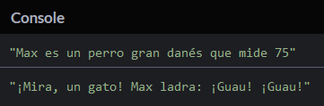

# Crea tus primeros objetos

Este capítulo presentará los objetos y la forma en que son creados y usados en JavaScript.

## TL;DR

* Un objeto javascript es una entidad que tiene propiedades. Cada propiedad es una dupla clave/valor. La clave es el nombre de la propiedad.

* El valor de una propiedad puede ser un dato (número, carácter, etcétera) o una función. En el último caso la propiedad es denominada **método**. 

* Un **objeto literal** JavaScript es creado simplemente estableciendo sus propiedades entre un par de llaves.

```js
const miObjeto = {
  propiedad1: valor1,
  propiedad2: valor2,
  // ... ,
  metodo1(/* ... */) {
    // ...
  },
  metodo2(/* ... */) {
    // ...
  }
  // ...
};

miObjeto.propiedad1 = valorNuevo; // Establecer el valor nuevo para la propiedad1 de miObjeto
console.log(miObjeto.propiedad1); // Mostrar el valor de propiedad1 de miObjeto
miObjeto.metodo1(...);           // Invocar a metodo1 en miObjeto
```

* Dentro de un método, la palabra clave `this` representa el objeto en que es invocado el método.

* El lenguaje javascript predefine muchos objetos útiles cómo `console` o `Math`.

## Introducción

### ¿Qué es un objeto?

Piensa en objetos en un sentido no informático, como un bolígrafo. Un bolígrafo puede tener diferentes colores de tinta, ser manufacturado por distintas personas, tener una punta diferente, y muchas otras propiedades.

Similarmente, un **objeto** en programación es una **entidad que tiene propiedades**. Cada propiedad define una característica del objeto. Una propiedad puede ser un dato asociado con el objeto (el color del bolígrafo) o una acción (la habilidad de escribir del bolígrafo).

### ¿Qué tiene que ver esto con programar?

La **programación orientada a objetos** (POO para abreviar) es una forma de escribir programas usando objetos. Cuando usas POO,  escribes, creas, y modificas objetos, y los objetos constituyen tu programa.

La POO cambia la forma en que un programa es escrito y organizado. Hasta ahora has estado escribiendo código basado en funciones, a veces denominado  [programación procedimental](https://es.wikipedia.org/wiki/Programaci%C3%B3n_por_procedimientos). Ahora descubramos cómo escribir código orientado a objetos.

## JavaScript y objetos

Como otros tantos lenguajes, JavaScript soporta la programación con objetos. Dispone de un número predefinido de objetos mientras te permite crear los propios.

### Crear un objeto

Aquí está la representación en JavaScript de un bolígrafo Bic azul de punta esférica.

```js
const boligrafo = {
  tipo: "esférico",
  color: "azul",
  marca: "Bic"
};
```

Como se dijo antes, un objeto JavaScript puede ser creado simplemente estableciendo sus propiedades dentro de un par de llaves: `{...}`. Cada propiedad es una dupla clave/valor.  Esto se denomina **objeto literal**.

W> El punto y coma `;` después de la llave de cierre es opcional, pero de todos modos es más seguro añadirlo.

El código anterior define una variable llamada `boligrafo` cuyo valor es un objeto: por lo tanto puedes decir que `boligrafo` es un objeto. Este objeto tiene tres propiedades: `tipo`, `color` y `marca`. Cada propiedad tiene un nombre y un valor y es seguido de una coma `,` (a excepción del último).

### Acceder a las propiedades de un objeto

Después de crear un objeto puedes acceder al valor de sus propiedades usando la **notación de puntos** por ejemplo `miObjeto.miPropiedad`.

```js
const boligrafo = {
  tipo: "esférico",
  color: "azul",
  marca: "Bic"
};

console.log(boligrafo.tipo);  // "esférico"
console.log(boligrafo.color); // "azul"
console.log(boligrafo.marca); // "Bic"
```

Acceder a una propiedad de un objeto es una **expresión** que produce un valor. Dicha expresión puede ser incluida en otras más complejas. Por ejemplo,  aquí está cómo mostrar las propiedades de nuestro bolígrafo en una declaración.

```js
const boligrafo = {
  tipo: "esférico",
  color: "azul",
  marca: "Bic"
};

console.log(`Yo escribo con un bolígrafo ${boligrafo.marca} ${boligrafo.color} ${boligrafo.tipo}`);
```


### Modificar un objeto

Una vez que un objeto es creado, puedes cambiar el valor de sus propiedades con la sintaxis `miObjeto.miPropiedad= valorNuevo`.

```js
const boligrafo = {
  tipo: "esférico",
  color: "azul",
  marca: "Bic"
};

boligrafo.color = "rojo"; // Modifica la propiedad color de boligrafo

console.log(`Yo escribo con un bolígrafo ${boligrafo.marca} ${boligrafo.color} ${boligrafo.tipo}`);
```


JavaScript incluso ofrece la habilidad de agregar nuevas propiedades dinámicamente a un objeto ya creado.

```js
const boligrafo = {
  tipo: "esférico",
  color: "azul",
  marca: "Bic"
};

boligrafo.precio = "2.5"; // Establece la propiedad precio a bolígrafo

console.log(`Mí bolígrafo cuesta ${boligrafo.precio}`);
```


## Programar con objetos

Muchos libros y cursos enseñan programación orientada a objetos a través de ejemplos relacionados con animales, carros o cuentas de banco. Hagamos algo más chido y creemos un mini juego de roles (JDR) usando objetos.

En un juego de roles, cada personaje es definido por muchos atributos como fuerza, energía o inteligencia. Aquí hay una captura de pantalla de un JDR en línea muy popular.


En nuestro ejemplo más simple, un personaje tendrá tres atributos:

* su nombre,
* su salud (número de puntos de vida),
* su fuerza.

### Un ejemplo sencillo 

Déjame presentarte a Aurora nuestro primer personaje del JDR.

```js
const aurora = {
  nombre: "Aurora",
  salud: 150,
  fuerza: 25
};
```

El objeto `aurora` tiene tres propiedades: `nombre` `salud` y `fuerza`.

I> Como puedes ver, puedes asignar números caracteres o ¡incluso otros objetos a las propiedades!

Aurora está a punto de iniciar una serie de grandes aventuras, algunas de ellas actualizarán sus atributos. Checa el siguiente ejemplo.

```js
const aurora = {
  nombre: "Aurora",
  salud: 150,
  fuerza: 25
};

console.log(`${aurora.nombre} tiene ${aurora.salud} puntos de vida y ${aurora.fuerza} de fuerza`);

// Aurora es herida por una flecha
aurora.salud -= 20;

// Aurora se equipa de un collar de fuerza
aurora.fuerza += 10;

console.log(`${aurora.nombre} tiene ${aurora.salud} puntos de vida y ${aurora.fuerza} de fuerza`);
```


### Introduciendo métodos

En el código de arriba, las dos veces tuvimos que escribir declaraciones `console.log` extensas para mostrar el estado de nuestro personaje. Hay una forma más limpia de realizar esto.

#### Añadir un método a un objeto 

Observa el siguiente ejemplo.

```js
const aurora = {
  nombre: "Aurora",
  salud: 150,
  fuerza: 25
};

// Devuelve la descripción del personaje
function describir(personaje) {
  return `${personaje.nombre} tiene ${personaje.salud} puntos de vida y ${personaje.fuerza} de fuerza`;
}

console.log(describir(aurora));
```


La función `describir()` toma un objeto como parámetro. Accede a las propiedades de ese objeto para crear un texto descriptivo.

A continuación se muestra un enfoque alternativo, usando la propiedad `describir()` *dentro* del objeto.

```js
const aurora = {
  nombre: "Aurora",
  salud: 150,
  fuerza: 25,

  // Devuelve la descripción del personaje
  describir() {
    return `${this.nombre} tiene ${this.salud} puntos de vida y ${this.fuerza} de fuerza`;
  }
};

console.log(aurora.describir());
```


Ahora nuestro objeto tiene una nueva propiedad a su disposición: `describir()`. El valor de esta propiedad es una función que devuelve una descripción textual del objeto. El resultado de ejecución es exactamente el mismo de antes.

A la propiedad de un objeto cuyo valor es una función se le denomina **método**.  Los métodos son usados para definir **acciones** en un objeto. Un método añade algún **comportamiento** a un objeto.

#### Invocar un método de un objeto

Analicemos la última línea de nuestro ejemplo previo.

```js
console.log(aurora.describir());
```

Para mostrar la descripción de nuestro personaje usamos la expresión `aurora.describir()` en lugar de `describir(aurora)`. Esto hace una diferencia crucial:


* `describir(aurora)` invoca la función `describir()` con el objeto `aurora` como argumento. La función es externa al objeto. Este es un ejemplo de programación procedimental.

* `aurora.describir()` invoca la función `describir()` en el objeto `aurora`. La función es una de las propiedades del objeto: es un método. Este es un ejemplo de programación orientada a objetos.

Para invocar un método llamado `miMetodo()` en el objeto `miObjeto`, la sintaxis es `miObjeto.miMetodo()`.

W> ¡Recuerda los paréntesis, aunque estén vacíos, cuando invoques un método!

### La palabra clave `this` 

Ahora mira detenidamente el cuerpo del método `describir()` en nuestro objeto.

```js
const aurora = {
  nombre: "Aurora",
  salud: 150,
  fuerza: 25,

  // Devuelve la descripción del personaje
  describir() {
    return `${this.nombre} tiene ${this.salud} puntos de vida y ${this.fuerza} de fuerza`;
  }
};
```

Observas una nueva palabra clave: `this`. Esta es automáticamente establecida por JavaScript dentro de un método y representa **el objeto en que el método fue invocado**.

El método `describir()` no toma ningún parámetro. Usa `this` para acceder a las propiedades del objeto en que es invocado.

## Objetos predefinidos en JavaScript 

El lenguaje JavaScript tiene muchos objetos predefinidos sirviendo para varios propósitos.  Ya nos hemos encontrado con algunos de ellos:


* El objeto `console` da acceso a la consola del entorno. `console.log()` es en realidad una invocación de método.

* El objeto `Math` contiene muchas propiedades matemáticas. Por ejemplo `Math.PI` devuelve un valor aproximado del número π (Pi) y la función `Math.random()` devuelve un número aleatorio entre 0 y 1.

## ¡Hora de programar!

### Agregando experiencia al personaje

Mejora nuestro programa ejemplo de JDR agregando una propiedad de experiencia llamada `exp` al personaje. Su valor inicial es 0. La experiencia debe aparecer en la descripción del personaje.

```js
// PENDIENTE: crear el objeto del personaje aquí

// Aurora es herida por una flecha
aurora.salud -= 20;

// Aurora se equipa de un collar de fuerza
aurora.fuerza += 10;

// Aurora aprende una habilidad nueva 
aurora.exp += 15;

console.log(aurora.describir());
```


### Diseñando un perro

Completa el siguiente programa agregando la definición del objeto `perro`.

```js
// PENDIENTE: crear él objeto perro aquí

console.log(`${perro.nombre} es un perro ${perro.especie} mide ${perro.size}`);
console.log(`¡Mira, un gato! ${perro.nombre} ladra: ${perro.ladrar()}`);
```



### Diseñando un círculo

Completa el siguiente programa agregando la definición del objeto `circulo`. El valor de su radio es introducido por el usuario.

```js
const r = Number(prompt("Ingresa el radio del círculo:"));

// PENDIENTE: crear el objeto círculo aquí

console.log(`Su circunferencia es ${circulo.circunferencia()}`);
console.log(`Su área es ${circulo.area()}`);
```

### Diseñando una cuenta de banco 

Escribe un programa que crea un objeto `cuenta` con las siguientes características:

* Una propiedad `nombre` establecida como "Alejandro".
* Una propiedad `saldo` establecida en 0.
* Un método `abonar` que agrega el valor (positivo o negativo) pasado como argumento al saldo de la cuenta.
* Un método `describir` que devuelve la descripción de la cuenta.

Usa este objeto para mostrar su descripción, abonale 250, retirale 80, después muestra de nuevo su descripción.


