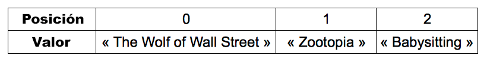

# Almacena información en matrices

Este capítulo que introducirá a las [matrices] (https://es.wikipedia.org/wiki/Vector_(inform%C3%A1tica)) un tipo de variable usado en muchos programas informáticos para almacenar información. 

## TL;DR

* Una **matriz**representa una lista de elementos. Una matriz JavaScript es un objeto que tiene propiedades especiales cómo `length` para acceder a su tamaño (número de elementos). 

* Puedes pensar en una matriz como una serie de cajas, cada una almacenando un valor específico y asociado con un número denominado su **posición**. El primer elemento de una matriz tendrá la posición número 0 - no 1.

* Puedes acceder a un elemento en particular pasando su posición entre **corchetes** `[]`.

* Para iterar en una matriz recorriendola elemento por elemento puedes usar él bucle `for`, el método `forEach()` o el bucle más reciente `for-of`.

```js
for (let i = 0; i < miMatriz.length; i++) {
  // Usar miMatriz[i] para acceder a cada elemento de la matriz uno por uno
}

miMatriz.forEach(miElemento => {
  // Usar miElemento para acceder a cada elemento de la matriz uno por uno
});

for (const miElemento of miMatriz) {
  // Usar miElemento para acceder a cada elemento de la matriz uno por uno
}
```

* El método `push()` agrega un elemento al final de una matriz. El método `unshift()` lo agrega al inicio.

* `pop()` y `splice()` son usados para remover elementos de una matriz.

## Introducción a las matrices

Imagina que quieres crear una lista de todas las películas que has visto este año.

Una solución sería crear varias variables:

```js
const peli1 = "The Wolf of Wall Street";
const peli2 = "Zootopia";
const peli3 = "Babysitting";
// ...
```

Sí eres un fanático de las películas, puede que te encuentres con demasiadas variables en tu programa. La peor parte es que estás variables son completamente independientes una de otra.

Otra posibilidad es agrupar las películas en un objeto.

```js
const peliculas = {
  peli1: "The Wolf of Wall Street",
  peli2: "Zootopia",
  peli3: "Babysitting",
  // ...
};
```

Esta vez, la información está centralizada en él objeto `peliculas`. Sin embargo, los nombres de sus propiedades (`peli1`, `peli2`, `peli3`...) son innecesarios y repetitivos. 

Necesitas una solución para almacenar elementos juntos ¡sin tener que nombrarlos individualmente!

Afortunadamente, de hecho hay una solución: usa una matriz. Una **matriz** es un tipo de dato que puede almacenar un conjunto de elementos. 

## Manipular matrices en JavaScript

En JavaScript, una matriz es un objeto que tiene propiedades especiales.

### Crear una matriz

Así es como se crea nuestra lista de películas en la forma de una matriz.

```js
const películas = ["The Wolf of Wall Street", "Zootopia", "Babysitting"];
```

Una matriz es creada con un par de corchetes `[]`. Todo lo que esté entre los corchetes conforma la matriz. 

Puedes almacenar diferentes tipos de elementos dentro de una matriz incluyendo caracteres números booleanos e incluso objetos. 

```js
const elementos = ["Hola", 7, { mensaje: "Hola mama" }, true];
```

T> Dado que una matriz podría contener múltiples elementos, es bueno nombrar la matriz en plural (por ejemplo, `peliculas`).

### Obtener el tamaño de una matriz

Al número de elementos almacenados en una matriz se le llama **tamaño**. Así es cómo se accede a el.

```js
const peliculas = ["The Wolf of Wall Street", "Zootopia", "Babysitting"];
console.log(peliculas.length); // 3
```

Accedes al tamaño de una matriz a través de su propiedad `length`, usando la notación de puntos.

Claro, esta propiedad `length` devuelve 0 en el caso de una matriz vacía.

```js
const matrizVacia = []; // Crea una matriz vacía
console.log(matrizVacia.length); // 0
```

### Acceder a un elemento en una matriz

Cada elemento en una matriz es identificado por un número llamado **posición** - un número entero que identifica un elemento de la matriz. Podemos ver a una matriz como un conjunto de cajas, cada una almacenando un valor específico y asociado con una posición. Este es el truco: el primer elemento de una matriz estará en la posición número 0 - no 1. El segundo elemento estará en la posición número uno, y así sucesivamente. La posición del último elemento de una matriz será el tamaño de la matriz menos 1.

Así es como podrías representar la matriz `peliculas`:



Puedes acceder a un elemento en particular pasando su posición entre **corchetes** `[]`:

```js
const peliculas = ["The Wolf of Wall Street", "Zootopia", "Babysitting"];
console.log(peliculas[0]); // "The Wolf of Wall Street"
console.log(peliculas[1]); // "Zootopia"
console.log(peliculas[2]); // "Babysitting"
```

Usar una posición inválida para acceder a un elemento de una matriz JavaScript
 devuelve el valor `undefined`.

```js
const peliculas = ["The Wolf of Wall Street", "Zootopia", "Babysitting"];
console.log(peliculas[3]); // undefined: el último elemento está en la posición 2
```

## Iterar en una matriz

Hay varias formas en examinar una matriz elemento por elemento.

La primera es usar un bucle `for` como se discutió previamente.

```js
const peliculas = ["The Wolf of Wall Street", "Zootopia", "Babysitting"];
for (let i = 0; i < peliculas.length; i++) {
  console.log(peliculas[i]);
}
```

El bucle atraviesa cada elemento en la matriz empezando con la posición 0 hasta la longitud de la matriz menos 1, que es su último elemento.

Otra forma es invocar el método `forEach()` en la matriz. Este toma como parámetro una **función** que sera aplicada a cada elemento de la matriz.

```js
miMatriz.forEach(miElemento => {
  // Usar miElemento para acceder a cada elemento de la matriz uno por uno
});
```

Aquí está el ejemplo previo, reescrito con este método y una función de flecha gruesa.

```js
const peliculas = ["The Wolf of Wall Street", "Zootopia", "Babysitting"];
peliculas.forEach(pelicula => {
  console.log(pelicula);
});
```

Durante la ejecución, cada elemento de la matriz es pasado como un parámetro (llamado `pelicula` en este ejemplo) a la función anónima asociada con `forEach()`.

Por último, puedes usar un bucle `for-of`, un tipo especial de bucle para lidiar con [objetos iterables](https://developer.mozilla.org/es/docs/Web/JavaScript/Guide/Iterators_and_Generators#iteradores) como las matrices. Aquí está su sintaxis.

```js
for (const miElemento of miMatriz) {
  // Usa miElemento para acceder a cada elemento de la matriz uno por uno
}
```

Revisa el ejemplo anterior escrito con un bucle `for-of`.

```js
const peliculas = ["The Wolf of Wall Street", "Zootopia", "Babysitting"];
for (const pelicula of peliculas) {
  console.log(pelicula);
}
```

## Actualizar el contenido de una matriz

### Agregar un elemento a una matriz

No mientas: acabas de ver Ghostbusters *otra vez*. Agreguemosla a la lista. Así es como lo harías.

```js
const peliculas = ["The Wolf of Wall Street", "Zootopia", "Babysitting"];
peliculas.push("Ghostbusters");
console.log(peliculas[3]); // "Ghostbusters"
```

Agregas un nuevo elemento a la matriz con el método `push()`. El nuevo elemento a agregarse es pasado como un parámetro al método. Es insertado al final de la matriz.

Para añadir un elemento al inicio de una matriz, usa el método `unshift()` en lugar de `push()`.

```js
const peliculas = ["The Wolf of Wall Street", "Zootopia", "Babysitting"];
peliculas.unshift("Pacific Rim");
console.log(peliculas[0]); // "Pacific Rim"
```

### Remover un elemento de una matriz

Puedes remover el último elemento de una matriz usando el método `pop()`.

```js
const peliculas = ["The Wolf of Wall Street", "Zootopia", "Babysitting"];
peliculas.pop(); // Eliminar el último elemento de la matriz
console.log(peliculas.length); // 2
console.log(peliculas[2]); // undefined
```

Alternativamente, puedes usar el método `splice()` con dos parámetros: el primero es la posición desde la cual empezar a eliminar, y el segundo es el número de elementos a eliminar.

```js
const peliculas = ["The Wolf of Wall Street", "Zootopia", "Babysitting"];
peliculas.splice(0, 1); // Eliminar un elemento empezando en la posición 0 
console.log(peliculas.length); // 2
console.log(peliculas[0]); // "Zootopia"
console.log(peliculas[1]); // "Babysitting"
```

## ¡Hora de programar!

Crea todos estos programas de modo genérico: el resultado del programa debe reflejar cualquier actualización al contenido de la matriz.

### Mosqueteros 

Escribe un programa que:

* Crea una matriz llamada `mosqueteros` conteniendo los valores "Athos", "Porthos" y "Aramis".
* Muestra cada elemento de la matriz usando un bucle `for`.
* Añade el valor "D'Artagnan" a la matriz.
* Muestra cada elemento de la matriz usando el método `forEach()`.
* Elimina al pobre Aramis.
* Muestra cada elemento de la matriz usando un bucle `for-of`.

### Suma de valores

Escribe un programa que cree la siguiente matriz, después calcule y muestre la suma de sus valores (en este caso 42).

```js
const valores = [3, 11, 7, 2, 9, 10];
```

### Valor máximo en matriz 

Escribe un programa que cree la siguiente matriz, después calcule y muestre el valor máximo de la matriz.

```js
const valores = [3, 11, 7, 2, 9, 10];
```

### Lista de palabras 

Escribe un programa que le pida una palabra al usuario hasta que el usuario escriba `"detente"`. Luego el programa muestra cada una de estas palabras a excepción de `"detente"`.