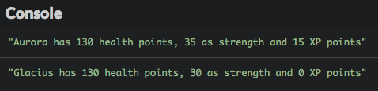
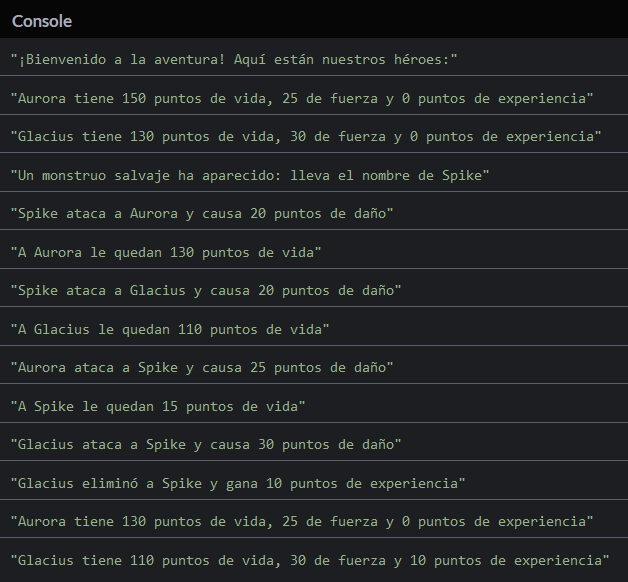
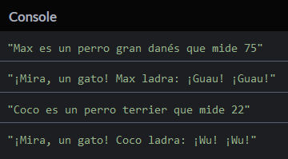
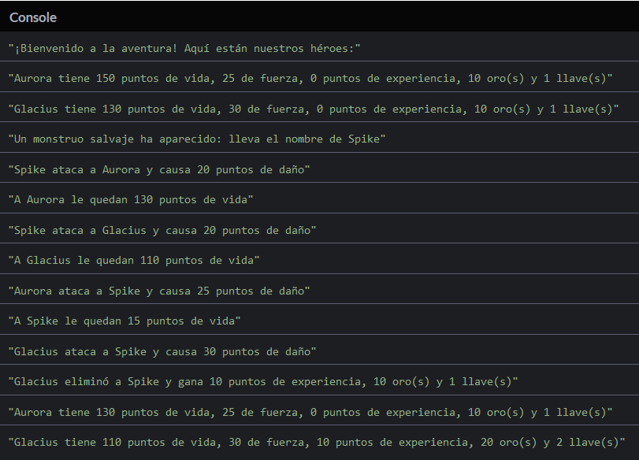
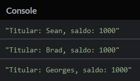

# Comprender la programación orientada a objetos

Unos capítulos antes, aprendiste cómo crear tus primeros objetos en JavaScript. Ahora es tiempo de comprender mejor cómo trabajar con ellos.

## TL;DR

* La **programación orientada a objetos**, o POO, es un <a href="https://es.wikipedia.org/wiki/Paradigma_de_programaci%C3%B3n"> paradigma de programación </a> que usa objetos que contienen tanto **datos** como **comportamientos** para crear programas.

* Una **clase** es una abstracción orientada a un objeto de una idea o un concepto manipulada por un programa. Ofrece una sintaxis práctica para crear objetos representando este concepto.

* Una clase JavaScript es definida con la palabra clave `class`. Únicamente puede contener **métodos**. El método `constructor()` invocado durante la creación del objeto, se usa para iniciar el objeto, muchas veces dándole algunas propiedades de datos. Dentro de los métodos, la palabra clave `this` representa **el objeto en el que el método fue invocado**.

```js
class MiClase {
  constructor(param1, param2, ...) {
    this.propiedad1 = param1;
    this.propiedad2 = param2;
    // ...
  }
  metodo1(/* ... */) {
    // ...
  }
  metodo2(/* ... */) {
    // ...
  }
  // ...
}
```

* Los objetos son creados de una clase con el operador `new`. Este invoca la clase constructora para iniciar el objeto recientemente creado.

```js
const miObjeto = new MiClase(arg1, arg2, ...);
// ...
```

* El modelo JavaScript de POO está basado en **prototipos**. Cualquier objeto JavaScript tiene una propiedad interna que es un vínculo (una **referencia**) a otro objeto: su prototipo. Los prototipos son usados para compartir propiedades y delegar comportamientos entre objetos.

* Cuando se intenta acceder a una propiedad que no existe en un objeto, JavaScript intenta encontrar esta propiedad en la **cadena del prototipo** de este objeto primero buscando en su prototipo, después en el prototipo de dicho prototipo, y así sucesivamente.

* Hay varias formas de crear y vincular objetos JavaScript a través de prototipos. Una es usar el método `Object.create()`.

```js
// Crear un objeto vinculado a miObjetoPrototipo
const miObjeto = Object.create(miObjetoPrototipo);
```

* La sintaxis `class` de JavaScript es otra forma, posiblemente más práctica de crear relaciones entre objetos. Imita el modelo basado en clases encontrado en lenguajes cómo C++, Java o C#. Sin embargo, solo es **simplificación sintáctica** encima del modelo propio de POO de JavaScript basado en prototipos.

## Contexto: un JDR para varios jugadores

Como recordatorio, aquí está el código de nuestro JDR minimalista tomado de un capítulo previo. Este crea un objeto literal llamado `aurora` con cuatro propiedades (`nombre`, `salud`, `fuerza` y `exp`) y el método `describir()`.


```js
const aurora = {
  nombre: "Aurora",
  salud: 150,
  fuerza: 25,
  exp: 0;

  // Devuelve la descripción del personaje
  describir() {
    return `${this.nombre} tiene ${this.salud} puntos de vida, ${this.fuerza} de fuerza y ${this.exp} puntos de experiencia`;
  }
};

// Aurora es herida por una flecha
aurora.salud -= 20;

// Aurora se equipa de un collar de fuerza
aurora.fuerza += 10;

// Aurora aprende una habilidad nueva
aurora.exp += 15;

console.log(aurora.describir());
```

Para hacer el juego más interesante, nos gustaría tener más personajes en él. Así que aquí viene Glacius, compañero de Aurora.

```js
const glacius = {
  nombre: "Glacius",
  salud: 130,
  fuerza: 30,
  exp: 0;

  // Devuelve la descripción del personaje
  describir() {
    return `${this.nombre} tiene ${this.salud} puntos de vida, ${this.fuerza} de fuerza y ${this.exp} puntos de experiencia`;
  }
};
```

Nuestros dos personajes son notablemente similares. Comparten las mismas propiedades, siendo la única diferencia algunos valores de propiedades.

Ya debes ser consciente de que la duplicación de código es peligrosa y que generalmente debería ser evitada. Debemos encontrar una forma de compartir lo que es común en nuestros personajes.

## Clases JavaScript

La mayoría de los lenguajes orientados a objetos usan clases como **abstracciones** de ideas o conceptos manipulados por un programa. Una **clase** es usada para crear objetos que representan un concepto. Ofrece una sintaxis práctica para otorgar tanto **información** como **comportamiento** a estos objetos.

JavaScript no es la excepción y soporta la programación con clases (pero con una peculiaridad -- más al respecto posteriormente).

### Crear una clase

Nuestro JDR ejemplo tiene que ver con personajes, así que creemos una clase `Personaje` para expresar lo que es un personaje.

```js
class Personaje {
  constructor(nombre, salud, fuerza) {
    this.nombre = nombre;
    this.salud = salud;
    this.fuerza = fuerza;
    this.exp = 0; // EXP siempre es 0 para nuevos personajes
  }
  // Devuelve la descripción del personaje
  describir() {
    return `${this.nombre} tiene ${this.salud} puntos de vida, ${this.fuerza} de fuerza y ${this.exp} puntos de experiencia`;
  }
}
```

Este ejemplo demuestra varios datos claves sobre las clases JavaScript:

* Una clase es creada con la palabra clave `class`, seguida del nombre de la clase (comenzando generalmente con una letra mayúscula).
* A diferencia de los objetos literales, no hay puntuación de separación entre los elementos adentro de una clase.
* Una clase únicamente puede contener **métodos**, no propiedades de datos.
* Al igual que con los objetos literales, la palabra clave `this` es automáticamente establecida por JavaScript dentro de un método y representa **el objeto en el que el método fue invocado**.
* Un método especial llamado `constructor()` puede ser añadido a la definición de la clase. Es invocado durante la creación del objeto y con frecuencia es usado para asignarle propiedades de datos.  

### Usar una clase

Una vez que la clase es definida, puedes usarla para crear objetos. Observa el resto del programa.

```js
const aurora = new Personaje("Aurora", 150, 25);
const glacius = new Personaje("Glacius", 130, 30);

// Aurora es herida por una flecha
aurora.salud -= 20;

// Aurora se equipa de un collar de fuerza
aurora.fuerza += 10;

// Aurora aprende una habilidad nueva
aurora.exp += 15;

console.log(aurora.describir());
console.log(glacius.describir());
```



Los objetos `aurora` y `glacius` son creados como personajes con el operador `new`. Esta declaración invoca la clase constructora para iniciar el objeto recientemente creado. Después de la creación, un objeto tiene acceso a las propiedades definidas dentro de la clase.

Aquí está la sintaxis canónica para crear un objeto usando una clase.

```js
class MiClase {
  constructor(param1, param2, ...) {
    this.propiedad1 = param1;
    this.propiedad2 = param2;
    // ...
  }
  metodo1(/* ... */) {
    // ...
  }
  metodo2(/* ... */) {
    // ...
  }
  // ...
}

const miObjeto = new MiClase (arg1, arg2, ...);
miObjeto.metodo1(/* ... */);
// ...
```

## Más allá de lo aparente: objetos y prototipos

Si tienes experiencia previa en programación, es posible que ya te hayas topado con clases y estés familiarizado con ellas. Pero como descubrirás pronto, las clases en JavaScript no son tanto como sus equivalentes en C++, Java o C#.

### El modelo orientado a objetos de JavaScript

Para crear relaciones entre objetos JavaScript usa **prototipos**.

Adicionalmente a sus propias propiedades particulares, cualquier objeto JavaScript tiene una propiedad interna que es un vínculo (conocido como una **referencia**) a otro objeto denominado su **prototipo**. Cuando se intenta acceder a una propiedad que no existe en un objeto, JavaScript intenta encontrar esa propiedad en el prototipo de dicho objeto.

Aquí hay un ejemplo (tomado de la excelente colección de libros de Kyle Simpson [You Don't Know JS](https://github.com/getify/You-Dont-Know-JS/blob/master/this%20%26%20object%20prototypes/ch5.md)).

```js
const unObjeto = {
  miProp: 2
};

// Crear otroObjeto usando unObjeto como prototipo
const otroObjeto = Object.create(unObjeto);

console.log(otroObjeto.miProp); // 2
```

En este ejemplo, la declaración JavaScript `Object.create()` es usada para crear el objeto `otroObjeto` con el objeto `unObjeto` como su prototipo.

```js
// Crear un objeto vinculado a miObjetoPrototipo
const miObjeto = Object.create(miObjetoPrototipo);
```

Cuando la declaración `otroObjeto.myProp` se ejecuta, la propiedad `miProp` de `unObjeto` es usada dado que `miProp` no existe en `otroObjeto`.

Si el prototipo de un objeto no tiene la propiedad deseada, entonces la búsqueda continúa en el prototipo propio del objeto hasta llegar al final de la **cadena del prototipo**. Si el final de la cadena es alcanzado sin haber hallado la propiedad, el intento de acceso a la propiedad devuelve el valor `undefined`.

```js
const unObjeto = {
  miProp: 2
};

// Crear otroObjeto usando unObjeto como prototipo
const otroObjeto = Object.create(unObjeto);

// Crear otroObjetoMas usando otroObjeto como prototipo
const otroObjetoMas = Object.create(otroObjeto);

// miProp es encontrado en la cadena del prototipo de otroObjetoMas (en unObjeto)
console.log(otroObjetoMas.miProp); // 2

// miOtroProt no puede ser hallado en la cadena del prototipo de otroObjetoMas
console.log(otroObjetoMas.miOtraProp); // undefined
```

Este tipo de relación entre los objetos JavaScript es denominada **delegación**: un objeto delega parte de su operación a su prototipo.

### La verdadera naturaleza de las clases JavaScript

En los lenguajes orientados a objetos *basados en clases* como C++, Java y C#, las clases son **planos** estáticos (plantillas). Cuando un objeto es creado, los métodos y propiedades de la clase son copiados en una nueva entidad, llamada **instancia**. Después de crear la instancia, el objeto recién creado no tiene ningún tipo de relación con su clase.

El modelo orientado a objetos de JavaScript está basado en prototipos, **no** clases, para compartir propiedades y delegar comportamientos entre objetos. En JavaScript, una clase en sí misma es un objeto, no un plano estático. Al "crear una instancia" de una clase se crea un objeto nuevo vinculado a un objeto prototipo. Respecto al comportamiento de las clases, el lenguaje JavaScript es completamente diferente de C++, Java o C#, pero cercano a otros lenguajes orientados a objetos cómo Python, Ruby y Smalltalk.

La sintaxis `class` de JavaScript es una forma meramente más práctica de crear relaciones entre objetos a través de prototipos. Las clases fueron introducidas para imitar el modelo de POO basado en clases encima del modelo propio de JavaScript basado en prototipos. Es un ejemplo de lo que los programadores llaman [simplificación sintáctica](https://es.wikipedia.org/wiki/Az%C3%BAcar_sint%C3%A1ctico).

> La utilidad de la sintaxis `class` es un debate bastante acalorado en la comunidad JavaScript.

## Programación orientada a objetos

Ahora de regreso a nuestro JDR, el cual es aún bastante aburrido. ¿Qué le falta? ¡Monstruos y peleas, claro!

Lo siguiente muestra cómo será manejada una pelea. Si es atacado, un personaje ve sus puntos de vida disminuir con base en la fuerza del atacante. Si el valor de su salud cae bajo cero, el personaje es considerado muerto y no puede atacar más. Su destructor recibe la cantidad fija de 10 puntos de experiencia.

Primero, agreguemos a nuestros personajes la capacidad de pelear entre ellos. Puesto que es una habilidad compartida, la definimos como un método llamado `atacar()` en la clase `Personaje`.

```js
class Personaje {
  constructor(nombre, salud, fuerza) {
    this.nombre = nombre;
    this.salud = salud;
    this.fuerza = fuerza;
    this.exp = 0; // EXP siempre es 0 para nuevos personajes
  }
  // Atacar a un objetivo
  atacar(objetivo) {
    if (this.salud > 0) {
      const daño = this.fuerza;
      console.log(
        `${this.nombre} ataca ${target.nombre} y causa ${daño} puntos de daño`
      );
      target.salud -= daño;
      if (target.salud > 0) {
        console.log(`${target.nombre} le quedan ${target.salud} puntos de vida`);
      } else {
        target.salud = 0;
        const bonoEXP = 10;
        console.log(
          `${this.nombre} eliminó a ${target.nombre} y gana ${bonoEXP} puntos de experiencia`
        );
        this.EXP += bonoEXP;
      }
    } else {
      console.log(`${this.nombre} no puede atacar (ha sido eliminado)`);
    }
  }
  // Devuelve la descripción del personaje
  describir() {
    return `${this.nombre} tiene ${this.salud} puntos de vida, ${this.fuerza} de fuerza y ${this.exp} puntos de experiencia`;
  }
}
```

Ahora podemos introducir un monstruo en el juego y hacer que pelee contra nuestros jugadores. Aquí está el resto del código final de nuestro JDR.

```js
const aurora = new Personaje("Aurora", 150, 25);
const glacius = new Personaje("Glacius", 130, 30);

console.log("¡Bienvenido a la aventura! Aquí están nuestros héroes:");
console.log(aurora.describir());
console.log(glacius.describir());

const monstruo = new Personaje("Spike", 40, 20);
console.log("Un monstruo salvaje ha aparecido: lleva el nombre de " + monster.name);

monster.atacar(aurora);
monster.atacar(glacius);
aurora.atacar(monstruo);
glacius.atacar(monstruo);

console.log(aurora.describir());
console.log(glacius.describir());
```



El programa anterior es un pequeño ejemplo de **programación orientada a objetos** (en síntesis: POO), un [paradigma de programación](https://es.wikipedia.org/wiki/Paradigma_de_programaci%C3%B3n) (un estilo de programación) basado en objetos que contienen tanto datos como comportamientos.

## ¡Hora de programar!

### Perros

Completa el siguiente programa agregando la definición de la clase `Perro`. 


> Perros arriba de los 60cm hacen `"¡Grrr! ¡Grrr!"` cuando ladran, otros solo hacen `"¡Guau! ¡Guau!"`.

```js
// PENDIENTE: definir la clase Perro aquí

const max = new Perro("Max", "gran danes", 75);
console.log(`${max.nombre} is a ${max.raza} dog measuring ${max.altura}`);
console.log(`¡Mira, un gato! ${max.nombre} ladra: ${max.ladrar()}`);

const coco = new Perro("Coco", "terrier", 22);
console.log(`${coco.nombre} is a ${coco.raza} dog measuring ${coco.altura}`);
console.log(`¡Mira, un gato! ${coco.nombre} ladra: ${coco.ladrar()}`);
```



### Inventario por personaje

Mejora el ejemplo de JDR agregando un manejo de inventario por personaje de acuerdo con las siguientes reglas:

* El inventario de un personaje contiene una cantidad de oro y una cantidad de llaves.

* Cada personaje empieza con 10 de oro y 1 llave.

* La descripción del personaje debe mostrar el estado de su inventario.

* Cuando un personaje aniquila a otro personaje, el inventario de la víctima va para su destructor.

Este es el resultado de ejecución que se espera.



### Lista de cuentas

Aprovechemos el ejercicio previo del objeto cuenta. Una cuenta de banco aún es definida por:

* Una propiedad `nombre`.
* Una propiedad saldo, inicialmente establecida en 0.
* Un método `abonar` que agrega el valor pasado como argumento al saldo de la cuenta.
* Un método `describir` que devuelve la descripción de la cuenta.

Escribe un programa que crea tres cuentas: una pertenece a Sean, otra a Brad y la tercera a Georges. Estas cuentas están almacenadas en una matriz, después el programa abona 1000 a cada cuenta y muestra su descripción.


