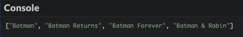

# Descubre la programación funcional

La programación orientada a objetos, aunque bastante popular, no es la única forma de crear programas. Este capítulo te introducirá a otro importante paradigma: la programación funcional.

## TL;DR

* **La programación funcional** se trata de escribir programas combinando funciones que expresen *qué* debería hacer un programa, en lugar de *cómo* hacerlo (que es la forma imperativa).

* El **estado** de un programa es el valor de sus **variables globales** en un momento dado. Un objetivo de la programación funcional es minimizar las **mutaciones** (cambios) de estado que hacen más difícil comprender el código. Algunas posibles soluciones son declarar variables con `const` en lugar de `let`, dividir el código en funciones, y favorecer las variables locales sobre las globales.

* Una **función pura** depende únicamente de sus parámetros de entrada para calcular sus valores de retorno y no tiene **efectos secundarios**. Las funciones puras son más fáciles de comprender, combinar entre sí y depurar. La programación funcional favorece el uso de funciones puras siempre que sea posible.
  
* Los métodos `map()`, `filter()` y `reduce()` pueden reemplazar a los bucles para recorrer una matriz y permitirte programar de una manera funcional con matrices.

* Las funciones javascript pueden ser pasadas como cualquier otro valor: son **ciudadanas de primera clase**, permitiendo una programación funcional. Una función que trabaja con otra función (tomándola como parámetro o devolviéndola) es llamada **función de orden superior**.

* JavaScript es un lenguaje **multiparadigma**: puedes escribir programas usando un estilo de programación imperativo, orientado a objetos, o funcional.

## Contexto: una lista de películas

En este capítulo, comenzaremos con un programa ejemplo y lo mejoraremos poco a poco, sin añadirle ninguna funcionalidad nueva. Esta importante tarea de programación se llama **refactorización**.

Nuestro programa inicial es sobre películas recientes de Batman. La información se presenta en forma de una matriz de objetos, con cada objeto describiendo una película.

```js
const listaPeliculas = [
  {
  titulo: "Batman",
  año: 1989,
  director: "Tim Burton",
  ratingImdb: 7.6
  },
  {
  titulo: "Batman Returns",
  año: 1992,
  director: "Tim Burton",
  ratingImdb: 7.0
  },
  {
  titulo: "Batman Forever",
  año: 1995,
  director: "Joel Schumacher",
  ratingImdb: 5.4
  },
  {
  titulo: "Batman & Robin",
  año: 1997,
  director: "Joel Schumacher",
  ratingImdb: 3.7
  },
  {
  titulo: "Batman Begins",
  año: 2005,
  director: "Christopher Nolan",
  ratingImdb: 8.3
  },
  {
  titulo: "The Dark Knight",
  año: 2008,
  director: "Christopher Nolan",
  ratingImdb: 9.0
  },
  {
  titulo: "The Dark Knight Rises",
  año: 2012,
  director: "Christopher Nolan",
  ratingImdb: 8.5
  }
];
```

Y aquí está el resto del programa que usa esta información para mostrar algunos resultados sobre las películas. Revísalo, debe ser bastante auto explicativo.

```js
// Obtener los títulos de las películas
const titulos = [];
for (const pelicula of listaPeliculas) {
  titulos.push(pelicula.titulo);
}
console.log(titulos);

// Contar películas de Christopher Nolan
const listaPeliculasNolan = [];
for (const pelicula of listaPeliculas) {
  if (pelicula.director === "Christopher Nolan") {
    listaPeliculasNolan.push(pelicula);
  }
}
console.log(listaPeliculasNolan.length);

// Obtener los títulos de películas con rating IMDB mayor o igual a 7.5
const mejoresTitulos = [];
for (const pelicula of listaPeliculas) {
  if (pelicula.ratingImdb >= 7.5) {
    mejoresTitulos.push(pelicula.titulo);
  }
}
console.log(mejoresTitulos);

// Calcular el rating promedio de las películas de Christopher Nolan
let ratingSuma = 0;
let ratingPromedio = 0;
for (const pelicula of listaPeliculasNolan) {
  ratingSuma += pelicula.ratingImdb;
}
ratingPromedio = ratingSuma / listaPeliculasNolan.length;
console.log(ratingPromedio);
```


## Estado del programa

El programa anterior es un ejemplo de lo que se denomina **programación imperativa**.  En este paradigma, el programador da órdenes a la computadora a través de una serie de declaraciones que modifican el estado del programa. La programación imperativa se enfoca en describir **cómo** opera un programa.

El concepto de estado es uno importante. El **estado** de un programa es el valor de sus **variables globales** (variables accesibles en cualquier punto del código) en un momento dado. En nuestro ejemplo, las variables `listaPeliculas`, `titulos`, `listaPeliculasNolan`, `mejoresTitulos`, `ratingSuma` y `ratingPromedio` conforman el estado del programa. Cualquier asignación a alguna de estas variables es un cambio de estado, con frecuencia llamado **mutación**.

En la programación imperativa, el estado puede ser modificado en cualquier punto del código fuente. Esto es práctico, pero también puede llevar a errores o fallos desagradables y problemas de mantenimiento. A medida que un programa crece en tamaño y complejidad, se vuelve más fácil para el programador mutar una parte del estado por error y más difícil de monitorear los cambios de estado.

### Limitando mutaciones con variables `const`

Para disminuir el riesgo de mutaciones de estado accidentales, un primer paso es favorecer `const` sobre `let` siempre que sea aplicable para la declaración de variables. Una variable declarada con la palabra clave `const` ya no puede ser reasignada. Sin embargo, el contenido de las matrices y objetos aún puede ser mutado. Checa el siguiente código para más detalles.

```js
const n = 10;
const fruta = "Banana";
const obj = {
  miProp: 2
};
const animales = ["Elefante", "Tortuga"];

obj.miProp = 3; // Mutar una propiedad está bien incluso para un objeto const
obj.miOtraProp = "abc"; // Agregar una propiedad nueva está bien incluso para un objeto const
animales.push("Gorilla"); // Actualizar contenido está bien incluso para una matriz const

n++; // Ilegal
fruta = "naranja"; // Ilegal
obj = {}; // Ilegal
animales = ["Abeja"]; // Ilegal
```

### Dividir el programa en funciones

Otra solución es dividir el código fuente en subrutinas llamadas procedimientos o **funciones**. Este enfoque es llamado **programación procedimental** y tiene el beneficio de transformar algunas variables en **variables locales** que son visibles únicamente en el código de la subrutina.

Intentemos incorporar algunas funciones en nuestro código.

```js
// Obtener los títulos de las películas
const titulos = () => {
  const titulos = [];
  for (const pelicula of listaPeliculas) {
    titulos.push(pelicula.titulo);
  }
  return titulos;
};

const listaPeliculasNolan = [];

// Obtener películas de Christopher Nolan
const peliculasNolan = () => {
  for (const pelicula of listaPeliculas) {
    if (pelicula.director === "Christopher Nolan") {
      listaPeliculasNolan.push(pelicula);
    }
  }
};

// Obtener los títulos de películas con rating IMDB mayor o igual a 7.5
const mejoresTitulos = () => {
  const mejoresTitulos = [];
  for (const pelicula of listaPeliculas) {
    if (pelicula.ratingImdb >= 7.5) {
      mejoresTitulos.push(pelicula.titulo);
    }
  }
  return mejoresTitulos;
};

// Calcular el rating promedio de las películas de Christopher Nolan
const ratingPromedioNolan = () => {
  let ratingSuma = 0;
  for (const pelicula of listaPeliculasNolan) {
    ratingSuma += pelicula.ratingImdb;
  }
  return ratingSuma / listaPeliculasNolan.length;
};

console.log(titulos());
peliculasNolan ();
console.log(listaPeliculasNolan.length);
console.log(mejoresTitulos());
console.log(ratingPromedioNolan());
```

El estado de nuestro programa ahora está limitado a dos variables: `listaPeliculas` y `listaPeliculasNolan` (la última siendo necesaria en las funciones `peliculasNolan()` y `ratingPromedioNolan()`). Las otras variables ahora son locales en las funciones que son usadas, lo cual limita la posibilidad de una mutación de estado accidental.

Además, esta versión del programa es más fácil de comprender que la anterior. Las funciones con nombres apropiados ayudan a describir el comportamiento de un programa. Los comentarios ahora son menos necesarios que antes.

## Funciones puras

Solo con introducir algunas funciones en un programa no es suficiente para cumplir con el paradigma de programación funcional. También necesitamos usar funciones puras, siempre que sea posible.

Una **función pura** es una función que tiene las siguientes características:

* Sus valores de retorno dependen únicamente de sus parámetros de entrada. 
* No tiene efectos secundarios.

Un **efecto secundario** es un cambio en el estado del programa o una interacción con el mundo externo. Acceder a una base de datos o una declaración `console.log()` son ejemplos de efectos secundarios.

Ante la misma información, una función pura siempre producirá el mismo resultado. Por diseño, una función pura es independiente al estado del programa y no debe acceder a él.  Tal función debe aceptar **parámetros** para hacer algo útil. La única forma en que una función sin parámetros sea pura es que devuelva un valor constante.

Las funciones puras son más fáciles de comprender, combinar y depurar: contrario a sus contrapartes *impuras*, no hay necesidad de buscar afuera del cuerpo de la función para entenderlas. Aun así, en cualquier programa son necesarios varios efectos secundarios como mostrar un resultado al usuario o actualizar una base de datos. En programación funcional, lo importante es crear esos efectos secundarios solo en algunas partes del programa específicas y claramente identificadas. El resto del código debe ser escrito como funciones puras.

Optimicemos nuestro código ejemplo para introducir funciones puras.

```js
// Obtener los títulos de las películas
const titulos = peliculas => {
  const titulos = [];
  for (const pelicula of peliculas) {
    titulos.push(pelicula.titulo);
  }
  return titulos;
};

// Obtener películas de Christopher Nolan
const peliculasNolan = peliculas => {
  const peliculasNolan = [];
  for (const pelicula of peliculas) {
    if (pelicula.director === "Christopher Nolan") {
      peliculasNolan.push(pelicula);
    }
  }
  return peliculasNolan;
};

// Obtener los títulos de películas con rating IMDB mayor o igual a 7.5
const mejoresTitulos = peliculas => {
  const mejoresTitulos = [];
  for (const pelicula of peliculas) {
    if (pelicula.ratingImdb >= 7.5) {
      mejoresTitulos.push(pelicula.titulo);
    }
  }
  return mejoresTitulos;
};

// Calcular el rating promedio de una lista de películas
const ratingPromedio = peliculas => {
  let ratingSuma = 0;
  for (const pelicula of peliculas) {
    ratingSuma += pelicula.ratingImdb;
  }
  return ratingSuma / peliculas.length;
};

console.log(titulos(listaPeliculas));
const listaPeliculasNolan = peliculasNolan(listaPeliculas);
console.log(listaPeliculasNolan.length);
console.log(mejoresTitulos(listaPeliculas));
console.log(ratingPromedio(listaPeliculasNolan));
```

Ya que solo optimizamos, el resultado del programa aún es el mismo.

El estado del programa (`listaPeliculas` y `listaPeliculasNolan`) no ha cambiado. Sin embargo, todas nuestras funciones ahora son puras; en lugar de acceder al estado, usan parámetros para lograr su comportamiento deseado. Como un beneficio adicional, la función `ratingPromedio()` ahora puede calcular el rating promedio de cualquier lista de películas; se ha vuelto más **genérica**.

## Operaciones con matrices

La programación funcional se trata sobre escribir programas combinando funciones que expresen *qué* debe hacer el programa, en lugar de *cómo* hacerlo. JavaScript ofrece varios métodos relacionados con matrices que favorecen un estilo de programación funcional.

### El método `map()`

El método `map()` toma una matriz como parámetro y crea una nueva matriz con los resultados de invocar una función que se haya proporcionado en cada elemento de esta matriz. Un uso típico de `map()` es para reemplazar un bucle en el recorrido de una matriz.

Veamos a `map()` en acción.

La función asociada multiplica cada número de la matriz x 2

```js
const numeros = [1, 5, 10, 15];
// La función asociada multiplica cada número de la matriz por 2
const dobles = numeros.map(x => x * 2);

console.log(numeros); // [1, 5, 10, 15] (sin cambios)
console.log(dobles); // [2, 10, 20, 30]
```

Así es como nuestro `titulos()` podría ser reescrito usando  `map()`. Mira como la función del código ahora es más conciso y expresivo.

```js
// Obtener los títulos de las películas
const titulos = peliculas => {
  /* Código anterior
  const titulos = [];
  for (const pelicula of peliculas) {
  titulos.push(pelicula.titulo);
  }
  return titulos;
  */

  // Devolver una nueva matriz que contenga únicamente títulos de películas
  return peliculas.map(pelicula => pelicula.titulo);
};
```

### El método `filter()` 

El método `filter()` ofrece una manera de evaluar cada elemento de una matriz ante una función proporcionada. Unicamente los elementos que pasen esta evaluación serán añadidas a la matriz retornada.

Aquí tenemos un ejemplo de cómo usar `filter()`.

```js
const numeros = [1, 5, 10, 15];
// Conserva solo los números mayores que o igual a 10
const losGrandes = numeros.filter(x => x >= 10);

console.log(numeros); // [1, 5, 10, 15] (sin cambios)
console.log(losGrandes); // [10, 15]
```

Podemos usar este método en la función `peliculasNolan()`.

```js
// Obtener películas de Christopher Nolan
const peliculasNolan = peliculas => {
  /* Código anterior
  const peliculasNolan = [];
  for (const pelicula of peliculas) {
  if (pelicula.director === "Christopher Nolan") {
    peliculasNolan.push(pelicula);
  }
  }
  return peliculasNolan;
  */

  // Devolver una nueva matriz que contenga únicamente películas de Christopher Nolan
  return peliculas.filter(pelicula => pelicula.director === "Christopher Nolan");
};
```

Los métodos `map()` y `filter()` pueden ser usados conjuntamente para conseguir efectos de gran alcance. Observa esta versión nueva de la función `mejoresTitulos()`.

```js
// Obtener los títulos de películas con rating IMDB mayor o igual a 7.5
const mejoresTitulos = peliculas => {
  /* Código anterior
  const mejoresTitulos = [];
  for (const pelicula of peliculas) {
  if (pelicula.ratingImdb >= 7.5) {
    mejoresTitulos.push(pelicula.titulo);
  }
  }
  return mejoresTitulos;
  */

  // Filtrar las películas según el rating IMDB, después crea una matriz de títulos de películas
  return peliculas.filter(pelicula => pelicula.ratingImdb >= 7.5).map(pelicula => pelicula.titulo);
};
```

### El método `reduce()`

El método `reduce()` aplica una función proporcionada a cada elemento de la matriz con el fin de *reducirla* a un valor. Este método es típicamente usado para realizar cálculos en una matriz.

Aquí tenemos un ejemplo de reducción de una matriz a la suma de sus valores.

```js
const numeros = [1, 5, 10, 15];
// Calcular la suma de los elementos de la matriz
const suma = numeros.reduce((acum, valor) => acum + valor, 0);

console.log(numeros); // [1, 5, 10, 15] (sin cambios)
console.log(suma);     // 31
```

El método `reduce()` puede tomar varios parámetros:

* El primero es la función asociada a `reduce()` e invocado para cada elemento de la matriz. Esta toma dos parámetros: el primero es un **acumulador** que contiene el valor acumulado qué fue devuelto previamente en la última invocación de la función. El otro parámetro de la función es el elemento de la matriz.

* El segundo es el valor inicial del acumulador (a menudo 0).

Así es cómo se usa `reduce()` para calcular el rating promedio de una lista de películas.

```js
// Calcular el rating promedio de una lista de películas
const ratingPromedio = peliculas => {
  /* Código anterior
  let ratingSuma = 0;
  for (const pelicula of peliculas) {
    ratingSuma += pelicula.ratingImdb;
  }
  return ratingSuma / peliculas.length;
  */

  // Calcular la suma de todos los ratings IMDB de las películas
  const ratingSuma = peliculas.reduce((acum, pelicula) => acum + pelicula.ratingImdb, 0);
  return ratingSuma / peliculas.length;
};
```
Otra solución posible es calcular la suma del rating usando antes `map()` para reducir a una matriz que contenga solo ratings de películas.

```js
// ...
// Calcular la suma de todos los ratings IMDB de las películas
const ratingSuma = peliculas.map(pelicula => pelicula.ratingImdb).reduce((acum , valor) => acum + valor, 0);
// ...
```

## Funciones de orden superior

A lo largo de este capítulo, hemos aprovechado el hecho de que las funciones JavaScript puedan ser pasadas como cualquier otro valor. Decimos que las funciones son **ciudadanas de primera clase** en JavaScript, lo que significa que son tratadas igual que otros tipos de valor.

Gracias a su ciudadanía de primera clase, las funciones pueden ser combinadas, haciendo programas aún más expresivos y permitiendo un estilo de programación verdaderamente funcional. Una función que toma otra función como parámetro o devuelve otra función es denominada **función de orden superior**.

Revisa esta versión final de nuestro programa ejemplo.

```js
const titulos = peliculas => peliculas.map(pelicula => pelicula.titulo);
const deNolan = pelicula => pelicula.director === "Christopher Nolan";
const filtro = (peliculas, func) => peliculas.filter(func);
const buenRating = pelicula => pelicula.ratingImdb >= 7.5;
const ratings = peliculas => peliculas.map(pelicula => pelicula.ratingImdb);
const promedio = matriz => matriz.reduce((suma, valor) => suma + valor, 0) / matriz.length;

console.log(titulos(listaPeliculas));
const listaPeliculasNolan = filtro(listaPeliculas, deNolan);
console.log(listaPeliculasNolan.length);
console.log(titulos(filtro(listaPeliculas, buenRating)));
console.log(promedio(ratings(listaPeliculasNolan)));
```

Hemos definido funciones auxiliares que combinamos para lograr el comportamiento deseado. El código es conciso y autodescriptivo. Dado que toma la función de filtrado como un parámetro, nuestra propia función `filtro()` es un ejemplo de una función de orden Superior

## JavaScript: un lenguaje multiparadigma

El lenguaje JavaScript está lleno de paradojas. Ha sido célebremente [inventado en 10 días](https://www.w3.org/community/webed/wiki/A_Short_History_of_JavaScript), y ahora disfruta de una popularidad casi única en la historia de la programación. Su sintaxis se inspira en gran medida de lenguajes imperativos convencionales como C o Java, pero sus principios de diseño son más parecidos a lenguajes funcionales como [Scheme](https://es.wikipedia.org/wiki/Scheme).

La naturaleza multi paradigmática de JavaScript significa que puedes escribir código imperativo, orientado a objetos o funcional, elegir la herramienta correcta para el trabajo y aprovechar tu experiencia previa en programación. Como siempre, la diversidad es una fuente de flexibilidad y una fortaleza en última instancia.

## ¡Hora de programar!

### Películas más antiguas

Mejora el ejemplo del programa de películas de arriba para que muestre los títulos de películas lanzadas antes del año 2000, usando programación funcional.

```js
const listaPeliculas = [
  {
  titulo: "Batman",
  año: 1989,
  director: "Tim Burton",
  ratingImdb: 7.6
  },
  {
  titulo: "Batman Returns",
  año: 1992,
  director: "Tim Burton",
  ratingImdb: 7.0
  },
  {
  titulo: "Batman Forever",
  año: 1995,
  director: "Joel Schumacher",
  ratingImdb: 5.4
  },
  {
  titulo: "Batman & Robin",
  año: 1997,
  director: "Joel Schumacher",
  ratingImdb: 3.7
  },
  {
  titulo: "Batman Begins",
  año: 2005,
  director: "Christopher Nolan",
  ratingImdb: 8.3
  },
  {
  titulo: "The Dark Knight",
  año: 2008,
  director: "Christopher Nolan",
  ratingImdb: 9.0
  },
  {
  titulo: "The Dark Knight Rises",
  año: 2012,
  director: "Christopher Nolan",
  ratingImdb: 8.5
  }
];

// PENDIENTE: hacer una matriz con los títulos de películas lanzadas antes del 2000

console.log(pelisAntes2000);
```



### Formas de gobierno

Completa el siguiente programa para procesar y mostrar los nombres de sistemas políticos que terminan con `"cia"`.

```js
const formasGobierno = [
  {
    name: "Plutocracia",
    definition: "Gobierno de los ricos"
  },
  {
    name: "Oligarquía",
    definition: "Gobierno de una cantidad reducida de personas"
  },
  {
    name: "Cleptocracia",
    definition: "Gobierno de los ladrones"
  },
  {
    name: "Teocracia",
    definition: "Gobierno de una elite religiosa"
  },
  {
    name: "Democracia",
    definition: "Gobierno del pueblo"
  },
  {
    name: "Autocracia",
    definition: "Gobierno de una sola persona"
  }
];

// PENDIENTE: procesar la matriz sistemasQueTermimanConCia

// Debe mostrar ["Plutocracia", "Cleptocracia", "Teocracia", "Democracia", "Autocracia"]
console.log(sistemasQueTermimanConCia);
```

### Suma de matrices

Completa el siguiente programa para calcular y mostrar la suma total de los valores en cada una de las matrices.

```js
const matrices = [[1, 4], [11], [3, 5, 7]];

// PENDIENTE: calcular el valor de la variable sumaMatrices

console.log(sumaMatrices); // Debe mostrar 31
```

### Resultados estudiantiles 

Aquí hay un programa que muestra resultados de estudiantes femeninas (nombre y calificación promedio).

```js
const estudiantes = [
  {
    nombre: "Anna",
    sexo: "f",
    calificaciones: [4.5, 3.5, 4]
  },
  {
    nombre: "Dennis",
    sexo: "m",
    pais: "Alemania",
    calificaciones: [5, 1.5, 4]
  },
  {
    nombre: "Martha",
    sexo: "f",
    calificaciones: [5, 4, 2.5, 3]
  },
  {
    nombre: "Brock",
    sexo: "m",
    calificaciones: [4, 3, 2]
  }
];

// Procesa resultados estudiantiles femeninos
const resultadosEstudiantesFemeninas = [];
for (const estudiante of estudiantes) {
  if (estudiante.sexo === "f") {
    let sumaCalificaciones = 0;
    for (const calificacion of estudiante.calificaciones) {
      sumaCalificaciones += calificacion;
    }
    const calificacionPromedio = sumaCalificaciones / estudiante.calificaciones.length;
    resultadosEstudiantesFemeninas.push({
      nombre: estudiante.name,
      promedio : calificacionPromedio
    });
  }
}

console.log(resultadosEstudiantesFemeninas);
```

Optimizalo usando programación funcional. El resultado de ejecución debe mantenerse igual.


