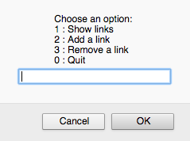
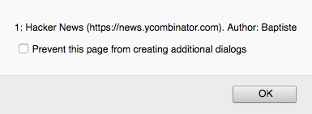
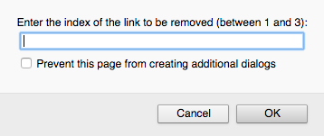

# Proyecto: un programa de noticias sociales

Ahora que has descubierto las bases de la programación, continuemos y construyamos un proyecto real. 

## Objetivo

La meta de este proyecto es crear un programa simple de noticias sociales. Sus usuarios podrán mostrar una lista de enlaces y añadir otros nuevos.

## Normas operativas

* Un enlace es definido por su título su URL y su autor (remitente).
* Si la URL de un nuevo enlace no empieza con `"http://"` o `"https://"`, se le agrega `"http://"` automáticamente al inicio.
* Al arranque el programa muestra un menú de inicio con las posibles acciones en una ventana de alerta y le solicita al usuario su elección. Las posibles acciones son:
  * Mostrar la lista de enlaces.
  * agregar un enlace nuevo.
  * Eliminar un enlace existente. 
  * Salir del programa.
* Al mostrar la lista de enlaces se muestra la posición (puesto) y las propiedades de cada enlace en una ventana de alerta, o un mensaje ante la inexistencia de enlaces.
* Al agregar un enlace, el programa solicita al usuario las propiedades del nuevo enlace (título, URL y autor). Después el enlace es creado. Posteriormente, debe aparecer en los enlaces mostrados.
* Al eliminar un enlace, se le solicita al usuario la posición del enlace hasta que esté es correcto. Después el enlace asociado es eliminado. Posteriormente, debe desaparecer de los enlaces mostrados. No es posible eliminar un enlace cuando no hay enlaces existentes.
* Después de que una acción es realizada, el menú de inicio se muestra de nuevo. Esto continúa así hasta que el usuario elige salir del programa.

## Normas técnicas

* Todo el código debe estar correctamente indentado.
* Los nombres deben ser elegidos atinadamente y adherirse a la convención camelCase.
* La duplicación de código debe ser evitada.

## Resultado esperado

Aquí hay algunas capturas de pantalla del resultado esperado.

