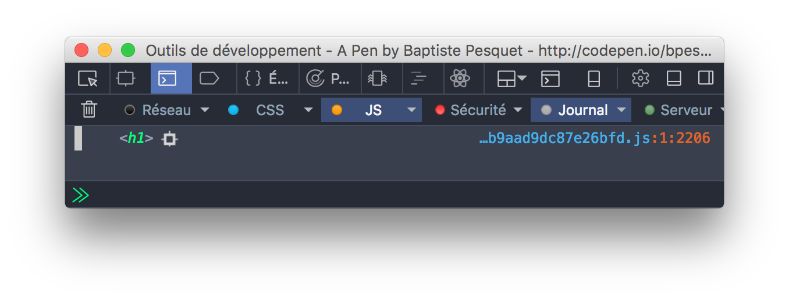

# Descubre el DOM

Este capítulo te ayudará a descubrir cómo se muestra una página web en un navegador.

## TL;DR

* Una **página web** es un documento estructurado que contiene tanto texto como etiquetas HTML. El **DOM**, o *modelo de documento por objetos*, es una manera estandarizada para definir la estructura de una página web.

* El DOM también es una **API** que permite interacciones programadas con la página web. Con JavaScript, puedes acceder a la estructura de una página mostrada en un navegador y modificarla.

* El DOM representa una página web como una jerarquía de **objetos**, donde cada objeto corresponde a un nodo en el árbol jerarquizado de elementos HTML. 

* La variable `document` proporciona acceso a la raíz del árbol del DOM y corresponde al elemento `<html>` en el mismo HTML.

* Los objetos del DOM tienen **propiedades** y **métodos** que puedes manipular con JavaScript. Por ejemplo, `nodeType` devuelve el tipo de nodo, `childNodes` contiene una colección de nodos secundarios, y `parentNode` devuelve el nodo primario.

## Introducción al DOM

Ya sabes que una página web es un documento que contiene texto y etiquetas tales como encabezados, párrafos, enlaces, etc. Esto sucede en un lenguaje llamado **HTML**.

Tomemos esta simple página web como ejemplo. ¡Puedes agregar tu propia información!

```html
<!doctype html>
<html>

<head>
    <meta charset="utf-8">
    <title>Mi página web</title>
</head>

<body>
    <h1>Mi página web</h1>
    <p>¡Hola! mi nombre es Baptiste.</p>
    <p>Vivo en la gran ciudad de <a href="https://es.wikipedia.org/wiki/Burdeos">Bordeos</a>.</p>
</body>

</html>
```


Para crear este resultado, el navegador primero toma el código HTML y construye una representación de su estructura. Después muestra esta estructura en el navegador.

El navegador también ofrece acceso **programado** a la representación estructurada de una página web que se visualiza. Usando está interfaz, puedes actualizar dinámicamente la página añadiendo o eliminando elementos, cambiando estilos, etc. Así es como creas páginas web **interactivas**.

A la representación estructurada de una página web se le llama **DOM**, abreviación del inglés Document Object Model, y traducido al español como *modelo de documento por objetos*. El DOM define la estructura de una página y una manera de interactuar con ella. Esto quiere decir que es una interfaz de programación, o **API** (*Application Programming Interface*). JavaScript es el lenguaje por excelencia para interactuar con el DOM.

> En los albores de la web, cada navegador usaba su propio DOM, provocando dolores de cabeza a los desarrolladores JavaScript al intentar programar páginas web. Estos tiempos duros han terminado. A través de un esfuerzo del [Consorcio World Wide Web](https://w3c.org) (W3C) la primera versión de un DOM unificado fue creado en 1998. Actualmente, todos los navegadores recientes usan un DOM estandarizado.

## Estructura de una página web

Una página web es un conjunto de etiquetas anidadas. Puedes representar una página web de una forma jerárquica llamada **árbol**. El elemento `<html>` configura tu documento como HTML y contiene dos sub elementos, `<head>` y `<body>`, que a su vez contienen varios sub elementos.

Este es el árbol correspondiente a nuestra página HTML de ejemplo.


Cada entidad en el árbol es llamada **nodo**. Hay dos tipos de nodos:

* Aquellos (aquí en azul) que corresponden a las etiquetas HTML como `<body>` o `<p>`. A estos nodos se les llama **nodos de elementos** y pueden tener sub nodos, llamados **nodos secundarios** o hijos.

* Esos (en rojo) que corresponden al contenido textual de la página. A esos nodos se les llama **nodos textuales** y no tienen hijos.

## Comienza a usar el DOM en JavaScript

El DOM representa una página web como una jerarquía de objetos, donde cada objeto corresponde a un nodo en el árbol jerarquizado de elementos HTML. Los objetos del DOM tienen **propiedades** y **métodos** que puedes manipular con JavaScript.

### Acceder al DOM con la variable `document`

Cuando un programa JavaScript se ejecuta en el marco de un navegador web, este puede acceder a la raíz del DOM usando la variable `document`. Esta variable corresponde al elemento `<html>`.

`document` es un objeto que tiene las propiedades `head` y `body` que permiten acceder a los elementos `<head>` and `<body>` de la página.

```js
const h = document.head; // la variable "h" contiene los contenidos del elemento head del DOM
const b = document.body; // la variable "b" contiene los contenidos del elemento body del DOM
```

### Descubre el tipo de nodo

Cada objeto tiene una propiedad llamada `nodeType` que indica su tipo. El valor de esta propiedad es `document.ELEMENT_NODE` para un nodo de "elemento" (también conocido como etiqueta HTML) y `document.TEXT_NODE` para un nodo de texto.

```js
if (document.body.nodeType === document.ELEMENT_NODE) {
  console.log("¡Body es un nodo de elemento!");
} else {
  console.log("¡Body es un nodo de texto!");
}
```


Como se esperaba, el objeto `body` del DOM es un nodo de elemento porque es una etiqueta HTML.

### Acceder al hijo de un nodo

Cada objeto de tipo elemento en el DOM tiene una propiedad llamada `childNodes`. Esta es una colección ordenada que contiene todos sus elementos secundarios como objetos DOM. Puedes usar esta colección de tipo matriz para acceder a los diferentes elementos secundarios de un nodo.

W> La propiedad `childNodes` de un nodo de elemento no es una matriz JavaScript real, sino más bien un objeto [NodeList](https://developer.mozilla.org/es/docs/Web/API/NodeList). No se le pueden aplicar todos los métodos convencionales de una matriz.

El siguiente código mostrará el primer hijo del nodo `body`.

```js
// Acceso al primer hijo del nodo body
console.log(document.body.childNodes[0]);
```


Q> Espera… ¿porque el primer hijo del nodo no es `h1`, dado que es el primer elemento en el HTML de body?

Eso es porque los espacios entre etiquetas y los saltos de línea en código HTML son considerados nodos de texto por el navegador. Por lo tanto, el nodo `h1` es el *segundo* nodo hijo de body. Verifiquemos eso:

```js
// Acceso al segundo hijo del nodo body
console.log(document.body.childNodes[1]);
```



Para eliminar estos nodos de texto entre las etiquetas, podrías haber escrito la página HTML de una manera más condensada.

```html
<body><h1>Mí página web</h1><!-- ... -->
```

Sin embargo, es mejor tener en cuenta los nodos de texto entre las etiquetas que sacrificar visibilidad y la indentación del código.

### Navega entre los nodos hijo

Para navegar una lista de nodos hijo puedes usar el clásico bucle `for`, el método `forEach()` o el bucle más nuevo `for-of` como se muestra a continuación:

```js
// Navega entre los hijos del nodo body usando un bucle for
for (let i = 0; i < document.body.childNodes.length; i++) {
  console.log(document.body.childNodes[i]);
}

// Navega entre los hijos del nodo body usando el método forEach()
document.body.childNodes.forEach(nodo => {
  console.log(nodo);
});

// Navega entre los hijos del nodo body usando un bucle for-of
for (const nodo of document.body.childNodes) {
  console.log(nodo);
}
```

Cada una de estas técnicas da el siguiente resultado.


Nuevamente, los espacios y saltos de línea cuentan como nodos de texto en el DOM.

### Accede al nodo padre

Cada objeto DOM tiene una propiedad llamada `parentNode` que devuelve su nodo padre como un objeto DOM.

> Para el nodo raíz del DOM (`document`), el valor de `parentNode` es `null` dado que no tiene nodo padre.

```js
const h1 = document.body.childNodes[1];
console.log(h1.parentNode);       // Muestra el nodo body
console.log(document.parentNode); // Mostrara null, dado que body no tiene nodo padre
```


> Hay otras propiedades que no discutiremos aquí que te permiten navegar a través del DOM, como `firstChild`, `lastChild` o `nextSibling`.

## ¡Hora de programar!

### Mostrar el hijo de un nodo

Tú misión aquí es crear una función `mostrarHijo()` que muestre uno de los hijos de un nodo de tipo elemento del DOM. Está función toma como parámetros el nodo padre y la posición del nodo hijo. Casos de error como un nodo que no sea de tipo elemento o una posición que esté fuera de alcance deben ser considerados.

Aquí está el código HTML correspondiente.
Algún texto con un enlace
```html
<h1>Un título</h1>
<div>Algún texto con <a href="#">un enlace</a>.</div>
```

Completa el siguiente programa para obtener los resultados esperados.

```js
// Mostrar un nodo hijo de un objeto del DOM
// "nodo" es el objeto DOM
// "posicion" es la posición del nodo hijo
const mostrarHijo = (nodo, posicion) => {
  // PENDIENTE: añadir código aquí
};

// Debe mostrar el nodo h1
mostrarHijo(document.body, 1);

// Debe mostrar "Posición incorrecta"
mostrarHijo(document.body, -1);

// Debe mostrar "Posición incorrecta"
mostrarHijo(document.body, 8);

// Debe mostrar "Tipo de nodo incorrecto"
mostrarHijo(document.body.childNodes[0], 0);
```

> Usa `console.error()` en lugar de `console.log()` para mostrar mensajes de error en la consola.
