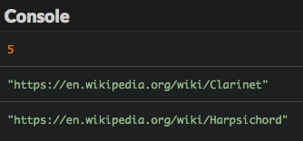

# Recorrer el DOM

En este capítulo, verás cómo usar JavaScript para recorrer el DOM.

## TL;DR

* En lugar de recorrer el DOM nodo por nodo. Puedes acceder rápidamente a uno o más elementos usando **métodos de selección**.

* Los métodos `getElementsByTagName()`, `getElementsByClassName()` y `getElementById()` buscan elementos por **nombre de etiqueta**, **clase**, e **ID** respectivamente. Los primeros dos métodos devuelven una lista, que puede convertirse a una matriz con `Array.from()`. El último método devuelve un solo elemento.

* Los métodos `querySelectorAll()` y `querySelector()` hacen posible buscar elementos usando un **selector CSS**. El primer método devuelve todos los elementos que coinciden, y el segundo devuelve solo el primer elemento.

* La propiedad `innerHTML` devuelve el **contenido HTML** de un elemento. La propiedad `textContent` devuelve su **contenido textual** sin ningún etiquetado HTML.

* Los métodos `getAttribute()` y `hasAttribute()` permiten el acceso a los **atributos** de un elemento. La propiedad `classList` y su método `contains()` ofrecen acceso a las **clases** de un elemento.

## Modelo de página web

Esta es la página web de ejemplo usada a lo largo de este capítulo.

```html
<h1>Las 7 maravillas del mundo</h1>
<p>¿Conoces las 7 maravillas del mundo?</p>
<div id="contenido">
    <h2>Maravillas del mundo antiguo</h2>
    <p>Está lista llega hasta nosotros desde tiempos antiguos.</p>
    <ul class="maravillas" id="antiguas">
        <li class="existe">La Gran Pirámide de Guiza</li>
        <li>Los Jardines Colgantes de Babilonia</li>
        <li>El Faro de Alejandría</li>
        <li>La Estatua de Zeus en Olimpia</li>
        <li>El Templo de Artemisa en Éfeso</li>
        <li>El Mausoleo de Halicarnaso</li>
        <li>El Coloso de Rodas</li>
    </ul>
    <h2>Maravillas del mundo moderno</h2>
    <p>Está lista fue hecha por votación.</p>
    <ul class="maravillas" id="nuevas">
        <li class="existe">Petra</li>
        <li class="existe">La Gran Muralla China</li>
        <Li class="existe">La estatua del Cristo Redentor</Li>
        <Li class="existe">Machu Picchu</Li>
        <li class="existe">Chichen Itza</li>
        <li class="existe">El Coliseo de Roma</li>
        <li class="existe">El Taj Mahal</li>
    </ul>
    <h2>Referencias</h2>
    <ul>
        <li><a href="https://es.wikipedia.org/wiki/Siete_maravillas_del_mundo_antiguo">Siete maravillas del mundo antiguo</a></li>
        <li><a href="https://es.wikipedia.org/wiki/Nuevas_siete_maravillas_del_mundo_moderno">Nuevas siete maravillas del mundo moderno</a></li>
    </ul>
</div>
```

## Seleccionar elementos

### Los límites de un recorrido nodo por nodo

En el capítulo anterior, viste cómo navegar la estructura de nodos DOM de una página web comenzando con el nodo raíz y usando la propiedad `childNodes` para bajar por los niveles de la estructura de la página.

Supongamos que quiere seleccionar el título `"Maravillas del mundo antiguo"` de nuestra página web. Considerando los nodos de texto entre cada elemento, este nodo es el segundo nodo hijo de los 6 nodos hijos del elemento `body`. Entonces podrías escribir algo así. 
Resultado de ejecución
```js
// Muestra el elemento h2 "Maravillas del mundo antiguo"
console.log(document.body.childNodes[5].childNodes[1]);
```


Esta técnica es bastante rara y propensa a errores. El código es difícil de leer y debe ser actualizado sí posteriormente se insertan nuevos elementos en la página web. Afortunadamente hay soluciones mucho mejores.

### Seleccionar elementos según la etiqueta HTML

Todos los elementos DOM tienen un método llamado `getElementsByTagName()`. Este devuelve, en forma de objeto [NodeList](https://developer.mozilla.org/es/docs/Web/API/NodeList), una lista de elementos que tienen el nombre de la etiqueta que fue pasado como parámetro. La búsqueda pasa por todos los sub elementos del nodo en el que fue invocado el método -- no solo en sus hijos directos.


Con el método `getElementsByTagName()` seleccionar el primer elemento `h2` se vuelve bastante fácil:

```js
// Insertar todos los elementos h2 en una matriz
const elementosDeTitulo = document.getElementsByTagName("h2");

console.log(elementosDeTitulo[0]);     // Muestra el primer h2
console.log(elementosDeTitulo.length); // 3 (número total de elementos h2 en la página)
```


T> Nombrar a las variables JavaScript asociados con los nodos de elemento del DOM con el prefijo `elemento` (o `elementos` cuando la variable contiene varios nodos) es una convención de nomenclatura popular. Nos apegaremos a esta a lo largo de este libro.

### Seleccionar elementos según la clase

Los elementos DOM también cuentan con un método llamado `getElementsByClassName()`. Este método devuelve un objeto `NodeList` de elementos con el nombre de la clase como parámetro. De nuevo, la búsqueda cubre todos los sub elementos del nodo en el que fue invocado el método.

Es importante señalar que los objetos `NodeList` no son matrices JavaScript reales, así que no todas las operaciones de una matriz les son aplicables. Para convertir un objeto `NodeList` en una matriz usa el método `Array.from()`.

Para seleccionar y mostrar todos los elementos del documento con la clase `"existe"`,puedes escribir el siguiente código.

```js
// Muestra todos los elementos que tienen la clase `"existe"`
const elementosExistentes = Array.from(document.getElementsByClassName("existe"));
elementosExistentes.forEach(elemento => {
  console.log(elemento);
});
```


### Seleccionar un elemento según su ID

Finalmente, la variable `document` dispone de un método llamado `getElementById()` que devuelve de entre todos los elementos del documento, el elemento con el ID especificado. Devuelve `null` si no puede hallar ningún elemento asociado.

El siguiente código selecciona y muestra la lista con el ID `"nuevas"`.

```js
// Muestra el elemento con el ID "nuevas"
console.log(document.getElementById("nuevas"));
```


E> Cuidado: a diferencia de otros, el método `getElementById()` no contiene ninguna `'s'` después de la palabra `"Element"`.

### Seleccionar elementos mediante selectores CSS

Para casos de uso más complejos, también puedes usar selectores CSS para acceder a los elementos del DOM.

Por ejemplo, digamos que quieres tomar todos los elementos `<li>` de maravillas que son antiguas y que aún existen.

```js
// Todas las maravillas "antiguas" que aún existen
console.log(document.getElementById("antiguas").getElementsByClassName("existe").length); // 1
```

No obstante, esta sintaxis es un poco anticuada. Aprendamos dos métodos nuevos que hacen más fácil encontrar elementos.

El primero es `querySelectorAll()`, con el cual puedes usar selectores CSS para identificar elementos.

```js
// Todos los párrafos
console.log(document.querySelectorAll("p").length); // 3

// Todos los párrafos dentro del bloque con ID "contenido"
console.log(document.querySelectorAll("#contenido p").length); // 2

// Todos los elementos con la clase "existe"
console.log(document.querySelectorAll(".existe").length); // 8

// Todas las maravillas "antiguas" que aún existen
console.log(document.querySelectorAll("#antiguas > .existe").length); // 1
```

> Checa en la [Red de desarrolladores de Mozilla](https://developer.mozilla.org/es/docs/Web/CSS/CSS_Selectors)el manual sobre los diferentes selectores CSS disponibles.

El segundo método que usa selectores CSS se llama `querySelector()`. Trabaja igual que `querySelectorAll()` pero solo devuelve el primer elemento que coincide. Devuelve `null` si ningún elemento puede ser hallado.

```js
// Muestra el primer párrafo
console.log(document.querySelector("p"));
```


### Elegir un método de selección

Acabas de descubrir varias formas de seleccionar elementos del DOM. ¿Cómo escoges el correcto?

Puesto que usan selectores CSS, `querySelectorAll()` y `querySelector()`  podrían cubrir todas tus necesidades, pero quizás se ejecuten más [lento](https://programmerclick.com/article/51151045135/) que los otros.

He aquí las reglas generales que debe seguir.

| Número de elementos a obtener | Criterio de selección | Método a usar |
|---|---|---|
| Muchos | Por etiqueta | `getElementsByTagName()` |
| Muchos | Por clase | `getElementsByClassName()` |
| Muchos | Ni por etiqueta ni por clase | `querySelectorAll()` |
| Solo uno | Por ID | `getElementById()` |
| Solo uno (el primero) | No por ID | `querySelector()` |

## Obtener información sobre los elementos

El DOM también ofrece información sobre los elementos que acabas de seleccionar.

### Contenido HTML

La propiedad `innerHTML` recuperará el contenido HTML de tu elemento DOM.

```js
// El contenido HTML del elemento DOM con el ID "contenido"
console.log(document.getElementById("contenido").innerHTML);
```


> Esta propiedad ha sido introducida por Microsoft y no es parte de las especificaciones del DOM de la W3C, pero no obstante es soportada por todos los principales navegadores.

### Contenido textual

La propiedad `textContent` devuelve todo el contenido de texto de un elemento DOM, sin ninguna etiqueta HTML.

```js
// El contenido textual del elemento DOM con el ID "contenido"
console.log(document.getElementById("contenido").textContent);
```


### Atributos

El método `getAttribute()` puede ser aplicado a un elemento DOM y devolverá el valor de un atributo determinado.

```js
// Muestra el atributo href del primer enlace
console.log(document.querySelector("a").getAttribute("href"));
```


Algunos atributos son directamente accesibles como propiedades. Esto es cierto para los atributos `id`, `href`, y `value`.

```js
// Muestra el atributo ID de la primera lista
console.log(document.querySelector("ul").id);

// Muestra el atributo href del primer enlace
console.log(document.querySelector("a").href);
```


Puedes verificar la existencia de un atributo usando el método `hasAttribute()`  como se puede ver en el siguiente ejemplo.

```js
if (document.querySelector("a").hasAttribute("target")) {
  console.log("El primer enlace tiene un atributo target.");
} else {
  console.log("El primer enlace no tiene un atributo target."); // Esto será mostrado
}
```

### Clases

En una página web, una etiqueta puede tener múltiples clases. La propiedad `classList`  recupera la lista de clases de un elemento DOM.

```js
// Lista de clases del elemento identificado como "antiguas"
const clases = document.getElementById("antiguas").classList;
console.log(clases.length); // 1 (puesto que el elemento solo tiene una clase)
console.log(clases[0]);     // "maravillas"
```

También tienes la oportunidad de comprobar la presencia de una clase en un elemento invocando el método `contains()` en la lista de clases, pasando la clase a comprobar como parámetro.

```js
if (document.getElementById("antiguas").classList.contains("maravillas")) {
  console.log("El elemento con el ID 'antiguas' tiene la clase 'maravillas'."); // Esto será mostrado
} else {
  console.log("El elemento con el ID 'antiguas' no tiene la clase 'maravillas'.");
}
```

> Esto solo es una parte de la API transversal del DOM. Para más información checa la [Red de desarrolladores de Mozilla](https://developer.mozilla.org/es/docs/Web/API/Element).

## ¡Hora de programar!

### Contar elementos

Aquí hay algo de código HTML (el contenido es del poeta francés Paul Verlaine).

```html
<h1>Mon rêve familier</h1>

<p>Je fais souvent ce rêve <span class="adjetivo">étrange</span> et <span class="adjetivo">pénétrant</span></p>
<p>D'une <span>femme <span class="adjetivo">inconnue</span></span>, et que j'aime, et qui m'aime</p>
<p>Et qui n'est, chaque fois, ni tout à fait la même</p>
<p>Ni tout à fait une autre, et m'aime et me comprend.</p>
```

Completa el siguiente programa escribiendo la función `contarElementos()`, que toma un selector CSS como parámetro y devuelve el número de elementos correspondientes..

```js
// PENDIENTE: escribe la función contarElementos() aquí

console.log(contarElementos("p"));              // Debe mostrar 4
console.log(contarElementos(".adjetivo"));     // Debe mostrar 3
console.log(contarElementos("p .adjetivo"));   // Debe mostrar 3
console.log(contarElementos("p > .adjetivo")); // Debe mostrar 2
```

### Gestionar atributos

He aquí la descripción de varios instrumentos musicales.

```html
<h1>Some musical instruments</h1>
<ul>
  <li id="clarinete" class="viento de madera">
    The <a href="https://es.wikipedia.org/wiki/Clarinete">clarinete</a>
  </li>
  <li id="saxofon" class="viento de madera">
    El <a href="https://es.wikipedia.org/wiki/Saxof%C3%B3n">saxofon</a>
  </li>
  <li id="trompeta" class="viento de metal">
    La <a https://es.wikipedia.org/wiki/Trompeta">trompeta</a>
  </li>
  <li id="violin" class="cordofono">
    El <a href="https://es.wikipedia.org/wiki/Viol%C3%ADn">violín</a>
  </li>
</ul>
```

Escribe un programa JavaScript que contenga una función `infoEnlace()` y que muestre:

* El número total de enlaces.
* El target del primer enlace y del último.

Esta función debe trabajar incluso si no hay enlaces.


Agrega el siguiente instrumento al final de la lista HTML, después checa el nuevo resultado de tu programa.

```html
<li id="clavicordio">
  El <a href="https://es.wikipedia.org/wiki/Clavicordio">clavicordio</a>
</li>
```



### Gestionar clases

Mejora el programa anterior agregando una función `tiene()` que comprueba si un elemento designado por su ID tiene una clase. La función muestra `cierto`, `falso` o un mensaje de error si el elemento no puede ser hallado.

```js
// Muestra si un elemento tiene una clase
const tiene = (id, algunaClase) => {
  // PENDIENTE: escribe el código de la función
};

has("saxofon", "viento de madera");     // Debe mostrar cierto
has("saxofon", "viento de metal");        // Debe mostrar falso
has("trompeta", "viento de metal");          // Debe mostrar cierto
has("contrabajo", "cordofono"); // Debe mostrar un mensaje de error
```

> Usa `console.error()` en lugar de `console.log()` para mostrar mensajes de error en la consola.


