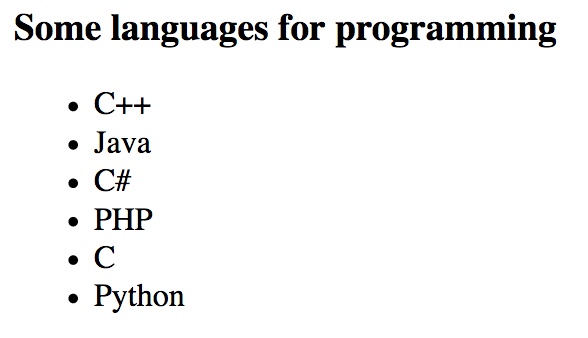
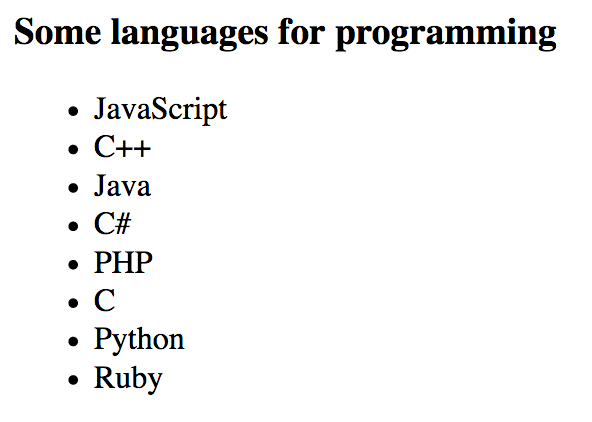
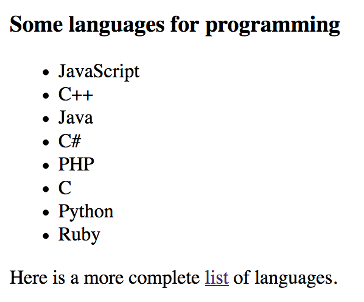
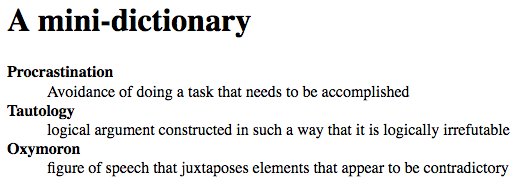

# Modificar la estructura de la página

¡Veamos cómo usar JavaScript para modificar una página web una vez que ha sido cargada por el navegador! De este modo puedes hacer tu contenido más dinámico e interactivo.

## TL;DR

* Las propiedades `innerHTML`, `textContent` y `classList`, así como el método `setAttribute`, te permiten modificar la información de un elemento del DOM.

* Creas nodos DOM nuevos a través de los métodos `createTextNode()` (para, claro, nodos de texto) y `createElement()` (para nodos de elemento).

* El método `appendChild()` té permite insertar un nodo nuevo como el último hijo de un elemento DOM.

* Los métodos `insertBefore()` y `insertAdjacentHTML()` son posibilidades alternativas para agregar contenido.


* Puedes reemplazar nodos existentes con el método `replaceChild()` o removerlos con `removeChild()`.

* La propiedad `style` de JavaScript representa el atributo `style` de un nodo DOM. Te permite modificar el estilo del elemento definiendo los valores de sus propiedades CSS.

* Las propiedades CSS que involucran múltiples palabras son escritas con **notacionCamello** cuando lidian con JavaScript. Por ejemplo, `font-family` se vuelve `fontFamily`.

* La propiedad `style` no nusca acceder al estilo de un elemento. En su lugar debes usar la función `getComputedStyle()`.

* La manipulación del DOM con JavaScript debe realizarse con moderación para que el rendimiento de la página no sufra.

## Modificar un elemento existente

Las propiedades para recorrer el DOM estudiadas en el capítulo anterior también pueden ser usadas para actualizar elementos en la página.

### Página de ejemplo

Los ejemplos en los siguientes párrafos usan el código HTML que se muestra enseguida.

```html
<h3 class="inicio">Algunos lenguajes</h3>
<div id="contenido">
    <ul id="lenguajes">
        <li id="cpp">C++</li>
        <li id="java">Java</li>
        <li id="csharp">C#</li>
        <li id="php">PHP</li>
    </ul>
</div>
```

### Contenido HTML

La propiedad `innerHTML` puede ser usada para cambiar el contenido de un elemento dentro del DOM.

Por ejemplo, puedes añadir un lenguaje nuevo a nuestra lista con el siguiente código. Accederemos a la etiqueta `<ul>` identificada como `"lenguajes"` y después añadiremos una entrada al final de la lista a través del operador (`+=`) y un `<li>`.

```js
// Modificar un elemento HTML: agregando un <li>
document.getElementById("lenguajes").innerHTML += '<li id="c">C</li>';
```


La propiedad `innerHTML` con frecuencia es usada para "vaciar" contenido. Intenta el siguiente ejemplo:

```js
// Elimina el contenido HTML de la lista, sustituyéndolo con nada
document.getElementById("lenguajes").innerHTML = "";
```

> Antes de continuar, elimina la línea de arriba de tu programa JavaScript. De lo contrario, ¡no tendrás contenido!

T> Cuando usas `innerHTML`, escribes contenido HTML como una cadena de caracteres. Para mantener tu código comprensible y evitar errores, solo deberías usar `innerHTML` para hacer cambios de contenido pequeños. Descubrirás soluciones más Versátiles a continuación.

### Contenido textual

Usa la propiedad `textContent` para modificar el contenido textual de un elemento del DOM. Aquí vemos como completar el título mostrado por nuestra página.

```js
// Modificación del contenido textual del título
document.querySelector("h3").textContent += " de programacion";
```


### Atributos

El método `setAttribute()` establece el valor del atributo de un elemento. Se pasa el nombre y el valor del atributo como parámetros

```js
// Define el atributo id del primer título
document.querySelector("h3").setAttribute("id", "titulo");
```

Como viste en el capítulo anterior, algunos atributos existen como propiedades y pueden ser actualizados directamente.

```js
// Define el atributo id del primer título
document.querySelector("h3").id = "titulo";
```

### Clases

¡Puedes usar la propiedad `classList` para añadir o eliminar clases de un elemento del DOM!

```js
const elementoTitulo = document.querySelector("h3"); // Toma el primer h3
elementoTitulo.classList.remove("inicio");        // Elimina la clase "inicio"
elementoTitulo.classList.add("titulo");               // Añade la clase llamada "titulo"
console.log(elementoTitulo);
```


## Añadir un nuevo elemento

Añadir un elemento nuevo a una página web puede ser dividida en tres pasos:

* Crear el elemento nuevo.
* Establecer las propiedades del elemento.
* Insertar el elemento nuevo en el DOM.

Por ejemplo, supón que quieres agregar el lenguaje "Python" a la lista de lenguajes de nuestra página. He aquí el código JavaScript que usarías para hacerlo.

```js
const elementoPython = document.createElement("li"); // Crea un elemento "li"
elementoPython.id = "python";          // Define el ID del elemento
elementoPython.textContent = "Python"; // Define su contenido de texto
document.getElementById("lenguajes").appendChild(elementoPython); // Inserta el elemento nuevo en el DOM
```



Estudiemos cada uno de estos pasos.

### Crear el elemento

Creas un elemento usando el método `createElement()` (sorprendente, ¡verdad!). Este método es usado en el objeto document y toma la etiqueta del nuevo elemento como parámetro. El método también devuelve el elemento creado como un objeto (aquí almacenado en una variable llamada `elementoPython`).

```js
const elementoPython = document.createElement("li"); // Crea un elemento "li"
```

### Establecer las propiedades del elemento

Una vez que el elemento es creado y almacenado en una variable, le puedes agregar algunos detalles (ID, clase, contenido textual, etc.) usando las propiedades DOM ya mencionadas.

En el ejemplo, el ID del elemento se convierte en `"python"` y su contenido textual queda como `"Python"`.

```js
// ...
elementoPython.id = "python";          // Define el ID del elemento
elementoPython.textContent = "Python"; // Define su contenido de texto
```

### Insertar el elemento en el DOM

Hay varias técnicas para insertar un nodo nuevo en el DOM. La más común es invocar el método `appendChild()` en el elemento que será el futuro padre del nodo nuevo. El nodo nuevo es añadido al final de la lista de nodos hijos de dicho padre.

En nuestro ejemplo, el nuevo elemento es añadido como un hijo nuevo de la etiqueta `<ul>` identificada como `"lenguajes"`, después de todos los otros hijos de esta etiqueta.

```js
// ...
document.getElementById("lenguajes").appendChild(elementoPython); // Inserta el elemento nuevo en el DOM
```

## Variaciones en la inserción de elementos

### Agregar un nodo de texto

En lugar de usar la propiedad `textContent` para definir el contenido textual del elemento nuevo, puedes crear un nodo de texto con el método `createTextNode()`. Después este no puede ser añadido al elemento nuevo con `appendChild()`.

El código siguiente demuestra esta posibilidad insertando el lenguaje Ruby al final de la lista.

```js
const elementoRuby = document.createElement("li"); // Crea un elemento "li"
elementoRuby.id = "ruby"; // Define el ID del elemento
elementoRuby.appendChild(document.createTextNode("Ruby")); // Define su contenido de texto
document.getElementById("lenguajes").appendChild(elementoRuby); // Inserta el elemento nuevo en el DOM
```


### Agregar un nodo antes de otro

En ocasiones, insertar un nodo nuevo al final de la lista de hijos de su padre no es lo ideal. En ese caso, puedes usar el método `insertBefore()`. Invocado en el futuro padre, este método toma como parámetros el nodo nuevo y el nodo antes del cual será insertado el nuevo.

Como ejemplo, así es como se podría insertar el lenguaje Perl antes de PHP en la lista.

```js
const elementoPerl = document.createElement("li"); // Crea un elemento "li"
elementoPerl.id = "perl"; // Define el ID del elemento
elementoPerl.textContent = "Perl"; // Define su contenido de texto
// Inserta el elemento nuevo antes del nodo "PHP"
document.getElementById("lenguajes").insertBefore(elementoPerl, document.getElementById("php"));
```


### Determinar la posición exacta del nodo nuevo

Hay un método para definir con mayor precisión la posición de elementos insertados: `insertAdjacentHTML()`. Se invoca en un elemento existente y se le pasa la posición y un texto de caracteres HTML que representan el contenido nuevo a ser añadido. La posición del contenido nuevo debe ser:

* `beforebegin`: antes del elemento existente.
* `afterbegin`: dentro del elemento existente, antes de su primer hijo.
* `beforeend`: dentro del elemento existente, después de su último hijo.
* `afterend`: después del elemento existente.

Así es como estas posiciones se traducen respecto a una etiqueta `<p>` existente.

```html
<!-- beforebegin -->
<p>
  <!-- afterbegin -->
  lo que sea
  <!-- beforeend -->
</p>
<!-- afterend -->
```

El siguiente ejemplo usa `insertAdjacentHTML()` para añadir JavaScript al principio de la lista de lenguajes.

```js
// Agrega un elemento al inicio de una lista
document.getElementById(lenguajes).insertAdjacentHTML("afterBegin", '<li id="javascript">JavaScript</li>');
```


## Sustituir o eliminar nodos

### Sustituir un nodo

Un elemento DOM puede ser sustituido con el método `replaceChild()`. Este sustituye un nodo hijo del elemento actual por otro nodo. El nuevo nodo y el nodo a ser reemplazado son pasados como parámetros (en ese orden).

Este ejemplo muestra la sustitución del lenguaje Perl por Lisp.

```js
const elementoLisp = document.createElement("li"); // Crea un elemento li
elementoLisp.id = "lisp";          // Define su ID
elementoLisp.textContent = "Lisp"; // Define su contenido de texto
// Sustituye el elemento identificado como "perl" por el nuevo elemento
document.getElementById("lenguajes").replaceChild(elementoLisp, document.getElementById("perl"));
```


### Eliminar un nodo

Finalmente, puedes eliminar un nodo gracias al método llamado `removeChild()`, al cual le pasas el nodo a ser eliminado como parámetro.

```js
// Elimina el elemento con el ID "lisp"
document.getElementById("lenguajes").removeChild(document.getElementById("lisp"));
```



## Dar estilo a elementos

JavaScript no solo te permite interactuar con la estructura de una página web, también te deja cambiar el estilo de elementos. Es hora de aprender cómo.

Este es el ejemplo de contenido HTML usado en los siguientes párrafos.

```html
<p>Primero</p>
<p style="color: green;">Segundo</p>
<p id="parra">Tercero</p>
```

Y aquí está la **hoja de estilos** CSS asociada. Las reglas en una hoja de estilos determinan la apariencia de los elementos de una página. Aquí, el único elemento que estamos ajustando a través de CSS es el elemento con el ID `para`. Su texto estará en azul y cursivas.

```css
#parra {
    font-style: italic;
    color: blue;
}
```


### La propiedad `style`

Los elementos DOM están equipados con una propiedad llamada `style`, la cual devuelve un objeto que representa él atributo `style` del elemento HTML. Las propiedades de este objeto corresponden a sus propiedades CSS. Al definir estas propiedades con JavaScript, en realidad estás modificando el estilo del elemento.

El siguiente código selecciona el primer párrafo de la página y modifica su color de texto y márgenes.

```js
const elementoParrafo = document.querySelector("p");
elementoParrafo.style.color = "red";
elementoParrafo.style.margin = "50px";
```

#### Propiedades CSS compuestas

Algunas propiedades CSS tienen nombres compuestos, lo cual significa que están integradas de dos palabras (como `background-color`). Para interactuar con estas propiedades a través de JavaScript, tienes que deshacerte del guión y poner en mayúscula la primera letra de las siguientes palabras.

Este ejemplo modifica las propiedades `font-family` y `background-color` del mismo elemento párrafo.

```js
// ...
elementoParrafo.style.fontFamily = "Arial";
elementoParrafo.style.backgroundColor = "black";
```


Está convención de nomenclatura, ya encontrado en capítulos previos es llamada [notacionCamello](https://es.wikipedia.org/wiki/Camel_case).

Puedes ver las propiedades CSS y sus propiedades JavaScript en la [Red de Desarrolladores de Mozilla](https://developer.mozilla.org/es/docs/Web/CSS/CSS_Properties_Reference).

### Los límites de la propiedad `style` 

Intentemos mostrar el color de texto de cada uno de nuestros párrafos de ejemplo.

```js
const elementosParrafos = document.getElementsByTagName("p");
console.log(elementosParrafos[0].style.color); // "red"
console.log(elementosParrafos[1].style.color); // "green"
console.log(elementosParrafos[2].style.color); // Muestra una cadena de caracteres vacía
```


¿Por qué no se muestra el color (azul) del tercer párrafo? 

Porque la propiedad `style` usada en este código solo representa el atributo `style` del elemento. Usando esta propiedad, no puedes acceder a las declaraciones de estilo definidas en otro lugar, por ejemplo en una hoja de estilos. Esto explica porque el estilo del tercer párrafo, definido externamente, no se muestra aquí.

### Acceder a los estilos de un elemento

Una mejor solución para acceder a los estilos de un elemento es usar una función llamada `getComputedStyle()`. Esta función toma un nodo DOM como parámetro y devuelve un objeto que representa el estilo del elemento. Así puedes ver las diferentes propiedades CSS del objeto.

El siguiente ejemplo mostrará las propiedades de estilo del tercer párrafo:

```js
const paragraphStyle = getComputedStyle(document.getElementById("para"));
console.log(paragraphStyle.fontStyle); // "italic"
console.log(paragraphStyle.color);     // color azul en valores RGB
```


> El color azul es representado como 3 valores de color: rojo, verde, y azul (RGB, por las siglas en inglés de Red, Green y Blue). Para cada uno de estos colores primarios, los valores siempre estarán entre o igual a 0 y 255.

## Manipulación del DOM y rendimiento

Actualizar el DOM a través de código JavaScript hace que el navegador procese la nueva presentación de la página. Manipulaciones frecuentes pueden llevar a ralentizaciones y un bajo nivel de rendimiento. Por lo tanto, debes mantener al mínimo los accesos al DOM y las operaciones de actualización.

Crear y establecer las propiedades de un elemento *antes* de que sean insertadas en el DOM es una buena forma de mantener el rendimiento.

```js
// Mal: el DOM es actualizado varias veces
const nuevoNodo = document.createElement(...); // Crea un elemento nuevo
parentNode.appendChild(nuevoNodo); // Lo añade al DOM
nuevoNodo.id = ...; // Establece algunas propiedades del elemento
nuevoNodo.textContent = "...";
// ...

// Mejor: el DOM solo es actualizado una vez
const nuevoNodo = document.createElement(...); // Crea un elemento nuevo
nuevoNodo.id = ...; // Establece algunas propiedades del elemento
nuevoNodo.textContent = "...";
// ...
parentNode.appendChild(nuevoNodo); // Lo añade al DOM
```

## ¡Hora de programar!

### Añadir un párrafo

Mejora el ejemplo de los lenguajes agregando un párrafo (etiqueta `<p>`) que contenga un link (etiqueta `<a>`) a la URL <https://es.wikipedia.org/wiki/Anexo:Lenguajes_de_programación>.



### Lista de periódicos

Aquí está el código HTML de una página web.

```html
<h3>Algunos periódicos</h3>
<div id="contenido"></div>
```

Escribe un programa que muestre en la página una lista de periódicos establecidos en una matriz JavaScript. Cada enlace debe ser cliqueable.

```js
// Lista de periódicos
const periodicos = ["https://www.nytimes.com", "https://www.washingtonpost.com", "http://www.economist.com"];
```


### Mini diccionario

Aquí está el código HTML de una página web.

```html
<h3>Un mini diccionario</h3>
<div id="contenido"></div>
```

Escribe un programa que muestre en la página una lista de términos y definiciones establecidos en una matriz JavaScript.

```js
const words = [{
  term: "Procastinación",
  definition: "Evitar la realización de una tarea que necesita ser completada"
}, {
  term: "Tautología",
  definition: "argumento lógico construido de tal forma que es irrefutable lógicamente"
}, {
  term: "Oxímoron",
  definition: "figura retórica que yuxtapone elementos que parecen ser contradictorios"
}];
```

Usa la etiqueta HTML `<dl>` para crear la lista ([más información sobre esta etiqueta](https://developer.mozilla.org/es/docs/Web/HTML/Element/dl)). A cada terminó del diccionario se le debe dar más importancia con una etiqueta `<strong>`.



### Updating colors

Actualizar colores

El siguiente contenido HTML define tres párrafos.

```html
<h1>Párrafo 1</h1>
<div>Lorem ipsum dolor sit amet, consectetur adipiscing elit. Donec dignissim fringilla dapibus. Curabitur placerat efficitur molestie. Quisque quis consequat nibh. Aenean feugiat, eros eget aliquam vulputate, leo augue luctus lectus, non lobortis libero quam non sem. Aliquam sit amet tincidunt ex, mollis interdum massa.</div>

<h1>Párrafo 2</h1>
<div>Vivamus at justo blandit, ornare leo id, vehicula urna. Fusce sed felis eget magna viverra feugiat eget nec orci. Duis non massa nibh. Aenean vehicula velit a magna lobortis tempor ut quis felis. Proin vitae dui a eros facilisis fringilla ut ut ante.</div>

<h1>Párrafo 3</h1>
<div>Lorem ipsum dolor sit amet, consectetur adipiscing elit. Duis sit amet pharetra massa. Nulla blandit erat nulla, et scelerisque libero varius ut. Praesent bibendum eu magna ullamcorper venenatis. Sed ut pellentesque leo. Sed ultrices sapien consequat odio posuere gravida.</div>
```

Escribe un programa que le pregunté al usuario por el nuevo color del texto, y después pregunte por el nuevo color de fondo. Luego la página es actualizada como corresponde.


### Información acerca de un elemento

Aquí está el código HTML del ejercicio.

```html
<div id="contenido">ABC
    <br>Tan fácil como
    <br>Uno, dos, tres
</div>
<div id="info"></div>
```

Y la hoja de estilos CSS asociada.

```css
#contenido {
    float: right;
    margin-top: 100px;
    margin-right: 50px;
}
```

Escribe un programa que agregue a la página una lista mostrando la altura y ancho del elemento identificado como "contenido".


