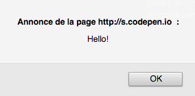
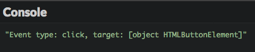
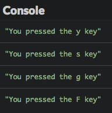
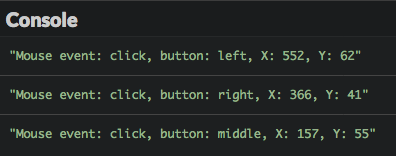
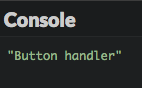
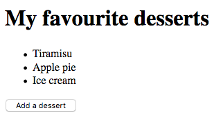

# Reaccionar a eventos

Para hacer una página web interactiva tienes que responder a las acciones del usuario. Descubramos cómo hacerlo.

## TL;DR

* Puedes hacer una página web interactiva escribiendo código JavaScript ligado a **eventos** dentro del navegador.

* Pueden ser manejados numerosos tipos de eventos. Cada tipo de evento está asociado con un objeto `Event` que contiene propiedades que proporcionan información acerca del evento.

* Los eventos `keypress`, `keydown` y `keyup` te permiten reaccionar a eventos relacionados con el teclado.

* Los eventos `click`, `mousedown` y `mouseup` te permiten reaccionar a eventos relacionados con el mouse.

* La apertura y cierre de una página están asociados con los eventos `load` y `beforeunload`, respectivamente.

* Un evento se propaga dentro del árbol DOM desde su nodo de origen hasta la raíz de document. Esta propagación puede ser interrumpida con el método `stopPropagation()`.

* Invocar el método `preventDefault()` en un objeto `Event`. Cancela el comportamiento predeterminado asociado con la acción que originó el evento.

## Introducción a los eventos

Hasta ahora, tu código JavaScript fue ejecutado desde el inicio. El orden de ejecución de las declaraciones fue establecido con anterioridad y las únicas interacciones del usuario fueron la introducción de información a través del método `prompt()`.

Para añadir más interactividad, la página debería reaccionar a las acciones del usuario: al hacer clic en un botón, rellenar un formulario, etc. En ese caso, el orden de ejecución de las declaraciones ya no es determinado con antelación, sino que depende del comportamiento del usuario. Sus acciones desencadenan **eventos** que pueden ser manejados escribiendo código JavaScript.

A esta forma de escribir programas se le llama **programación orientada a eventos**. Con frecuencia es usado por interfaces de usuario, y de forma más general cada que un programa necesita interactuar con un usuario.

### Un primer ejemplo

Aquí hay algo de código HTML para arrancar.

```html
<button id="miBoton">¡Haz clic!</button>
```

Y este es el código JavaScript asociado.

```js
const mostrarMensaje = () => {
  alert("¡Hola!");
};

// Acceder al botón
const elementoBoton = document.getElementById("miBoton");
// Detectar el evento "click"
elementoBoton.addEventListener("click", mostrarMensaje);
```
|
Al hacer clic en el botón de la página web se muestra un mensaje de `"¡Hola!"`.



### Agregar un detector de eventos

Invocado en un elemento DOM, el método `addEventListener()` añade un **controlador** para un evento en particular. Este método toma como parámetro el **tipo de evento** y la **función** asociada. Esta función es invocada siempre que un evento del tipo correspondiente aparece en el elemento DOM. 

El código JavaScript de arriba puede ser descrito de forma más concisa usando una función anónima, consiguiendo un resultado idéntico.

```js
// Muestra un mensaje cuando el usuario hace clic en el botón
document.getElementById("miBoton").addEventListener("click", () => {
  alert("¡Hola!");
});
```

### Remover un detector de eventos

En algunos casos particulares, quizás quieras dejar de reaccionar a un evento en un elemento DOM. Para lograr esto, invoca `removeEventListener()` en el elemento, pasándole como parámetro la función que era controlada por el evento.

> Esto solo puede funcionar si la función controladora no es anónima.

```js
// Remueve el controlador del evento click
elementoBoton.removeEventListener("click", mostrarMensaje);
```

## Familia de eventos

Los elementos DOM pueden desencadenar muchos tipos de eventos. Está es la principal clasificación de eventos.

| Categoría | Ejemplos |
|---|---|
| Eventos del teclado | Presionar o liberar una tecla |
| Eventos del ratón | Hacer clic en un botón del ratón, presionar o liberar un botón del ratón, pasar el cursor sobre una zona |
| Eventos de ventana | Cargar o cerrar una página, cambiar de tamaño, desplazarse |
| Eventos de formulario | Enfocar un campo de formulario diferente, enviar un formulario |


Cada evento está asociado a un objeto `Event` que tiene tanto **propiedades** (información sobre el evento) como **métodos** (formas de actuar ante el evento). Este objeto puede ser usado por la función controladora.

Muchas propiedades del objeto `Event` asociadas a un evento dependen del tipo de evento. Algunas propiedades siempre están presentes, cómo `type` que devuelve el tipo de evento y `target` que devuelve el objetivo del evento (el elemento DOM que origina el evento).

El objeto `Event` es pasado como un parámetro a la función controladora. El siguiente código usa este objeto para mostrar el tipo de evento y el objetivo en la consola.

```js
// Muestra el tipo de evento y el objetivo cuando el usuario hace clic en el botón
document.getElementById("miBoton").addEventListener("click", e => {
  console.log(`Event type: ${e.type}, target: ${e.target}`);
});
```

> El nombre del parámetro elegido para el objeto `Event` generalmente es `e` o `event`.



## Reaccionar a eventos comunes

### Pulsaciones de teclas

La solución más común para reaccionar a pulsaciones de teclas en un teclado implica la gestión de eventos `keypress` que suceden en una página web (el elemento `body` del DOM, que corresponde a la variable global llamada `document` en JavaScript).
          
El siguiente ejemplo muestra en la consola el carácter asociado a una tecla presionada. La información del carácter es proporcionada por la propiedad `charCode` del objeto asociado al evento. Esta propiedad devuelve un valor numérico (llamado **Valor Unicode**) que puede ser traducido a un carácter con el método `String.FromCharCode()`.

```js
// Mostrar el carácter presionado
document.addEventListener("keypress", e => {
  console.log(`Presionaste la tecla ${String.fromCharCode(e.charCode)}`);
});
```



Para manejar la pulsación y liberación de cualquier tecla (no solo las que producen caracteres) usaras los eventos `keydown` y `keyup`. Este ejemplo usa la misma función para manejar dos eventos. Esta vez, el código de la tecla es accesible mediante la propiedad `keyCode` del objeto `Event`.

```js
// Muestra información sobre un evento del teclado
const infoTeclado = e => {
  console.log(`Evento del teclado: ${e.type}, tecla: ${e.keyCode}`);
};

// Integra está función en la pulsación y liberación de una tecla:
document.addEventListener("keydown", infoTeclado);
document.addEventListener("keyup", infoTeclado);
```


Estos resultados demuestran que el orden de ejecución de los eventos relacionados con el teclado es como se indica continuación: `keydown` -> `keypress` -> `keyup`.

> `keydown` es lanzado varias veces cuando una tecla se mantiene presionada.

### Clics del ratón

Los clics del ratón en cualquier elemento del DOM producen un evento de tipo `click`. Las interfaces táctiles como las de teléfonos inteligentes y tabletas también tienen eventos `click` asociados con botones, los cuales de hecho, se inician al presionar un botón con el dedo.

El objeto `Event` asociado con un evento `click` tiene una propiedad `button` que te permite conocer el botón del mouse usado, así como las propiedades `clientX` y `clientY` que devuelven las coordenadas horizontales y verticales del punto donde ocurrió el clic. Estás coordenadas son definidas con relación a la zona de la página mostrada por el navegador en ese momento.


El siguiente código muestra información sobre todos los eventos click que suceden en una página web. La función `mouseInfo()` asociada al evento usa otra función, llamada `getMouseButton()`, para obtener el botón del mouse en el que se hizo clic.

```js
// Devuelve el nombre del botón del ratón
const conocerBotonRaton = codigo => {
  let boton = "desconocido";
  switch (codigo) {
    case 0: // 0 es el código para el botón izquierdo del ratón
      button = "izquierdo";
      break;
    case 1: // 1 es el código para el botón central del ratón
      button = "central";
      break;
    case 2: // 2 es el código para el botón derecho
      button = "derecho";
      break;
  }
  return boton;
};

// Mostrar información sobre un evento del ratón
const infoRaton = e => {
  console.log(
    `Evento del ratón: ${e.type}, botón: ${conocerBotonRaton(
      e.boton
    )}, X: ${e.clientX}, Y: ${e.clientY}`
  );
};

// Agregar detector de eventos click
document.addEventListener("click", infoRaton);
```



Puedes usar los eventos `mousedown` y `mouseup` de forma similar a `keydown` y `keyup` para lidiar con la con los eventos de pulsación y liberación de los botones del ratón. El siguiente código asocia el mismo controlador a estos dos eventos.

```js
// Controlar la pulsación y liberación de botones del ratón
document.addEventListener("mousedown", infoRaton);
document.addEventListener("mouseup", infoRaton);
```


El orden de aparición de los eventos relacionados con el ratón es: `mousedown` -> `mouseup` -> `click`.

### Carga de página

Dependiendo de qué tan compleja sea, puede tomar algo de tiempo para que una página web sea enteramente cargada por el navegador. Puedes añadir un detector de eventos en el evento `load` producido por el objeto `window` (que representa la ventana del navegador) para saber cuándo sucede esto. Esto evita situaciones problemáticas donde JavaScript interactúa con páginas que no están completamente cargadas.

El siguiente código muestra un mensaje en la consola una vez que la página está totalmente cargada.

```js
// Evento de carga de página web
window.addEventListener("load", e => {
  console.log("¡La página ha sido cargada!");
});
```

### Cierre de página

A veces quieres reaccionar al cierre de una página. El cierre sucede cuando el usuario cierra la pestaña que muestra la página o navega hacía otra página en esta pestaña. Un ejemplo de uso frecuente consiste en mostrar un diálogo de confirmación al usuario. El control del cierre de una página es realizado agregando un controlador al evento `beforeunload` en el objeto `window`.

```js
// Controlar cierre de página
window.addEventListener("beforeunload", e => {
  const mensaje = "¿Deberías quedarte o deberías irte?";
  // Forma habitual de mostrar un diálogo de confirmación
  e.returnValue = mensaje;
  // Forma específica del navegador de mostrar un diálogo de confirmación
  return mensaje;
});
```

> Establecer el valor de la propiedad `returnValue` en el objeto `Event` es la forma habitual de generar un diálogo de confirmación mostrando este valor. Sin embargo, algunos navegadores mejor usan el valor retornado del detector de eventos. El código anterior asocia las dos técnicas para ser universal.

## Ir más allá con eventos

### Propagación de eventos

El DOM representa a una página web como una jerarquía de nodos. Los eventos generados en un nodo hijo van a ser generados en el nodo padre, después en el nodo superior del nodo padre, hasta la raíz del DOM (la variable `document`). A esto se le llama **propagación de eventos**. 

Para ver la propagación en acción, usa este código HTML para crear una pequeña jerarquía DOM.

```html
<p id="parra">Un párrafo con un <button id="propa">botón</button> adentro</p>
```

Aquí está el código JavaScript complementario. Agrega controladores del evento `click` en el botón, su padre (el párrafo), y el padre de este también (la raíz del DOM).

```js
// Controlador de clics en el documento
document.addEventListener("click", e => {
  console.log("Controlador del documento");
});
// Controlador de clics en el párrafo
document.getElementById("parra").addEventListener("click", e => {
  console.log("Controlador del párrafo ");
});
// Controlador de clics en el botón
document.getElementById("propa").addEventListener("click", e => {
  console.log("Controlador del botón");
});
```


El resultado en la consola del navegador de muestra la programación de eventos `click`. Desde el botón hasta el nivel del document. Hiciste clic en el botón, lo cual significa que también hiciste clic en el párrafo, que a su vez significa que también hiciste clic en el document.

Pero quizás solo quieras iniciar un evento una vez que se hace clic en un botón sin contar su extenso ecosistema. La propagación de eventos puede ser interrumpida en cualquier momento invocando el método `stopPropagation()` en el objeto `Event` desde un controlador de eventos. Esto es útil para evitar la gestión del mismo evento múltiples veces.

Agregar una línea en el controlador de clics del botón previene que el evento `click` se propague por todas partes en el árbol DOM. 

```js
// Controlador de clics en el botón
document.getElementById("propa").addEventListener("click", e => {
  console.log("Controlador del botón");
  e.stopPropagation(); // Detiene la propagación del evento
});
```



### Cancelar el comportamiento predefinido de una acción

La mayoría de las acciones del usuario en una página están asociadas a un comportamiento predeterminado. Hacer clic en un enlace lleva al objetivo del enlace, hacer clic en cualquier lugar con el botón derecho del ratón muestra un menú contextual, etc. Cancelar un comportamiento predeterminado es posible invocando el método `preventDefault()` en el objeto `Event` en un controlador de eventos.

Usemos el siguiente código HTML para ver esta posibilidad en acción.

```html
<p>¿Tiempo libre? <a id="prohibido" href="https://9gag.com/">Haz clic aquí</a></p>
```

```js
// Controlando los clics en el enlace prohibido
document.getElementById("prohibido").addEventListener("click", e => {
  alert("Sí.. Pero no.");
  e.preventDefault(); // Cancela el comportamiento predeterminado
});
```

Ahora al hacer clic en el enlace se muestra un diálogo en lugar de navegar hacia su objetivo.


## ¡Hora de programar!

### Contar clics

```html
<button id="miBoton">¡Haz clic!</button>
<p>Hiciste clic en el botón <span id="conteoClics">0</span> veces</p>
<button id="desactivar">Desactivar conteo</button>
```

Escribe el código JavaScript que cuenta el número de clics en el botón `miBoton` y actualiza el elemento `conteoClics`. El botón `desactivar` detiene el conteo.

### Cambiar colores

Aquí hay algo de contenido HTML para empezar.

```html
<p>Presiona las teclas R (rojo), A (amarillo), V (verde) o A (azul) para cambiar el color de los párrafos respectivamente.</p>

<h1>Párrafo 1</h1>
<div>Lorem ipsum dolor sit amet, consectetur adipiscing elit. Donec dignissim fringilla dapibus. Curabitur placerat efficitur molestie. Quisque quis consequat nibh. Aenean feugiat, eros eget aliquam vulputate, leo augue luctus lectus, non lobortis libero quam non sem. Aliquam sit amet tincidunt ex, mollis interdum massa.</div>

<h1>Párrafo 2</h1>
<div>Vivamus at justo blandit, ornare leo id, vehicula urna. Fusce sed felis eget magna viverra feugiat eget nec orci. Duis non massa nibh. Aenean vehicula velit a magna lobortis tempor ut quis felis. Proin vitae dui a eros facilisis fringilla ut ut ante.</div>

<h1>Párrafo 3</h1>
<div>Lorem ipsum dolor sit amet, consectetur adipiscing elit. Duis sit amet pharetra massa. Nulla blandit erat nulla, et scelerisque libero varius ut. Praesent bibendum eu magna ullamcorper venenatis. Sed ut pellentesque leo. Sed ultrices sapien consequat odio posuere gravida.</div>
```

Escribe el código JavaScript correspondiente que actualice el color de fondo de todas las etiquetas `div` según la tecla (R, A, V o A) presionada por el usuario.


### Lista de postres

El siguiente código HTML define una lista de postres, vacía por ahora.

```html
<h1>Mis postres favoritos</h1>

<ul id="postres">
</ul>

<button id="botonAgregar">Añade un postre</button>
```

Escribe el código JavaScript que agrega un nuevo postre a la lista cuando el usuario hace clic en el botón. El nombre del postre es elegido por el usuario.

Puntos extra si se agrega la posibilidad de cambiar el nombre del postre cuando se hace clic en él.



### Cuestionario interactivo

Este es el código HTML inicial.

```html
<div id="contenido"></div>
```

Y el código JavaScript correspondiente que define una lista de preguntas.

```js
// Lista de preguntas (enunciado + respuesta)
const preguntas = [
  {
    enunciado: "2+2?",
    respuesta: "2+2 = 4"
  },
  {
    enunciado: "¿En qué año descubrió América Cristóbal Colón?",
    respuesta: "1492"
  },
  {
    enunciado:
      "¿Qué es lo que se repite una vez cada minuto, dos veces cada momento y nunca en cien años?",
    respuesta: "La letra M."
  }
];
```

Completa este código para mostrar las preguntas en el elemento `<div>` de la página, con un botón de `"Mostrar respuesta"` junto a cada pregunta. Al hacer clic en este botón este es reemplazado con la respuesta de esa pregunta.


