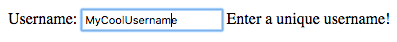
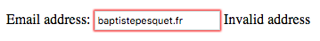
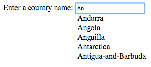

# Manipular formularios

JavaScript te permite administrar formularios definidos dentro de tu página web, con la finalidad de mejorar aún más la interactividad. 

## TL;DR

* Un **formulario** permite al usuario introducir información a través de una página web. La información introducida generalmente es enviada a un **servidor web**. Antes de que la información sea enviada, puedes usar JavaScript para interactuar con la información del formulario y validarla.

* Cada zona de texto (`input type="text">` o `<textarea>`) tiene una propiedad `value` para acceder al valor introducido.

* Cuando un campo de texto se vuelve el campo de introducción activo, este campo tiene el **enfoque**. Los eventos `focus` y `blur` se activan cuando un campo obtiene o pierde el enfoque, respectivamente. Los métodos `focus()` y `blur()` pueden actualizar el objetivo de enfoque mediante programación.

* Las casillas, botones de selección y listas desplegables generan eventos `change` cada vez que un usuario modifica su elección.

* El elemento DOM que corresponde al formulario tiene una propiedad `elements` que te permite acceder a sus campos de entrada mediante programación.

* Enviar un formulario genera un evento `submit` en el elemento formulario del DOM. Puedes prevenir el envío de la información del formulario al servidor usando el método `preventDefault()` en el objeto `Event` asociado.

* Cualquier modificación de un campo de texto genera un evento `input`, que puede ser usado para validar su información mientras el usuario la introduce.

* Una **expresión regular** es un patrón que puede ser comparado con cadenas de caracteres. Las expresiones regulares con frecuencias son usadas para realizar validaciones minuciosas de información de formularios.

## JavaScript y formularios

### Resumen sobre formularios 

Los formularios potencian a las páginas web permitiendo a los usuarios introducir información a través de campos de texto, casillas de selección, menús desplegables y más. Dentro de una página web, un formulario se define con una etiqueta HTML `<form>`, y dentro de esta etiqueta tienes tus diferentes etiquetas `<input>`, `<select>` o `<textarea>`.

> Si los formularios son totalmente nuevos para ti, la Red de Desarrolladores de Mozilla tiene una excelente introducción acertadamente llamada [Mi primer formulario HTML](https://developer.mozilla.org/es/docs/Learn/HTML/Forms/Your_first_HTML_form). Para un resumen más general sobre formularios checa este [artículo]( https://webdesign.tutsplus.com/es/tutorials/bring-your-forms-up-to-date-with-css3-and-html5-validation--webdesign-4738) en tutsplus.com.

### Gestionar formularios con JavaScript

La información introducida en un formulario por los usuarios normalmente es enviada a través de una red a un **servidor web** que procesa y envía una respuesta al navegador en forma de una página web nueva. Para hacer esto, los servidores web usan lenguajes de programación del lado del servidor como PHP o Ruby.

Gracias a JavaScript, puedes manejar formularios (y su información) directamente en el navegador *antes* de enviarlos a un servidor externo. Puedes notificar a los usuarios sobre introducción de información incorrecta, hacer sugerencias sobre lo que deben teclear, y más. ¿Quién dijo que los formularios eran aburridos?

## Campos de formulario

### Formulario de ejemplo

Comencemos con un formulario sencillo que le permite a los usuarios registrarse en un servicio.

```html
<form>
  <h1>Formulario de registro</h1>
  <p>
    <label for="nombreUsuario">Nombre de usuario</label>:
    <input type="text" name="nombreUsuario" id="nombreUsuario" required>
    <span id="apoyoNombreUsuario"></span>
  </p>
  <p>
    <label for="contraseña">Contraseña</label>:
    <input type="contraseña" name="contraseña" id="contraseña" required>
    <span id="apoyoContraseña"></span>
  </p>
  <p>
    <label for="correoElectronico">Correo electrónico</label>:
    <input type="email" name="correoElectronico" id="correoElectronico" required placeholder="usuario@dominio">
    <span id="apoyoCorreo"></span>
  </p>
  <p>
    <input type="checkbox" name="confirmacion" id="confirmacion">
    <label for="confirmacion">Envíenme un correo de confirmación</label>
  </p>
  <p>
    <input type="radio" name="subscripcion" id="salaprensa" value="infoprom">
    <label for="salaprensa">Subscribirme al boletín y promociones</label>
    <br>
    <input type="radio" name="subscripcion" id="info" value="info">
    <label for="info">Subscribirme solo al boletín</label>
    <br>
    <input type="radio" name="subscripcion" id="nada" value="nada" checked>
    <label for="nada">Sin subscripciones</label>
    <br>
  </p>
  <p>
    <label for="nacionalidad">Nacionalidad</label>:
    <select name="nacionalidad" id="nacionalidad">
      <option value="EU" selected>Estadounidense</option>
      <option value="FR">Frances</option>
      <option value="MX">Mexicano</option>
      <option value="XX">Otro</option>
    </select>
  </p>

  <input type="submit" value="Enviar">
  <input type="reset" value="Cancelar">
</form>
```


Este ejemplo contiene múltiples áreas de entrada: de texto, casillas, botones de selección, una lista desplegable así como botones para enviar y cancelar. Aprenderemos cómo manejar cada uno de estos elementos con JavaScript.

> Quizás hayas notado que la etiqueta `<form>` no tiene los atributos habituales `action` and `method`. Estos atributos te permiten definir la fuente del servidor cuando el formulario es enviado por el usuario. Dado que nuestro formulario solo será controlado por JavaScript en el navegador, no son necesarios.

###  Áreas de texto

#### Acceder a valores introducidos

Un **campo de texto** permite al usuario introducir texto en una sola línea o múltiples. Tienes dos opciones para definir campos de texto: un campo de texto de una sola línea se define como `<input type="text">` en HTML, en cambio un campo para introducir texto multilínea será definido mediante `<textarea>`.

Este es el fragmento del código anterior qué permite a los usuarios introducir un nombre de usuario.

```html
<label for="nombreUsuario">Nombre de usuario</label>:
<input type="text" name="nombreUsuario" id="nombreUsuario" required>
<span id="nombreUsuarioApoyo"></span>
```

En JavaScript, puedes acceder al valor de un campo de texto usando la propiedad `value` del elemento DOM correspondiente. Al establecer un valor nuevo para esta propiedad, modificarás el valor mostrado en el campo de texto.

El siguiente ejemplo inserta el valor "NombreDeUsuarioChido" en el campo de texto.

```js
// Define el valor del campo de entrada "nombreUsuario"
const elementoNombreUsuario = document.getElementById("nombreUsuario");
elementoNombreUsuario.value = "NombreDeUsuarioChido";
```

#### Controlar el enfoque

Cuando una zona de texto es seleccionada, se vuelve el área enfocada del formulario. Quizá has notado que los bordes del campo se vuelven azules u otros efectos cuando estás accediendo a una área de entrada en particular. Esto te ayuda a saber dónde estás en el formulario. Un usuario haciendo click en un campo de texto (o presionando la tecla Tab hacia este) da comienzo a un evento `focus`. Adicionalmente un evento `focus` desencadena un evento `blur`  en el campo que tenía el enfoque previamente.

Puedes usar estos eventos para mostrarle consejos al usuario relacionados con el campo de texto actual, como en el siguiente ejemplo:

```js
// Muestra una recomendación relacionada con el área de texto seleccionada
elementoNombreUsuario.addEventListener("focus", e => {
  document.getElementById("nombreUsuarioApoyo").textContent = "¡Ingresa un nombre de usuario único!";
});
// Oculta la recomendación cuando el usuario se mueve a un campo diferente
elementoNombreUsuario.addEventListener("blur", e => {
  document.getElementById("nombreUsuarioApoyo").textContent = "";
});
```

Al seleccionar el campo de entrada `nombreUsuario`, verás un mensaje útil en el HTML `<span>` definido específicamente para ese propósito e inicialmente vacío.



A partir de código JavaScript, puedes modificar el objetivo de enfoque invocando los métodos `focus()` (para dar enfoque) y `blur()` (para quitarlo) en un elemento DOM.

```js
// Darle enfoque al campo de entrada "nombreUsuario"
elementoNombreUsuario.focus();
```

Los campos de texto multilínea (etiquetas `<textarea>`) trabajan de forma similar a las etiquetas `<input>`.

> Aprenderás cómo validar texto que introduce un usuario (para asegurarte que se ajusta a ciertos criterios) más adelante en este capítulo.

### Elegir entre elementos

Con frecuencia ves elementos en formularios que permiten a los usuarios hacer una elección entre distintas posibilidades. Un evento `change` será iniciado una vez que un usuario cambie su elección.

#### Casillas de selección

Puedes añadir casillas a tu formulario HTML usando la etiqueta `<input type="checkbox">`.

Este es el código del formulario ejemplo que le ofrece al usuario la posibilidad de elegir entre recibir un correo de confirmación (o no).

```html
<input type="checkbox" name="confirmacion" id="confirmacion">
<label for="confirmacion">Envíenme un correo de confirmación</label>
```

Siempre que la casilla sea activada o desactivada por el usuario, un evento `change` es iniciado. El objeto `Event` asociado a este evento tiene una propiedad booleana `checked` que proporciona el nuevo estado del campo (activada o desactivada).

El código siguiente se encarga del evento `change` en la casilla para mostrar un mensaje en la consola.

```js
// Muestra si la casilla de correo de confirmación está activada
document.getElementById("confirmacion").addEventListener("change", e => {
  console.log(`Solicitud de correo de confirmación: ${e.target.checked}`);
});
```


#### Botones de selección

Los botones de selección permiten a los usuarios hacer una elección entre múltiples posibilidades. Puedes crear botones de selección con etiquetas `<input type="radio">`, que tienen el mismo atributo `name` y diferentes atributos  `value`. 

Este es el fragmento del formulario de ejemplo que permite al usuario elegir entre tres botones de selección, cada uno representando una opción de subscripción.

```html
<input type="radio" name="subscripcion" id="salaprensa" value="infoprom">
<label for="salaprensa">Subscribirme al boletín y promociones</label>
<br>
<input type="radio" name="subscripcion" id="info" value="info">
<label for="info">Subscribirme solo al boletín</label>
<br>
<input type="radio" name="subscripcion" id="nada" value="nada" checked>
<label for="nada">Sin subscripciones</label>
<br>
```

El siguiente código JavaScript añade un mensaje en la consola cuando la elección del botón de selección cambia.

```js
// Mostrar el tipo de subscripción elegida a través del botón de selección 
const elementosSubscripcion = Array.from(document.getElementsByName("subscripcion"));
elementosSubscripcion.forEach(element => {
  element.addEventListener("change", e => {
    console.log(`Subscripción elegida: ${e.target.value}`);
  });
});
```


La propiedad `target.value` del evento `change` coincide con el atributo `value` de la etiqueta `<input>` recientemente seleccionada.

#### Listas desplegables

Una lista desplegable es creada usando la etiqueta `<select>` (para el menú en general) en el cual puedes agregar etiquetas `<option>` para posibles opciones.

Este es el fragmento de código de arriba que permite a los usuarios elegir una nacionalidad:

```html
<label for="nacionalidad">Nacionalidad</label>:
<select name="nacionalidad" id="nacionalidad">
  <option value="EU" selected>Estadounidense</option>
  <option value="FR">Frances</option>
  <option value="MX">Mexicano</option>
  <option value="XX">Otro</option>
</select>
```

El siguiente código usa el evento `change` desencadenado en la lista desplegable para mostrar la nueva elección hecha por el usuario.

```js
// Mostrar la nacionalidad seleccionada
document.getElementById("nacionalidad").addEventListener("change", e => {
  console.log("Código de nacionalidad: " + e.target.value);
});
```


Así como con los botones de selección, la propiedad `target.value` del evento `change` corresponde al atributo `value` de la etiqueta `<option>` asociada con la nueva elección -- ¡no el texto mostrado en la lista desplegable!

## Formularios como elementos DOM

### Acceder a los campos de un formulario

Una etiqueta `<form>` corresponde a un elemento DOM. Este elemento tiene una propiedad `elements` que reúne todos los campos de llenado del formulario. Puedes usar esta propiedad para acceder a un campo a través de su atributo `name` o por su posición (orden de aparición en el formulario).

El ejemplo siguiente muestra algo de información sobre los campos de llenado de nuestro formulario de ejemplo.

```js
// Mostrar algo de información sobre el primer elemento formulario
const elementoFormulario = document.querySelector("form");
console.log(`Número de campos: ${formElement.elements.length}`); // 10
console.log(formElement.elements[0].name);       // "nombreUsuario"
console.log(formElement.elements.password.type); // "contraseña"
```

### Enviar un formulario

Un formulario será enviado cuando un usuario haga clic en el botón enviar, el cual tendrá una etiqueta `<input type="submit">`. Una etiqueta `<input type="reset">` muestra un botón que restablece la información del formulario.

He aquí dos botones del formulario de ejemplo.

```html
<input type="submit" value="Enviar">
<input type="reset" value="Cancelar">
```

Cuando un usuario envía un formulario, el comportamiento predeterminado del navegador es contactar a un servidor web y solicitar el recurso identificado por el atributo `action` de la etiqueta `<form>`, enviando la información del formulario en el proceso. Antes de esto, un evento `submit` es desencadenado en el elemento DOM correspondiente al formulario. Al agregar un controlador para este tipo de evento, puedes acceder a la información del formulario antes de que sea enviada. Puedes cancelar la solicitud al servidor invocando el método `preventDefault()` en el objeto `Event` asociado al evento.

El siguiente código muestra en la consola toda la información introducida por el usuario en el formulario, después cancela la solicitud al servidor.

```js
// Muestra toda la información introducida por el usuario y cancela el envío de información del formulario
formElement.addEventListener("submit", e => {
  const nombreUsuario = e.target.elements.nombreUsuario.value;
  const contraseña = e.target.elements.contraseña.value;
  const correoElectronico = e.target.elements.correoElectronico.value;
  console.log(`Nombre de usuario: ${nombreUsuario}, contraseña: ${contraseña}, correo electrónico: ${correoElectronico}`);

  if (e.target.elements.confirmacion.checked) {
    console.log("Solicitaste un correo de confirmación");
  } else {
    console.log("No solicitaste un correo de confirmación");
  }
  switch (e.target.elements.subscripcion.value) {
    case "infoprom":
      console.log("Estás subscrito al boletín y promociones");
      break;
    case "info":
      console.log("Estás subscrito solo al boletín");
      break;
    case "nada":
      console.log("No estás subscrito a nada");
      break;
    default:
      console.error("Código de suscripción desconocido");
  }
  switch (e.target.elements.nacionalidad.value) {
    case "EU":
      console.log("Hello! Eres un ciudadano estadounidense");
      break;
    case "FR":
      console.log("Bonjour! Eres un ciudadano francés");
      break;
    case "MX":
      console.log("Hola! Eres un ciudadano mexicano ");
      break;
    default:
      console.log("Tu nacionalidad es desconocida");
  }
  e.preventDefault(); // Cancelar el envío de información del formulario
});
```


## Validación de formulario

Checar la información introducida por los usuarios antes de que sea enviada al servidor es uno de los principales usos de JavaScript en los formularios web.  Usando validación de formularios, puedes mejorar la experiencia del usuario alertandolo inmediatamente sobre problemas con su información. Esto también es una forma eficiente de prevenir solicitudes innecesarias al servidor con información errónea.

La validación puede suceder de varias formas:

* mientras la información está siendo introducida;
* después de que la información fue introducida;
* cuando el usuario envía el formulario.

Esta última técnica solo implica agregar validación en el controlador del evento `submit` del formulario: ya sabes cómo hacer eso. Veremos las otras dos técnicas una a la vez, usando el mismo formulario de ejemplo que antes.

### Validación instantánea

La validación mientras un usuario está introduciendo información está basada en eventos `input`, que son desencadenados en una zona de introducción de datos cada vez que su valor cambia.

El siguiente ejemplo de código agrega un controlador de evento a la introducción de datos del campo contraseña. Este controlador revisa el tamaño (número de caracteres) de la contraseña que está haciendo tecleada y muestra un mensaje al usuario con un contenido y color específicos.

```js
// Validar tamaño de contraseña
document.getElementById("contraseña").addEventListener("input", e => {
  const contraseña = e.target.value; // Valor del campo contraseña
  let tamañoContraseña = "muy corta";
  let colorMensaje = "red"; // Contraseña corta => red
  if (password.length >= 8) {
    tamañoContraseña = "adecuado";
    colorMensaje = "green"; // Contraseña larga => green
  } else if (password.length >= 4) {
    tamañoContraseña = "moderado";
    colorMensaje = "orange"; // Contraseña moderada => orange
  }
  const elementoApoyoContraseña= document.getElementById("apoyoContraseña");
  elementoApoyoContraseña.textContent = `Tamaño: ${tamañoContraseña}`; // texto de ayuda
  elementoApoyoContraseña.style.color = colorMensaje; // color del texto de ayuda
});
```


### Validación posterior a la introducción

La introducción en una zona de texto se considera finalizada una vez que el enfoque se pierde en la zona, lo cual da inicio a un evento `blur` que puedes usar para generar la validación.

Imaginemos que quieres validar la presencia de un carácter `@` en la dirección de correo introducida por un usuario. Aquí está el código JavaScript que muestra está validación.

```js
// Revisando una dirección de correo una vez introducida
document.getElementById("correoElectronico").addEventListener("blur", e => {
  let validezCorreoElectronico = "";
  if (e.target.value.indexOf("@") === -1) {
    // el correo electrónico no contiene @
    validezCorreoElectronico = "Correo inválido";
  }
  document.getElementById("apoyoCorreo").textContent = validezCorreoElectronico;
});
```



### Expresiones regulares

Las validaciones previas eran bastante primitivas: muchas cadenas de caracteres que contienen un `@` no son direcciones de correo válidas. Para realizar revisiones más avanzadas, puedes usar una herramienta poderosa: **expresiones regulares**.

Una expresión regular define un **patrón** con el cual las cadenas de caracteres se comparan, buscando coincidencias. Muchos lenguajes de programación las soportan. Una adición poderosa al cinturón de herramientas de un programador, no obstante puede tomar algo de tiempo sentirse cómodo con ellas. Lo que sigue solo es una introducción al vasto territorio de las expresiones regulares.

Comencemos intentando crear una expresión regular que revise la presencia de un signo `@` dentro de una cadena de caracteres. Aquí está el código JavaScript asociado.

```js
const regex = /@/; // La cadena de caracteres debe contener @
console.log(regex.test(""));  // falso
console.log(regex.test("@")); // verdadero
console.log(regex.test("sophie&mail.fr")); // falso
console.log(regex.test("sophie@mail.fr")); // verdadero
```

Una expresión regular JavaScript es definida poniendo su patrón entre un par de signos `/`. Es un objeto cuyo método `test()` revisa coincidencias entre el patrón y la cadena de caracteres pasada como parámetro. Si se detecta una coincidencia este método devuelve`true` o `false` de lo contrario.

La siguiente tabla presenta algunas de las numerosas posibilidades ofrecidas por las expresiones regulares.

| Patrón | Coincide si | Coincide  | No coincide |
|---|---|---|---|
| `abc` | La cadena contiene `"abc"` | `"abc"`, `"abcdef"`, `"123abc456"` | `"abdc"`, `"1bca"`, `"adbc"`, `"ABC"` |
| `[abc]` | La cadena contiene ya sea `"a"`, `"b"` o `"c"` | `"abc"`, `"daef"`, `"bbb"`, `"12c34"` | `"def"`, `"xyz"`, `"123456"`, `"BBB"` |
| `[a-z]` | La cadena contiene una letra minúscula | `"abc"`, `"12f43"`, `"_r_"` | `"123"`, `"ABC"`, `"_-_"` |
| `[0-9]` or `\d` | La cadena contiene una cifra | `"123"`, `"ab4c"`, `"a56"` | `"abc"` |
| `a.c` | La cadena contiene una `"a"`, seguida de cualquier carácter, seguido por una `"c"`  | `"abc"`, `"acc"`, `"12a.c34"` | `"ac"`, `"abbc"`, `"ABC"` |
| `a\.c` | La cadena contiene `"a.c"` | `"a.c"`, `"a.cdef"`, `"12a.c34"` | `"ac"`, `"abc"` |
| `a.+c` | La cadena contiene una `"a"`, seguida de al menos un carácter, seguido por una `"c"` | `"abc"`, `"abbc"`, `"12a$ùc34"` | `"ac"`, `"bbc"` |
| `a.*c` | La cadena contiene una `"a"`, seguida de cero o más caracteres, seguidos por una `"c"`  | `"abc"`, `"abbc"`, `"ac"` | `"ABC"`, `"bbc"` |

Observar estos ejemplos nos lleva a las siguientes reglas:

* Los corchetes `[]` definen un intervalo de caracteres. Cualquier cadena de caracteres con al menos un carácter de este intervalo coincidirá con el patrón.

* Los patrones `[a-z]` y `[A-Z]` son usados para buscar la presencia de cualquier letra, minúscula o mayúscula respectivamente.

* Los patrones `[0-9]` y `\d` son esencialmente idénticos y coinciden con un dígito en una cadena de caracteres.

* El signo  `.` reemplaza un solo carácter. 

* El signo  `\` (*diagonal invertida*) indica que el siguiente carácter debe ser buscado como tal. Por ejemplo, `\.` es usado para coincidir con el signo `.` en sí mismo.

* El signo `+` corresponde a una o varias instancias de la expresión precedente.

* El signo `*` corresponde a cero, una o varias instancias de la expresión precedente.

T> El sitio <https://regex101.com> es útil para comprender, probar y depurar expresiones regulares.

Volvamos a nuestro ejemplo y revisemos el campo de dirección de correo. Aquí hay una posible expresión regular (entre muchas otras) para compararlo: `/.+@.+\..+/`.

Q> Antes de seguir leyendo, puedes descifrar este patrón para comprender ¿Cuáles son las condiciones que debe respetar una cadena de caracteres para coincidir con el?

Bien, aquí está la respuesta. Este patrón coincide con una cadena de caracteres que:

* Empieza con uno o varios caracteres  (`.+`).
* Después, contiene el signo `@` (`@`).
* Después, contiene uno o varios caracteres (`.+`).
* Después, contiene el signo `.` (`\.`).
* Termina con uno o varios caracteres (`.+`).

En otras palabras, cualquier cadena de caracteres con forma de `xxx@yyy.zzz` coincidirá con este patrón. Esta no es la forma definitiva de validar una dirección de correo, pero es un comienzo.

Mira cómo poner está solución en práctica.

```js
// Comprobar la validez del correo cuando el campo pierde el enfoque
document.getElementById("correoElectronico").addEventListener("blur", e => {
  // Coincidir con una cadena de caracteres en forma de xxx@yyy.zzz
  const correoExpreg = /.+@.+\..+/;
  let mensajeValidez = "";
  if (!correoExpreg.test(e.target.value)) {
    mensajeValidez = "Dirección inválida";
  }
  document.getElementById("apoyoCorreo").textContent = mensajeValidez;
});
```


## ¡Hora de programar!


### Verificador de contraseñas

Comienza con el siguiente código HTML.

```html
<form>
  <p>
    <label for="contraseña1">Ingresar contraseña</label>:
    <input type="password" name="contraseña1" id="contraseña1" required>
  </p>
  <p>
    <label for="contraseña2">Confirmar contraseña</label>:
    <input type="password" name="contraseña2" id="contraseña2" required>
  </p>

  <input type="submit" value="Enviar">
</form>

<p id="apoyoContraseña"></p>
```

Escribe el código JavaScript que valide la contraseña cuando el usuario envié el formulario. Las reglas de validación son las siguientes:

* Las dos contraseñas introducidas deben ser idénticas.
* La longitud mínima de la contraseña es de 6 caracteres. 
* La contraseña debe contener al menos un número.

El resultado de validación debe mostrarse en la página con un mensaje oportuno en cada caso.


### Lista de personajes

La serie Juego de tronos es sobre la lucha por el poder entre varias familias de la nobleza. En este ejercicio, tendrás que mostrar los personajes que pertenecen a la casa seleccionada por el usuario.

Este es el código HTML correspondiente.

```html
<h1>Algunos de los personajes de Juego de tronos</h1>
<form>
  <label for="casa">Casa</label>:
  <select name="casa" id="casa">
      <option value="" selected>Selecciona una casa</option>
  </select>
</form>

<p>
  <ul id="personajes"></ul>
</p>
```

El código de inicio JavaScript es el siguiente.

```js
// Lista de personajes. Cada casa tiene un nombre y un código
const casas = [
  {
    codigo: "ST",
    nombre: "Stark"
  },
  {
    codigo: "LA",
    nombre: "Lannister"
  },
  {
    codigo: "BA",
    nombre: "Baratheon"
  },
  {
    codigo: "TA",
    nombre: "Targaryen"
  }
];

// Devuelve una matriz de personajes que pertenecen a una casa
const obtenerPersonajes = codigoCasa => {
  switch (codigoCasa) {
    case "ST":
      return ["Eddard", "Catelyn", "Robb", "Sansa", "Arya", "Jon Snow"];
    case "LA":
      return ["Tywin", "Cersei", "Jaime", "Tyrion"];
    case "BA":
      return ["Robert", "Stannis", "Renly"];
    case "TA":
      return ["Aerys", "Daenerys", "Viserys"];
    default:
      return []; // Matriz vacía
  }
};
```

Completa la lista para que:

* La lista desplegable de casas sea llenada durante la carga de la página. 
* La lista de personajes sea mostrada cada vez que el usuario seleccione una nueva casa en la lista.


### Autocompletado

En este ejercicio, tendrás que asistir al usuario en la selección de un país. Mientras él teclea el nombre del país en un campo de texto, la página muestra una lista de los países correspondientes. Al hacer clic en uno de los países sugeridos se reemplaza el valor en el campo.

> Para mantener las cosas simples solo los países que empiezan con la letra `"A"` son considerados.

Este es el código HTML que crea el campo de texto.

```html
<label for="pais">Introduce el nombre de un país</label>:
<input type="text" id="pais">
<div id="sugerencias"></div>
```

El siguiente código CSS mejora la presentación de la página.

```css
/* Añade espacio entre cada sugerencia de país */
.sugerencia {
    padding-left: 2px;
    padding-right: 2px;
}

/* Cambia el color de la sugerencia cuando el puntero del mouse pasa sobre él */
.sugerencia:hover {
    background-color: #adf;
    cursor: pointer;
}

/* Coloca la lista de sugerencias justo debajo del campo de texto */
#sugerencias {
    position: absolute;
    border: 1px solid black;
    left: 155px;
}
```

Por último, el código JavaScript de inicio define la lista de países.

```js
// Lista de países
const listaPaises = [
  "Afganistán",
  "Albania",
  "Algeria",
  "Andorra",
  "Angola",
  "Anguila",
  "Antártida",
  "Antigua y Barbuda",
  "Argentina",
  "Armenia",
  "Aruba",
  "Australia",
  "Autria",
  "Azerbaiyán"
];
```

Completa este código para implementar el autocompletado de país.


