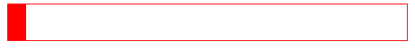
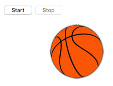

# Animar elementos

¡Este capítulo te va ayudar a iniciar con JavaScript para animaciones! Veremos cómo iniciar animaciones que deben ejecutarse repetidamente o deben detenerse en determinado punto.

## TL;DR

* La función `setInterval()` inicia una acción repetitiva y es invocada en intervalos regulares. La función `clearInterval()`  detiene una acción repetitiva que fue iniciada con `setInterval()`.

* La función `setTimeout()` ejecuta una vez una acción después de cierto plazo.

* La función `requestAnimationFrame()` solicita al navegador la ejecución de una función que actualiza una animación lo antes posible. Esto funciona bien para las animaciones en tiempo real. La función `cancelAnimationFrame()` detiene una animación en progreso que fue iniciada con `requestAnimationFrame()`.

* También puedes crear animaciones web a través de **CSS**.

## Repetir una acción en intervalos regulares

Empecemos con las animaciones aprendiendo cómo modificar repetidamente el contenido de un elemento. Este es el código HTML asociado.

```html
<h1 id="titulo">Esta página se autodestruirá en <span id="contador">10</span> segundo(s)...</h1>
```

Ahora el código JavaScript correspondiente.

```js
// Conteo regresivo del contador
const reducirContador = () => {
  // Convertir el texto del contador a un número
  const contador = Number(elementoContador.textContent);
  // Disminuir el contador de uno en uno
  elementoContador.textContent = contador - 1;
};

const elementoContador = document.getElementById("contador");

// Invocar la función reducirContador cada segundo (1000 milisegundos)
setInterval(reducirContador, 1000);
```

[Haz clic aquí] (https://codepen.io/bpesquet/pen/RVWLeY?editors=1010) para verlo en acción.  Funciona como esperabamos… bueno algo así: el contador nunca se detiene. Arreglaremos esto un poco más tarde.

### Iniciar una acción repetitiva

¿Cómo funcionó el ejemplo anterior? El código JavaScript define una función llamada `reducirContador()` que accede y disminuye de uno en uno el valor del elemento HTML denominado `contador`.

> Invocar `Number()` en el código de la función es obligatorio: convierte el carácter del contador en un número, lo cual le confiere la funcionalidad de sustracción.

La invocación de `setInterval()` desencadena una acción repetitiva. Esta función te permite invocar una función en intervalos regulares. Sus parámetros son la función a ejecutar y el tiempo en milisegundos entre cada ejecución. El valor retornado es un identificador para la acción repetitiva, que puede ser usado para modificarla posteriormente.

```js
// Establecer una acción repetitiva
const identificadorIntervalo = setInterval(funcionInvocada, tiempoEntreCadaInvocacion);
```

### Detener una acción repetitiva

Intentemos detener el contador una vez que la cuenta regresiva está completa. También modificaremos el texto de la página. Aquí está el código JavaScript para nuestro ejemplo, actualizado para producir nuestro resultado deseado:

```js
// Conteo regresivo del contador
const reducirContador = () => {
  // Convertir el texto del contador a un número
  const contador = Number(elementoContador.textContent);
  if (contador > 1) {
    // Disminuir el contador de uno en uno
    elementoContador.textContent = contador - 1;
  }
  else {
    // Cancelar la ejecución repetitiva 
    clearInterval(identificadorIntervalo);
    // Modificar el título de la página
    const titulo = document.getElementById("titulo");
    titulo.textContent = "BOOM!!";
  }
};

const elementoContador = document.getElementById("contador");

// Invocar la función reducirContador cada segundo (1000 milisegundos)
const identificadorIntervalo = setInterval(reducirContador, 1000);
```

[Haz clic aquí](https://codepen.io/bpesquet/pen/zwvEVz?editors=1010) para verlo en acción.

En la función `decreaseCounter()` solo reducimos el contador si el valor actual es mayor a 1. Si no es así, invocamos la función `clearInterval()` y después modificamos el título de la página.

La función `clearInterval()` te permite interrumpir la ejecución de código repetitivo. Toma como parámetro el identificador de la acción establecido al invocar `setInterval()`.

```js
// Cancela una acción repetitiva establecida con setInterval()
clearInterval(identificadorIntervalo);
```

## Iniciar una acción después de un tiempo

Imagina que quieres modificar el texto de la página después de su “explosión” en el ejemplo anterior. Modificarías nuestro ejemplo de la siguiente manera:


```js
// Conteo regresivo del contador hasta 0
const reducirContador = () => {
  // Convertir el texto del contador a un número
  const contador = Number(elementoContador.textContent);
  if (contador > 1) {
    // Disminuir el contador de uno en uno
    elementoContador.textContent = contador - 1;
  }
  else {
    // Cancelar la ejecución repetitiva
    clearInterval(identificadorIntervalo);
    // Modificar el título de la página
    const elementoTitulo = document.getElementById("titulo");
    elementoTitulo.textContent = "BOOM!!";
    // Modificar el título después de 2 segundos
    setTimeout(() => {
      elementoTitulo.textContent = "Ahora todo está destrozado :(";
    }, 2000);
  }
};

const elementoContador = document.getElementById("contador");

// Invocar la función reducirContador cada segundo (1000 milisegundos)
const identificadorIntervalo = setInterval(reducirContador, 1000);
```

[Haz clic aquí](https://codepen.io/bpesquet/pen/ybYPbb?editors=1010) para verlo en acción.

Una vez que la cuenta regresiva ha finalizado, invocamos la función `setTimeout()` para establecer un nuevo título de página después de un plazo de 2 segundos (2000 milisegundos).

La función `setTimeout()` te permite ejecutar una vez una función después de un plazo en particular, expresado en milisegundos.

```js
// Ejecuta una vez una acción, después de un plazo
setTimeout(funcionInvocada, tiempoAntesDeInvocacion);
```

## Animar elementos de una página

Las soluciones previas fueron prácticas para hacer a nuestras páginas un poco más dinámicas, pero no fueron suficientes para añadir animación en tiempo real. Veamos una solución con mejor rendimiento.

Tomemos como ejemplo, el movimiento de un elemento de tipo `<div>` de izquierda a derecha en la página. Comenzamos con el siguiente código HTML y CSS que muestra un bloque rojo en la página.

```html
<div id="marco">
  <div id="bloque"></div>
</div>
```

```css
#marco {
  border: 1px solid red;
}

#bloque {
  width: 20px;
  height: 40px;
  background: red;
  position: relative;
}
```

 

Y aquí está el código JavaScript que te permite mover el bloque rojo.

```js
// Mueve el bloque a la izquierda
const moverBloque = () => {
  // Convierte la posición izquierda del bloque (valor en forma de "XXpx") a un número 
  const bloqueX = parseFloat(getComputedStyle(elementoBloque).left);
  // Mueve el bloque a la derecha
  elementoBloque.style.left = (bloqueX + movimiento) + "px";
  // Hacer que el navegador invoque a moverBloque lo antes posible
  requestAnimationFrame(moverBloque);
};

const elementoBloque = document.getElementById("bloque");

// Valor del movimiento en píxeles
const movimiento = 7;

// Iniciar la animación
requestAnimationFrame(moverBloque);
```

[Haz clic aquí](https://codepen.io/bpesquet/pen/RVWxbW) para verlo en acción.

Después de la carga de la página, el bloque rojo se mueve (indefinidamente) de izquierda a derecha.

### Iniciar una animación

El código de ejemplo define una función llamada `moverBloque()` que mueve el bloque horizontalmente hacia la derecha. Esta toma la posición actual del borde izquierdo del bloque después le añade el valor contenido en la variable `movimiento`. Luego, el código invoca el método `requestAnimationFrame()` para mantener la animación corriendo.

Los valores de posición se escriben en píxeles. Estos son los caracteres que viste y que se parecen a "XXpx", lo cual requiere el uso de la función JavaScript `parseFloat()` para convertir valores numéricos antes de hacer cálculos.

> No uses `Number()` para convertir un carácter con `"px"` a un valor numérico. ¡Esto no funcionará y obtendrás un valor `NaN` (*Not a Number*) como resultado!

La función `requestAnimationFrame()` te permite solicitarle al navegador que ejecute una función lo antes posible, lo cual actualiza la animación. Es el trabajo del navegador hacer la animación tan fluida como sea posible. El valor devuelto de `requestAnimationFrame()` es un identificador para la animación, que puede ser usado para modificarlo más adelante

Así es como se usa `requestAnimationFrame()` combinada con una función de animación.

```js
const animar = () => {
    // Código de animación
    // ...
    // Al final de la animación, solicitar otra
    identificadorAnimacion = requestAnimationFrame(animar);
};

// Inicio de la animación
let identificadorAnimacion = requestAnimationFrame(animar);
```

### Detener una animación

Ahora veamos cómo detener el bloque antes de que alcance el borde del marco que lo contiene. Tendremos que verificar que la posición del borde izquierdo sea menor al ancho del marco, teniendo en mente el grosor del bloque en sí mismo.

Aquí está el código JavaScript actualizado.

```js
// Mueve el bloque a la derecha, hasta el final del marco
const moverBloque = () => {
  // Convierte la posición izquierda del bloque (valor en forma de "XXpx") a un número
  const bloqueX = parseFloat(getComputedStyle(elementoBloque).left);
  // Convierte el ancho del marco (valor en forma de "XXpx") a un número
  const xMax = parseFloat(getComputedStyle(frame).width);
  // Si el bloque todavía no está al final del marco
  if (bloqueX + bloqueAncho <= xMax) {
    // Movimiento del bloque
    elementoBloque.style.left = (bloqueX + movimiento) + "px";
    identificadorAnimacion = requestAnimationFrame(moverBloque);
  }
  else {
    // Cancelar la animación
    cancelarAnimacionMarco(identificadorAnimacion);
  }
};

const elementoBloque = document.getElementById("bloque");
// Convierte el ancho del bloque (valor en forma de "XXpx") a un número
const bloqueAncho = parseFloat(getComputedStyle(bloque).width);

// Valor del movimiento en píxeles
const movimiento = 7;

// Iniciar la animación
let identificadorAnimacion = requestAnimationFrame(moverBloque);
```

[Haz clic aquí](https://codepen.io/bpesquet/pen/rmOpZE) para verlo en acción.

La nueva función `moveBlock()` revisa si el bloque ha llegado al final del marcó antes de moverlo. Sí ese es el caso, la animación se detiene mediante una invocación a `cancelAnimationFrame()`.

La función `cancelAnimationFrame()` detiene la animación y toma el identificador de la animación establecido por una invocación previa de `requestAnimationFrame()`.

```js
// Detener una animación
cancelarAnimacionMarco(identificadorAnimacion);
```

###  Una alternativa: animaciones CSS

Acabas de descubrir las diferentes posibilidades que ofrece JavaScript para animar páginas web. Solo considera que hay otra alternativa: CSS.

> Este párrafo apenas roza la superficie de las animaciones CSS.

Revisemos cómo obtener un efecto similar al ejemplo anterior usando CSS en lugar de JavaScript. Elimina cualquier código JavaScript de tu ejemplo y modifica tu código CSS de la siguiente forma.

```css
#frame {
  border: 1px solid red;
}

#block {
  width: 20px;
  height: 40px;
  background: red;
  position: relative;
  margin-left: -20px; /* Margen negativo para simplificar los cálculos de la posición */
  animation-name: moverBloque; /* Nombre de la animación */
  animation-duration: 6s; /* Duración de la animación */
  animation-fill-mode: forwards; /* Dejar el bloque en su posición final */
}

@keyframes moverBloque {
  from {
    /* Posición inicial: a la izquierda del marco (considerando el margen negativo) */
    left: 20px;
  }
  to {
    /* Posición final: del lado derecho del marco (considerando el margen negativo) */
    left: 100%;
  }
}
```

[Haz clic aquí](https://codepen.io/bpesquet/pen/wdKyQb?editors=1100) para verlo en acción.

Este código define una animación CSS llamada `moverBloque()`, la cual mueve el bloque del lado izquierdo al derecho dentro del marco que lo contiene. El resultado es virtualmente idéntico al de la versión JavaScript.

## Escoger la técnica de animación correcta

Ahora, tiempo de decidir. ¿Cómo deberías escoger entre `setInterval()`, `requestAnimationFrame()`, o CSS para animar tu página? La respuesta depende de lo compleja que sea tu animación. En teoría, las animaciones CSS son más eficientes en cuanto a rendimiento, pero no puedes hacer todo con ellas.


Esta es la manera en la que tal vez quieras plantear tu decisión:

* Usa `setInterval()` si la animación no es en tiempo real y solo debería suceder en intervalos regulares.
* Prefiere CSS si la animación sucede en tiempo real y puede ser manejada con esta herramienta. 
* Usa `requestAnimationFrame()` para cualquier otro caso.

## Hora de programar!

### Cronómetro

Escribe una página web interactiva con un botón para iniciar y detener un cronómetro que cuenta el número de segundos transcurridos.

### Balón rebotador

La meta de este ejercicio es hacer rebotar un balón de básquetbol a través de la pantalla. Puedes descargar la imagen del balón [aquí](https://raw.githubusercontent.com/bpesquet/thejsway/master/resources/basketball.jpg).

Inicia con el siguiente contenido HTML y CSS. 

```html
<p>
  <button id="iniciar">Iniciar</button>
  <button id="detener" disabled>Detener</button>
</p>

<div id="marco">
  <!-- Actualiza el atributo "src" si descargaste la imagen localmente -->
  
</div>
```

```css
#balon {
    position: relative;
    left: 0px;
}
```

Escribe el código JavaScript que hace botar el balón horizontalmente.



Con tu solución, crea una variable con los valores 1 o -1 que determine la dirección en la que debe moverse el balón.