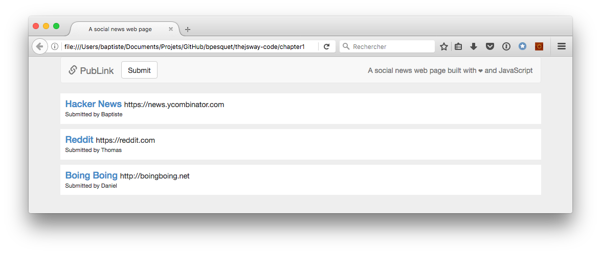
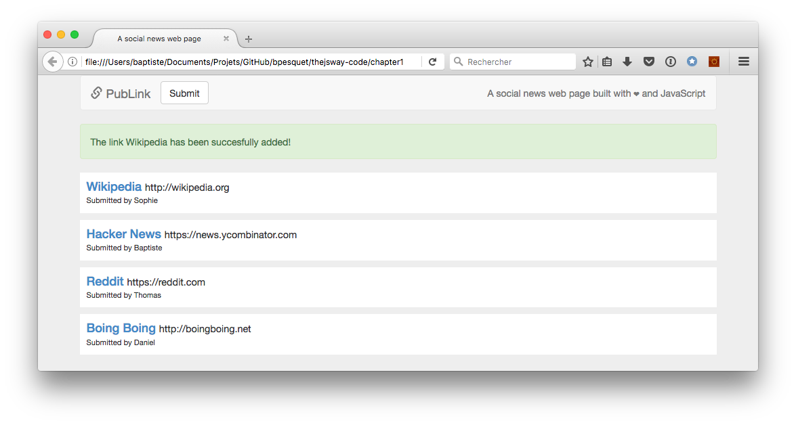

# Proyecto: una página web de noticias sociales

Ahora sabes suficiente de JavaScript y del DOM para continuar ¡y crear páginas web interactivas de verdad!

## Objetivo

Este proyecto toma como base el programa de noticias sociales que creaste previamente. Esta vez el objetivo es hacer una página web de noticias sociales.

> La idea general y el diseño de la página para este proyecto están inspirados en la aplicación de ejemplo del [libro Discover Meteor](http://www.discovermeteor.com/).

## Normas operativas

* Un enlace es definido por su título, su URL y su autor (remitente).
* Si la URL de un nuevo enlace no empieza con `"http://"` o `"https://"`, se le agrega `"http://"` automáticamente al inicio.
* La página web muestra una lista de al menos tres enlaces ya existentes.
* Existe un botón para que el usuario envié un enlace nuevo. Cuando se hace click en este, aparece un formulario antes de la lista de enlaces para introducir las nuevas propiedades del enlace (autor, título y URL).
* En este formulario, todos los campos del enlace son obligatorios.
* Cuando el enlace nuevo es validado por el usuario, se muestra al inicio de la lista de enlaces, reemplazando el formulario. Un mensaje indica el logro de la operación, luego desaparece después de dos segundos.

## Normas técnicas

* Deberías reusar cualquier código útil del proyecto anterior.
* Todo tu código debe estar correctamente indentado.
* Los nombres deben ser elegidos atinadamente y adherirse a la convención camelCase.
* La duplicación de código debe ser evitada.

## Código inicial

Dado que ante todo esté es un proyecto JavaScript, aquí está el código completo HTML y CSS de la página web. También está en línea como un [CodePen](https://codepen.io/bpesquet/pen/pPyxLG/).

> Esta página usa el framework [Bootstrap](http://getbootstrap.com/) para mejorar la presentación y hacerla responsiva. Sin embargo, el conocimiento de Bootstrap no es imperativo para lograr el resultado deseado. Puedes ignorarlo y escribir tu código.

```html
<!doctype html>
<html>

<head>
  <meta charset="utf-8">
  <!-- Latest compiled and minified CSS -->
  <link rel="stylesheet" href="https://maxcdn.bootstrapcdn.com/bootstrap/3.3.7/css/bootstrap.min.css">
  <link href="../css/publink.css" rel="stylesheet" type="text/css">
  <title>A social news web page</title>
</head>

<body>
  <div class="container">

    <!-- Bootstrap navigation bar -->
    <nav class="navbar navbar-default">
      <div class="container-fluid">
        <div class="navbar-header">
          <button type="button" class="navbar-toggle collapsed" data-toggle="collapse" data-target="#bs-example-navbar-collapse-1" aria-expanded="false">
            <span class="sr-only">Toggle navigation</span>
            <span class="icon-bar"></span>
            <span class="icon-bar"></span>
            <span class="icon-bar"></span>
        </button>
          <a class="navbar-brand" href="#"><span class="glyphicon glyphicon-link" aria-hidden="true"></span> PubLink</a>
        </div>
        <div class="collapse navbar-collapse" id="bs-example-navbar-collapse-1">
          <button type="button" id="submitButton" class="btn btn-default navbar-btn">Submit</button>
          <p class="navbar-text navbar-right">Una página web de noticias sociales creada con ❤ y JavaScript</p>
        </div>
      </div>
    </nav>

    <div id="content">
      <!-- Dynamic content goes here -->
    </div>

  </div>

  <!-- El código JavaScript va en este archivo -->
  <script src="../js/publink.js"></script>

  <!-- jQuery (necessary for Bootstrap's JavaScript plugins) -->
  <script src="https://ajax.googleapis.com/ajax/libs/jquery/1.12.4/jquery.min.js"></script>
  <!-- Include all compiled plugins (below), or include individual files as needed -->
  <script src="https://maxcdn.bootstrapcdn.com/bootstrap/3.3.7/js/bootstrap.min.js"></script>
</body>

</html>
```

```css
body {
  background-color: #eee;
}

/* Main link element (<div> tag) */
.link {
  background: white;
  padding: 10px;
  margin-bottom: 10px;
}

/* Link title (<a> tag) */
.linkTitle {
  color: #428bca;
  text-decoration: none;
  margin-right: 5px;
}
.linkTitle:hover {
  text-decoration: none;
}

/* Link URL (<span> tag) */
.linkUrl {
  font-weight: normal;
  font-size: 80%;
}

/* Link headline containing title & URL (<h4> tag) */
.linkHeadline {
  margin: 0;
}

/* Link author (<span> tag) */
.linkAuthor {
  font-weight: normal;
  font-size: 80%;
}

.linkForm {
  margin-bottom: 20px;
}
```

## Resultado esperado

Estas son algunas capturas de pantalla del resultado esperado.






