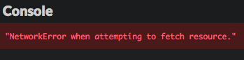
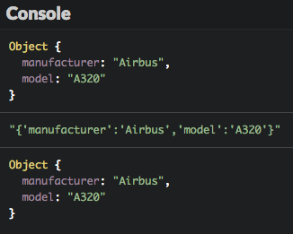
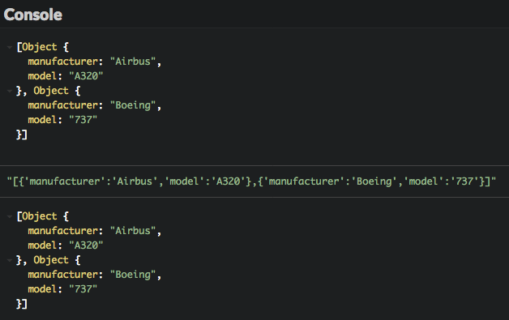
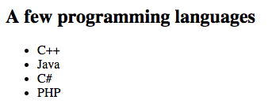

# Consulta un servidor web 

Este capítulo te enseñará cómo obtener información de un servidor web a través de solicitudes HTTP.

## TL;DR

* Las solicitudes HTTP enviadas a un servidor necesitan ser **asíncronas** para prevenir el bloqueo de la aplicación cliente mientras espera la respuesta del servidor.

* El método JavaScript `fetch()` está reemplazando a `XMLHttpRequest` como la manera confiable de crear una solicitud asíncrona. Sus métodos `then()` y `catch()` se encargan del éxito o fracaso de la solicitud respectivamente. 

```js
// Envía una solicitud HTTP asíncrona a la url de destino
fetch(url)
  .then(() => {
    // Código invocado en el futuro cuando la solicitud concluye satisfactoriamente
  })
  .catch(() => {
    // Código invocado en el futuro cuando ocurre un error durante la solicitud
  });
```

* El método `fetch()` demuestra el uso de **promesas** para escribir código asincrono en JavaScript. Una promesa es el contenedor de una operación cuyo resultado podría estar disponible en el futuro. Esta *pendiente* (estado inicial), *completada* (operación completada satisfactoriamente) o *rechazada* (operación fallida).

* Javascript trata con contenido JSON con los métodos `JSON.parse()` (para transformar un texto JSON en un objeto) y `JSON.stringify()` (para hacer lo contrario).

* El resultado de una invocación a `fetch()` es un objeto HTTP  `Response`. Sus métodos  `text()` y `json()` son usados para leer contenido como texto plano o información JSON. Estos dos métodos devuelven una promesa que resuelve ya sea como una cadena de caracteres o como JSON.

## Crear solicitudes HTTP asíncronas en JavaScript

En el capítulo anterior, examinamos las solicitudes síncronas contra las asíncronas. Puesto que las solicitudes síncronas bloquean el proceso que hace la invocación hasta que el resultado es recibido. Únicamente deberían usarse solicitudes HTTP asíncronas cuando se construye una aplicación web. Sin embargo, el código asincrono puede ser complicado de escribir y comprender, dado que las declaraciones no sé ejecutarán de una manera lineal y secuencial como en las operaciones sincronas.

### El método `fetch()`

La mejor manera de enviar solicitudes HTTP asíncronas en JavaScript es usar el método `fetch()`. Está es su forma general de uso.

```js
// Envía una solicitud HTTP asíncrona a la url de destino
fetch(url)
  .then(() => {
    // Código invocado en el futuro cuando la solicitud concluye satisfactoriamente
  })
  .catch(() => {
    // Código invocado en el futuro cuando ocurre un error durante la solicitud
  });
```

> Tal vez encuentras código JavaScript que usa un objeto llamado `XMLHttpRequest` para realizar operaciones HTTP. Esta es una técnica más antigua que ahora es reemplazada por `fetch()`.


### Más allá de lo aparente: promesas 

Cuando el método `fetch()` es ejecutado, inmediatamente devuelve una **promesa**, lo cual es un contenedor de una operación cuyo resultado podría estar disponible en el futuro. Una promesa está en uno de estos estados:

* *pendiente*: estado inicial, no completada ni rechazada.
* *completada*: significa que la operación se completó satisfactoriamente.
* *rechazada*: significa que la operación falló.

Una promesa JavaScript es un objeto con métodos  `then()` y `catch()`. `then()` es invocado cuando la promesa es **completada**. Toma el resultado de la operación como parámetro. En cambio, `catch()` es invocado cuando la promesa es **rechazada**.

Lo bueno de las promesas es que pueden ser encadenadas juntas. Así es cómo podrías realizar una serie de operaciones asíncronas en JavaScript.

```js
getData()
  .then(a => filterData(a)) // Invocado asíncronamente cuando getData() retorna
  .then(b => processData(b)) // Invocado asíncronamente cuando filterData()  retorna
  .then(c => displayData(c)) // Invocado asíncronamente cuando processData() retorna
  // ...
```

### Ejemplo: obtener un archivo de texto

Comencemos con un ejemplo muy básico: mostrar el contenido de un archivo de texto ubicado en un servidor web. El archivo esta [hospedado en GitHub](https://raw.githubusercontent.com/bpesquet/thejsway/master/resources/languages.txt) y tiene el siguiente contenido.

```text
C++;Java;C#;PHP
```

Así es como se hace esto en JavaScript usando `fetch()`.

```js
fetch(
  "https://raw.githubusercontent.com/bpesquet/thejsway/master/resources/languages.txt"
)
  .then(response => response.text()) // Accede a y devuelve el contenido de texto de response
  .then(text => {
    console.log(text); // Muestra el contenido del archivo en la consola
  });

```


El resultado de la solicitud HTTP asíncrona creada por `fetch()` llega en forma de un objeto `Response`. Este objeto tiene varios métodos para tratar con la respuesta de la invocación HTTP. El método `text()` usado en este ejemplo lee el contenido textual de la respuesta y devuelve otra promesa. Su resultado es gestionado por el segundo método `then()`, el cual simplemente muestra el contenido de texto del archivo en la consola.

Para aprender más sobre el objeto `Response`, consulta, como siempre, la  [Red de Desarrolladores de Mozilla](https://developer.mozilla.org/es/docs/Web/API/Response).

### Lidiar con errores

Por naturaleza, las solicitudes HTTP externas están sujetas a errores: fallas de red, recursos faltantes, etc. El manejo de estos errores se realiza agregando el método `catch()` a la invocación. Un nivel básico de manejo de errores es registrar el mensaje de error en la consola.

```js
fetch("http://recurso-no-existente")
  .catch(err => {
    console.error(err.message);
  });
```



## Gestionar información JSON 

Avancemos a un escenario más interesante y realista. Muy a menudo, la información disponible en los servidores web está publicada bajo el formato JSON. 

### JSON y JavaScript

En lenguaje JavaScript ofrece soporte nativo para el formato JSON: 

* El método `JSON.parse()` transforma una cadena de caracteres JSON en un objeto JavaScript.

* En cambio, el método `JSON.stringify()` transforma un objeto JavaScript en una cadena de caracteres JSON.

Muestra el objeto como una cadena de caracteres json
```js
// Definir un objeto JavaScript
const avion = {
  fabricante: "Airbus",
  modelo: "A320"
};
console.log(avion); // Mostrar el objeto 

const textoAvion = JSON.stringify(avion);
console.log(textoAvion ); // Mostrar el objeto como una cadena de caracteres JSON

console.log(JSON.parse(planeText)); // Mostrar el objeto
```



Estos métodos también pueden manejar matrices JSON. 

```js
// Definir una matriz que contiene dos objetos
const aviones = [
  {
    fabricante: "Airbus",
    modelo: "A320"
  },
  {
    fabricante: "Boeing",
    modelo: "737"
  }
];
console.log(aviones); // Mostrar la matriz de objetos

const textoAviones = JSON.stringify(aviones);
console.log(textoAviones); // Mostrar la matriz como una cadena de caracteres JSON

console.log(JSON.parse(textoAviones)); // Mostrar la matriz de objetos
```



### Ejemplo: obtener contenido JSON

Por ejemplo, el siguiente archivo JSON contiene información sobre algunas películas `movies.json`. Este archivo define una matriz que contiene tres objetos.

```json
[
  {
    "title": "The Wolf of Wall Street",
    "year": "2013",
    "author": "Martin Scorsese"
  },
  {
    "title": "Inside Out",
    "year": "2015",
    "author": "Pete Docter"
  },
  {
    "title": "Babysitting",
    "year": "2013",
    "author": "Philippe Lacheau and Nicolas Benamou"
  }
]
```

Así es como se obtiene este archivo de su URL y se muestra el título de cada película en la consola.

```js
fetch(
  "https://raw.githubusercontent.com/bpesquet/thejsway/master/resources/movies.json"
)
  .then(response => response.json()) // Accede a la respuesta y devuelve su contenido JSON
  .then(movies => {
    // Itera en la matriz de las películas
    movies.forEach(movie => {
      // Muestra el título de cada película
      console.log(movie.title);
    });
  })
  .catch(err => {
    console.error(err.message);
  });
```


Él método `json()` del objeto HTTP `Response` devuelve una promesa que resuelve con el resultado de analizar el texto de respuesta cómo un JSON. Como tal, el parámetro `movies` del segundo `then()` es una simple matriz JavaScript sobre la cual se puede iterar.

## ¡Hora de programar!

### Lista de lenguajes

El objetivo de este ejercicio es mostrar los lenguajes del archivo previo `languages.txt` en una página web. Aquí está el código HTML inicial.

```html
<h2>A few programming languages</h2>
<ul id="languageList">
</ul>
```

Escribe el código JavaScript que obtiene el archivo del servidor web y llena la lista HTML. 



### Pinturas famosas

En este ejercicio, mostraras información sobre algunas pinturas famosas en la tabla de una página web. La información sobre las pinturas está ubicada en la URL:

<https://raw.githubusercontent.com/bpesquet/thejsway/master/resources/paintings.json>

Tiene el siguiente contenido.

```json
[
  {
    "name": "The Starry Night",
    "year": "1889",
    "artist": "Vincent Van Gogh"
  },
  {
    "name": "The Scream",
    "year": "1893",
    "artist": "Edvard Munch"
  },
  {
    "name": "Guernica",
    "year": "1937",
    "artist": "Pablo Picasso"
  }
]
```

Comienza con el siguiente código HTML.

```html
<h2>Some famous paintings</h2>
<table id="paintings">
    <tr>
        <th>Name</th>
        <th>Year</th>
        <th>Artist</th>
    </tr>
</table>
```

Escribe el código javascript que llena la tabla con los detalles sobre las pinturas.

