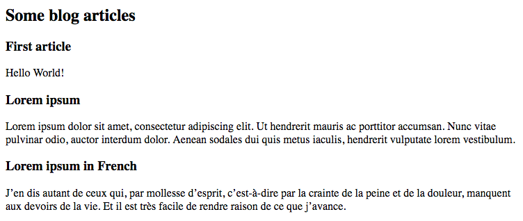

# Usa APIs web 

En este capítulo, aprenderás cómo aprovechar servicios web del mundo real en tus aplicaciones.

## TL;DR

* Una **API** (del inglés Application Programming Interface) o **interfaz de programación de aplicaciones** es un conjunto de servicios bien definidos ofrecidos por un programa o servicio a otros. Los desarrolladores las usan para integrar servicios o tecnologías externas en sus aplicaciones.

* Una **API web** es una API accesible a través de tecnologías web (HTTP o HTTPS). A menudo usan JSON como su formato de datos.

* Una API web puede ser consumida mediante programación usando una **invocación AJAX**. Antes de eso, la API debe ser revisada y su documentación debe ser estudiada para comprender cómo funciona y qué es lo que devuelve.

```js
// Obtener información de una API
fetch("http://url-de-mi-api")
  .then(response => response.json()) // Traducir JSON a JavaScript
  .then(content => {
    // Usar el contenido retornado
    // ...
  })
  .catch(err => {
    console.error(err.message);
  });
```

Un número cada vez mayor de servicios son presentados a través de APIs web. Algunas son abiertas, otras requieren la **autentificación** del cliente, con una **clave de acceso**, por ejemplo.

## Presentación de APIs web

Interfaz de programación de aplicaciones

El acrónimo **API** se deriva del inglés Application Programming Interface, traducido al español como **interfaz de programación de aplicaciones**. Una API es un punto de acceso ofrecido por un programa o servicio a otros programas. Es un conjunto de métodos de comunicación bien definidos. A través de las APIs, los desarrolladores pueden integrar fácilmente tecnologías o servicios externos dentro de sus aplicaciones.

Las APIs existen bajo una amplia gama de formas. Como ejemplo, el modelo de documento por objetos (DOM) es en sí mismo una API para interactuar con una página web mediante programación: este define métodos para navegar y actualizar la estructura de una página.

Una **API web** es una API disponible en la web y accesible a través de tecnologías web, concretamente el protocolo HTTP o su contraparte protegida HTTPS. Las APIs web son una tecnología clave para las interacciones de un programa: siempre que te autentificas en un sitio web usando tu cuenta de Google, o haces clic en un botón para publicar algo en tu red social favorita, las estás usando. Un número creciente de servicios son presentados a través de APIs web, conformando un floreciente ecosistema para construir productos digitales.

## Consumir una API web 

Para poder usar una API web, tienes que saber su dirección y su modo de usó. La mayoría de las APIs web son accesibles a través de una **URL** y usan el formato **JSON** para intercambios de información.

### Consultar una API

La primera API web que usaras aquí simula un blog y presenta una serie de artículos. Su URL es <https://thejsway-server.herokuapp.com/api/articles>. Al abrirla en un navegador muestra la información JSON devuelta por la API.


Este resultado en bruto no es fácil de leer. Para una interacción más fácil con una API web, es fuertemente recomendado usar una herramienta especializada como [Postman](https://www.getpostman.com) o [RESTClient](https://addons.mozilla.org/fr/firefox/addon/restclient/). Así es cómo luce el resultado en Postman.


Esta API web devuelve una matriz que contiene algunos artículos. Cada artículo corresponde a un objeto JavaScript con las propiedades `id`, `title` y `content`.

> ¿Tienes curiosidad sobre cómo crear semejante API? Aprenderás cómo construir justo este servicio (y otros) en un próximo capítulo. 

Las APIs del mundo real casi siempre están acompañadas de una **documentación** en línea mostrando como usarlas. Estudiar esta documentación es fundamental para usar la API a la perfección.

### Invocar una API con JavaScript

Ahora que sabemos la dirección y el formato de datos de nuestra API de ejemplo, intentemos mostrar su resultado en una página web. Para hacerlo, aprovecharemos nuestro conocimiento de AJAX del capítulo previo. Mira el siguiente ejemplo, el cual muestra cómo acceder a la lista de artículos de la API.

Aquí está el código HTML de la página.

```html
<h2> Algunos artículos de blog </h2>
<div id="articulos"></div>
```

Y aquí está el código JavaScript asociado.

```js
// Obtener los datos desde la API
fetch("https://thejsway-server.herokuapp.com/api/articles")
  .then(response => response.json()) // Traducir JSON a JavaScript
  .then(articles => {
    articles.forEach(article => {
      // Crear elemento de título
      const titleElement = document.createElement("h3");
      titleElement.textContent = article.title;
      // Crear elemento de contenido
      const contentElement = document.createElement("p");
      contentElement.textContent = article.content;
      // Añadir título y contenido a la página
      const articlesElement = document.getElementById("articles");
      articlesElement.appendChild(titleElement);
      articlesElement.appendChild(contentElement);
    });
  })
  .catch(err => {
    console.error(err.message);
  });
```

Usar una API web funciona igual que consultar a un servidor web: obtener la URL de la API, traducir la respuesta JSON a una matriz JavaScript e iterar en ella.

Este es el contenido web resultante.



## APIs web y autentificación 

Las APIs web pueden clasificarse en dos categorías:

* APIs abiertas que no necesitan ninguna autentificación para ser usadas.
* APIs que requieren la autentificación del consumidor a través de varios métodos.

### APIs abiertas

Estás APIs son libres para usarse por cualquiera, de cualquier manera. Para prevenir abusos a menudo usan una **limitación de velocidad**: el número de invocaciones desde una fuente en específico (identificada por su dirección IP) es limitada.

Muchas instituciones públicas como la [policía británica](https://data.police.uk/docs/) o el [gobierno francés](https://www.data.gouv.fr/) publican información para los ciudadanos usando APIs abiertas.

También hay muchas pequeñas APIs divertidas ahí afuera. Por ejemplo, la [API Punk](https://punkapi.com) te deja buscar dentro de un catálogo inmenso de cervezas. Así es cómo puedes renovar tu afición a la bebida recibiendo una al azar desde esta API.

```html
<button id="grabButton">Toma una cerveza</button>
<div id="beer"></div>
```

```js
// Función anónima para obtener y mostrar una cerveza al azar
const grabRandomBeer = () => {
  // Obtener la información de una cerveza al azar desde la API
  fetch("https://api.punkapi.com/v2/beers/random")
    .then(response => response.json())
    .then(beers => {
      // La API devuelve una matriz que contiene solo un elemento: lo recibimos
      const beer = beers[0];
      // Crear un elemento DOM para algunas propiedades de la cerveza
      const nameElement = document.createElement("h2");
      nameElement.textContent = beer.name;
      const descriptionElement = document.createElement("p");
      descriptionElement.textContent = beer.description;
      // Limpiar la información previa de la cerveza
      const beerElement = document.getElementById("beer");
      beerElement.innerHTML = "";
      // Agregar la información de la cerveza en la página
      beerElement.appendChild(nameElement);
      beerElement.appendChild(descriptionElement);
    })
    .catch(err => {
      console.error(err.message);
    });
};

// Obtener una cerveza nueva al hacer clic en el botón
document.getElementById("grabButton").addEventListener("click", grabRandomBeer);
```

Cada vez que se hace clic en el botón `"Toma una cerveza "` en la página web, una función anónima es invocada para obtener y mostrar una cerveza al azar.


### Autentificación basada en clave

Otra clase de APIs requieren que el cliente se autentifique cuando accede al servicio. La autentificación puede ser realizada a través de varias técnicas. En este párrafo, usaremos la más simple: la clave de acceso. Una **clave de acceso** es una cadena de caracteres generada que contiene caracteres y dígitos y que está asociada a un usuario.

> Por supuesto, las APIs basadas en autentificación a menudo también tienen límites de velocidad.

No hay un estándar universal con respecto a las claves de acceso. Cada servicio es libre de usar su propio formato personalizado. El cliente debe proporcionar su clave de acceso cuando accede a la API, generalmente agregándola al final de la URL de la API.

Un prerrequisito para usar cualquier API web basada en clave es generarse una clave de acceso para este servicio en particular.

Pongamos esto en práctica para obtener información acerca del clima actual en tu área. Para hacerlo, puedes simplemente mirar por la ventana, pero está más chido ;) si en cambio usas un servicio basado en la web como [OpenWeather](https://openweathermap.org).

Este servicio tiene una API basada en clave para obtener el clima en cualquier lugar. Para conseguirlo, tienes que registrarte como usuario (es gratis) y una nueva clave de API será generada y asociada a tu cuenta.

Una vez que has hecho esto, la información del clima está disponible a través de una URL en forma de <http://api.openweathermap.org/data/2.5/weather?q=LOCATION&appid=API_KEY>. Sustituye `LOCATION` y `API_KEY` con tus propios parámetros, y deberías obtener el clima en tus inmediaciones.

Antes de usar cualquiera API en nuestro código, un primer paso necesario es revisar y comprender su formato de datos. Cuando obtenemos la información del clima de Burdeos, Francia, el resultado se ve así.

```json
{
  "coord": {
    "lon": -0.5805,
    "lat": 44.8404
  },
  "weather": [
    {
      "id": 803,
      "main": "Clouds",
      "description": "broken clouds",
      "icon": "04d"
    }
  ],
  "base": "stations",
  "main": {
    "temp": 20.15,
    "feels_like": 19.89,
    "temp_min": 19.08,
    "temp_max": 20.15,
    "pressure": 1020,
    "humidity": 64
  },
  "visibility": 10000,
  "wind": {
    "speed": 2.57,
    "deg": 120
  },
  "clouds": {
    "all": 75
  },
  "dt": 1654506765,
  "sys": {
    "type": 1,
    "id": 6450,
    "country": "FR",
    "sunrise": 1654489047,
    "sunset": 1654544687
  },
  "timezone": 7200,
  "id": 3031582,
  "name": "Bordeaux",
  "cod": 200
}
```

Ahora solo tenemos que invocar la API desde nuestro código JavaScript y mostrar la información del clima en una página web.

```js
// Sustituye TU_CLAVE_DE_ACESO con tu propia clave de acceso a la API OpenWeather  
fetch(
  "http://api.openweathermap.org/data/2.5/weather?q=Bordeaux,fr&appid=TU_CLAVE_DE_ACESO&units=metric"
)
  .then((response) => response.json())
  .then((weatherData) => {
    // Extraer algunas propiedades del clima obtenidas del resultado de la invocación a la API 
    const location = weatherData.name;
    const temperature = weatherData.main.temp;
    const humidity = weatherData.main.humidity;

    // Crear elementos DOM para estas propiedades 
    const summaryElement = document.createElement("div");
    summaryElement.textContent = `Temperature is ${temperature} °C with ${humidity}% humidity.`;
    // Agregar la ubicación al título 
    document.querySelector("h2").textContent += ` ${location}`;
    // Agregar los elementos a la página
    const weatherElement = document.getElementById("weather");
    weatherElement.appendChild(summaryElement);
  })
  .catch((err) => {
    console.error(err.message);
  });
```


## ¡Hora de programar!

### Más cerveza por favor

Mejora el ejemplo previo de Punk API para mostrar información adicional sobre la cerveza exhibida: grados de alcohol (ABV), volumen (volume) y fecha de la primera elaboración (first_brewed).


### Perfil de GitHub 

La plataforma ubicua de código compartido [GitHub](https://github.com) tiene una API pública. La meta de este ejercicio es mostrar algo de información sobre un usuario de GitHub identificado por su cuenta. La documentación de la API está disponible [aquí](https://docs.github.com/es/rest/users).

Usa esta API para mostrar la foto de perfil, nombre y dirección de sitio web del usuario de GitHub cuya cuenta es introducida en un campo de texto.


> Puedes probar tu código usando las cuentas de GitHub de miembros prominentes de la comunidad JS como `brendaneich` (el padre de JavaScript), `douglascrockford` o `vjeux`.

### Universo Star Wars 

La [API de Stars Wars](https://swapi.co/) que es abierta, tiene toda la información de Star Wars que siempre has querido. En este ejercicio, mostraras información sobre algunos de los planetas en el universo.

Aquí está el código HTML inicial.

```html
<h2>Algunos planetas de Star Wars</h2>
<div id="links"></div>
<div id="infos"></div>
```

Escribe el código JavaScript asociado para que se genere automáticamente una lista de enlaces de los primeros diez identificadores de planetas. Al hacer clic en el enlace del planeta se muestra información sobre él.


