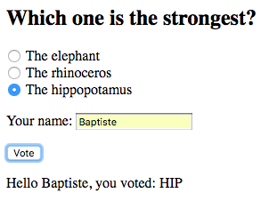
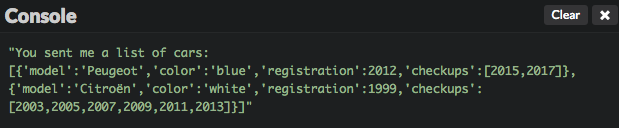

# Enviar información a un servidor web

Ahora sabes, cómo obtener información de servidores web o APIs. Este capítulo te enseñara cómo enviarles información.

## TL;DR

* Puedes enviar información a un servidor web a través de una invocación AJAX traduciéndola a una solicitud HTTP `POST` usando el método `fetch()`.

* Para enviar información de formularios HTML o pares clave/valor, usas el objeto `FormData`.

```js
// Crea un objeto FormData que contiene la información del formulario HTML
const formData = new FormData(miFormulario);
// Envía la información del formulario al servidor con una solicitud POST asíncrona
fetch("https://url-de-mi-servidor", {
  method: "POST",
  body: formData
})
  .then();
```

* El objeto `FormData` también puede ser usado para enviar pares arbitrarios clave/valor a un servidor.

```js
// Crear un objeto formData nuevo y vacío
const formData = new FormData();
// Rellenar el objeto con los pares clave/valor
formData.append("talla", "G");
formData.append("color", "azul");
// ...
```

* Cuando la información esperada por el servidor es más estructurada, enviarla cómo datos JSON es más conveniente.

```js
// Crear algo de información JavaScript
const miInfo = {
  // ...
};

// Enviar esta información como JSON al servidor
fetch("https://https://my-server-url", {
  method: "POST",
  headers: {
    Accept: "application/json",
    "Content-Type": "application/json"
  },
  body: JSON.stringify(myData)
})
  .then();
```

## Enviar información: los fundamentos

El envío de información a un servidor regularmente es realizado a través del método HTTP `POST`. En ese caso, el cuerpo de la solicitud contiene la información a enviar.

El formato de datos depende de lo que el servidor espere. Puede ser:

* Pares clave/valor como cuando se envía directamente un formulario. 
* JSON para información más estructurada.

## Enviar información de un formulario

Si el servidor espera información directa de un formulario, puedes usar el objeto JavaScript `FormData` para encapsular la información a enviar.

Aquí hay un formulario de ejemplo para elegir al animal más fuerte de todos.

```html
<h2>¿Cuál es el más fuerte?</h2>
<form>
    <p>
        <input type="radio" name="masFuerte" id="elefante" value="ELE" checked>
        <label for="elefante">El elefante</label>
        <br>
        <input type="radio" name="masFuerte" id="rinoceronte" value="RIN">
        <label for="rinoceronte">El rinoceronte</label>
        <br>
        <input type="radio" name="masFuerte" id="hipopotamo" value="HIP">
        <label for="hipopotamo">El hipopótamo </label>
        <br>
    </p>
    <p>
        <label for="nombre">Tu nombre</label>:
        <input type="text" name="nombre" id="nombre" required>
    </p>
    <input type="submit" value="Voto">
</form>
<p id="resultado"></p>
```


Y este es el código JavaScript asociado que se encarga del envío del formulario.

```js
// Gestionar el envío del formulario
document.querySelector("form").addEventListener("submit", e => {
  // Cancelar el comportamiento predeterminado de enviar una solicitud POST sincrona
  e.preventDefault();
  // Crear un objeto FormData, pasando el formulario como un parámetro
  const FormData = new FormData(e.target);
  // Enviar la información del formulario al servidor con una solicitud POST asíncrona
  fetch("https://thejsway-server.herokuapp.com/animals", {
    method: "POST",
    body: FormData
  })
    .then(response => response.text())
    .then(resultado => {
      document.getElementById("resultado").textContent = resultado;
    })
    .catch(err => {
      console.error(err.message);
    });
});
```

El detector de eventos comienza deshabilitando el comportamiento predeterminado de envío del formulario, el cual es enviar una solicitud HTTP `POST` síncrona al servidor. En cambio, se crea un objeto `FormData` con el formulario en sí mismo (la expresión `e.target`) como parámetro. Todos los campos del formulario son agregados automáticamente como pares clave/valor en este objeto.

Una vez que los campos del formulario son encapsulados en el objeto `FormData`, el método `fetch()` visto previamente es usado para enviar una solicitud asíncrona a la URL `https://thejsway-server.herokuapp.com/animals`. El segundo parámetro de la invocación a `fetch()` establece el método HTTP como `POST` y añade la información del formulario dentro del cuerpo de la solicitud.

Finalmente, el elemento `result` de la página es actualizado cuando el servidor responde a la solicitud asíncrona.



El objeto `FormData` también puede ser usado independientemente de algún formulario, para enviar pares personalizados clave/valor a un servidor. Aquí hay un ejemplo de formulario muy simple que contiene solo un botón.

```html
<button id="botonCompra">Comprar una playera nueva</button>
<p id="resultado"></p>
```

Cuando el usuario hace clic en el botón, la información personalizada se añade al objeto `FormData` y se envía al servidor a través de una solicitud `POST` asíncrona.

```js
document.getElementById("botonCompra").addEventListener("click", () => {
    // Crear un objeto formData nuevo y vacío
    const formData = new FormData();
    // Rellenar el objeto con los pares clave/valor
    formData.append("talla", "G");
    formData.append("color", "azul");
    // Enviar la información al servidor
    fetch("https://thejsway-server.herokuapp.com/tshirt", {
      method: "POST",
      body: formData
    })
    .then(response => response.text())
    .then(resultado => {
      document.getElementById("resultado").textContent = resultado;
    })
    .catch(err => {
      console.error(err.message);
    });
});
```


## Enviar información JSON 

Cuando la información esperada por el servidor web es más estructurada (con tipos de datos más complejos, campos anidados, etc.), a menudo es una mejor opción enviarla como datos JSON.

Por ejemplo, mira cómo enviar una matriz JavaScript como información JSON a un servidor web.

Crear una matriz que contiene dos objetos Enviar esta matriz como información JSON al servidor

```js
// Crear una matriz que contiene dos objetos
const carros = [
  {
    modelo: "Peugeot",
    color: "blue",
    registro: 2012,
    verificaciones: [2015, 2017]
  },
  {
    modelo: "Citroën",
    color: "white",
    registro: 1999,
    verificaciones: [2003, 2005, 2007, 2009, 2011, 2013]
  }
];

// Enviar esta matriz como información JSON al servidor
fetch("https://thejsway-server.herokuapp.com/api/cars", {
  method: "POST",
  headers: {
    Accept: "application/json",
    "Content-Type": "application/json"
  },
  body: JSON.stringify(carros)
})
  .then(response => response.text())
  .then(result => {
    console.log(result);
  })
  .catch(err => {
    console.error(err.message);
  });
```




El segundo parámetro de la invocación a `fetch()` establece que `POST` es el método HTTP a usar, actualiza los encabezados de la solicitud para indicar que el formato de datos es JSON, y añade la representación JSON de la matriz JavaScript dentro del cuerpo de la solicitud.

## ¡Hora de programar!

### Artículo nuevo

Escribe el código HTML que muestre los campos de entrada para crear un nuevo artículo de blog mediante la introducción de su título y contenido.

Después, escribe el código JavaScript asociado para enviar los campos del artículo como información de un formulario a la URL `https://thejsway-server.herokuapp.com/articles`. Deberías recibir un mensaje de confirmación desde el servidor y mostrarlo en la página.


W> El servidor solo acepta solicitudes `POST` en está URL.

### Países visitados

La meta de este ejercicio es enviar tu información de viajes a un servidor. Los datos son esperados como un objeto JSON que contiene dos campos:

* Un campo `nombre` que representa tu nombre. Su valor es una cadena de caracteres.
* Un campo `paises` que representa los países que ya has visitado. Su valor es una matriz de objetos. Cada objeto tiene un campo `nombre` (cadena de caracteres) para el nombre del país, y un campo `año` para el año que lo visitaste por última vez.

Esta información debe ser enviada a la URL `https://thejsway-server.herokuapp.com/api/countries`. Deberías recibir un mensaje de confirmación del servidor y mostrarlo en la consola.


