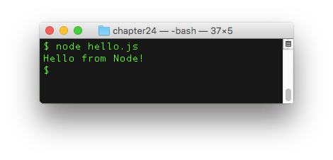
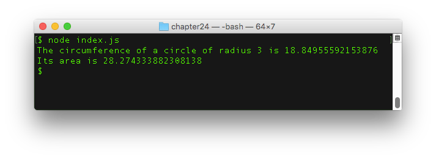

# Descubre Node.js

En este capítulo, descubrirás cómo crear aplicaciones JavaScript fuera del navegador gracias a una tecnología llamada Node.js.

## TL;DR

* **Node.js** (o simplemente Node) es una plataforma construida en el motor JavaScript de Chrome (V8) para crear aplicaciones JavaScript fuera del navegador.

* Node enfatiza lo modular: en lugar de ser monolíticas, las aplicaciones son diseñadas como un conjunto de **módulos** pequeños y enfocados trabajando juntos para lograr el comportamiento deseado.

* Node cumple con el formato de módulos [CommonJS](http://requirejs.org/docs/commonjs.html). Proporciona una función `require()` para cargar un módulo.

* Dentro de un módulo, el objeto `module.exports` es usado para exportar fragmentos de código. Puedes **agregarle propiedades** para exportar el elemento. También puedes **reasignar** `module.exports` para exportar solo un elemento en específico.

* Node proporciona una forma de estructurar una aplicación en forma de un **paquete**. Un paquete es un folder que contiene una aplicación descrita por un archivo `package.json`. El punto de acceso predeterminado de un paquete es el archivo `index.js`.

* Las versiones de los paquetes son definidas usando el formato de **control de versiones semántico**: una cadena de tres dígitos en forma de `MAJOR.MINOR.PATCH`. Este formato facilita la gestión de **dependencias** entre paquetes.

* [npm](https://www.npmjs.com) (administrador de paquetes Node) es el administrador predeterminado de paquetes para el ecosistema Node. Consiste en un cliente de línea de comandos y un registro en línea de los paquetes públicos a los que se puede acceder mediante el cliente. Este registro es el ecosistema más grande de librerías de código abierto en el mundo.

* Los principales comandos npm son `npm install` (para instalar todas las dependencias de un paquete o agregar una nueva) y `npm update` (para actualizar todos los paquetes e instalar los faltantes de acuerdo con `package.json`).

* Una vez instalados a través de npm, los paquetes definidos como dependencias son almacenados en la subcarpeta `node_modules/` y pueden ser cargados como módulos usando `require()`.

* Algunos paquetes (que contienen solo archivos ejecutables o no tienen punto de acceso) no pueden ser cargados como módulos. Algunos módulos (archivos JavaScript individuales) no son paquetes. 
 
## Presentación de Node.js

### Un poco de historia

Para entender qué es [Node.js](https://nodejs.org) (o Node para abreviar), tenemos que viajar atrás en el tiempo a los años 2000 mientras JavaScript se volvía cada vez más importante para mejorar la experiencia de usuario en la web, los diseñadores de navegadores web gastaban una cantidad considerable de recursos en ejecutar código JS lo más rápido posible. En particular el motor JavaScript de Chrome, denominado V8, fue un enorme avance en cuanto a desempeño y optimización en general; y se volvió de código abierto en el 2008.


La idea central detrás de Node.js era simple pero visionaria: ya que el motor V8 es tan bueno ejecutando código, ¿porque no aprovechar su potencia para crear aplicaciones JavaScript eficientes *fuera del navegador*? Y de esta manera nació Node.js en el 2009, originalmente escrito por Ryan Dahl. Su proyecto se volvió muy popular rápidamente y ahora Node es una de las tecnologías principales para construir aplicaciones y crear APIs con JavaScript.


Node también hizo más fácil para los desarrolladores publicar, compartir y reusar código. Actualmente cientos de miles de librerías JavaScript listas para usarse, llamadas **paquetes** están disponibles y son fáciles de integrar en cualquier proyecto basado en Node (más al respecto después). Este rico ecosistema es una de las fortalezas más grandes de Node. 

### Un primer ejemplo

> El resto de este capítulo presupone un entorno de trabajo Node. Consultar el apéndice para configurar uno.

El programa Node más simple posible es el siguiente. 

```js
console.log("Hola desde Node!");
```

Cómo puedes ver, el comando `console.log()` también está disponible en Node. Igual que en un navegador web, devuelve el valor pasado como parámetro en la consola. Suponiendo que este código está guardado dentro de un archivo llamado `hello.js`, así es como se ejecuta a través de Node en una terminal.

```console
node hello.js
```



Un estudio a fondo de la plataforma Node está fuera del alcance de este libro. Enfoquémonos en dos de sus características cruciales: **módulos** y **paquetes**.

## Módulos Node.js

### Beneficios de la modularidad

La idea general detrás de los módulos es bastante clara y similar a la que está detrás de las funciones. En lugar de escribir todo el código en un solo lugar, y por lo tanto crear una aplicación monolítica, con frecuencia es mejor dividir las funcionalidades en partes más pequeñas y libremente asociadas. Cada parte debe enfocarse en una tarea específica, haciéndola mucho más fácil de comprender y reusar. El comportamiento general de la aplicación es el resultado de la interacción entre estos elementos constitutivos.


Estas partes más pequeñas a veces son denominadas como componentes en otros entornos. En Node son llamados **módulos** y pueden presentarse bajo formas diferentes. La definición general de un módulo es: cualquier cosa que pueda ser cargada usando la función `require()` de Node. La plataforma Node.js se ajusta al formato de módulos [CommonJS](http://requirejs.org/docs/commonjs.html).

### Crear un módulo

La forma más simple de un módulo es un archivo JavaScript individual, que contiene comandos especiales para **exportar** fragmentos específicos de código. El resto del código es **privado** en el módulo y no será visible fuera de él.

Por ejemplo, el módulo `greetings.js` podría contener el siguiente código.

```js
// Crea tres funciones
const saludar = nombre => `Hola, ${nombre}`;
const halagar = () => `¡Mira que bien te ves hoy!`;
const despedir = nombre => `Adios, ${nombre}`;

// Exporta dos de ellas
module.exports.saludar = saludar;
module.exports.halagar = halagar;
```

En Node, las funciones pueden ser *exportadas* (hacerlas accesibles desde el exterior) especificando propiedades adicionales en el objeto especial `module.exports`. Aquí, dos funciones son exportadas bajo los nombres de `saludar` y `halagar`. La tercera no es exportada. 

Este módulo podría haber sido escrito de una manera ligeramente más concisa definiendo directamente las funciones como propiedades del objeto `module.exports`.

```js
// Crear y exportar dos funciones
module.exports.saludar = nombre => `Hola, ${nombre}`;
module.exports.halagar = () => `¡Mira que bien te ves hoy!`;

// Crear una función no exportada
const despedir = nombre => `Adios, ${nombre}`;
```

### Cargar un módulo

Suponiendo que ambos archivos están ubicados en el mismo directorio, otro archivo JavaScript podría cargar el módulo creado previamente usando la función `require()` proporcionada por Node.js.

```js
// Cargar el módulo "saludos.js"
const saludos = require("./saludos.js");

// Usar funciones exportadas
console.log(saludos.saludar("Baptiste")); // "Hola, Baptiste"
console.log(saludos.halagar()); // "¡Mira que bien te ves hoy!"
console.log(saludos.despedir("Baptiste")); // Error: despedir doesn't exist
```

El parámetro pasado a `require()`  identifica el módulo a cargar. Aquí, la subcadena `"./"` al inicio indica una **ruta relativa**: el módulo debe ser buscado en el mismo directorio que el archivo que lo carga.

El resultado de la invocación a `require()` es un objeto, llamado `saludos` aquí. Este objeto remite al valor del objeto `module.exports` definido dentro del módulo. Por lo tanto, el objeto `saludos` tiene dos funciones como propiedades `sayHello` y `flatter`. Tratar de acceder a su propiedad no existente `despedir` desencadena un error durante la ejecución.

> Otorgarle al objeto resultante de una invocación a `require()` el mismo nombre que el nombre del módulo cargado, aunque no es obligatorio, es una práctica común.

### Exportar solo un objeto específico

Numerosos módulos en el ecosistema Node.js exportan solo un objeto individual que concentra todas las funcionalidades del módulo. Para hacerlo, reasignan el objeto `module.exports` en lugar de agregarle propiedades.

Por ejemplo, revisa cómo se define el siguiente módulo `calculadora.js`.

```js
// Declara una función de fábrica que devuelve un objeto literal
const crearCalculadora = () => {
  // El objeto devuelto tiene cuatro métodos
  return {
    sumar(x, y) {
      return x + y;
    },
    restar(x, y) {
      return x - y;
    },
    multiplicar(x, y) {
      return x * y;
    },
    dividir(x, y) {
      return x / y;
    }
  };
};

// Exportar la función de fábrica
module.exports = crearCalculadora;
```

En este módulo, el único elemento exportado es una función que devuelve un objeto literal. Para usarlo en otro archivo (ubicado en la misma carpeta) se haría de la siguiente forma. 

```js
const calculadora = require("./calculadora.js");

// Crear un objeto invocando a la función exportada de este módulo
const calc = calculadora();

// Usar los métodos del objeto
console.log(`2 + 3 = ${calc.sumar(2, 3)}`); // "2 + 3 = 5"
```

El resultado de la invocación a `require()` es una función almacenada en la variable `calculadora`, que remite a la función `crearCalculadora()`. Invocar esta función devuelve un objeto con varios métodos, que pueden ser usados subsecuentemente.

### Exportar solo una clase

Cuando quieras que un módulo únicamente exporte una clase específica, también puedes reasignar el objeto `module.exports`.

Este es el módulo `usuario.js` que define y exporta la clase `Usuario`.

```js
// Exporta la clase Usuario
module.exports = class Usuario {
  constructor(nombre, apellido) {
    this.nombre = nombre;
    this.apellido = apellido;
    // Crea la cuenta de usuario combinando la primera letra del nombre + el apellido
    this.cuenta = (nombre[0] + apellido).toLowerCase();
  }
  describe() {
    return `${this.nombre} ${this.apellido} (cuenta: ${this.cuenta})`;
  }
};
```

Así es cómo se usa esta clase en otro archivo (ubicado en la misma carpeta).

```js
// Observa la mayúscula inicial, dado que Usuario es una clase
const Usuario = require("./usuario.js");

// Crea un objeto a partir de esta clase
const johnDoe = new Usuario("John", "Doe");

// Usa el objeto creado
console.log(johnDoe.describir());
```


## Paquetes Node.js 

La plataforma Node proporciona una manera de estructurar una aplicación en forma de un **paquete**.

### Anatomía de un paquete

Técnicamente, un paquete es un folder que contiene los siguientes elementos:

* Un archivo `package.json` que describe la aplicación y sus dependencias.
* Un punto de acceso a la aplicación, dirigiendo al archivo `index.js` por defecto.
* Una subcarpeta `node_modules/`, que es el lugar predeterminado donde Node busca los módulos a cargar dentro de la aplicación.
* Todos los otros archivos que conforman el código fuente de la aplicación.

### El archivo `package.json`

Este archivo JSON describe la aplicación y sus dependencias: puedes verlo como el documento de identificación de la aplicación. Tiene un formato bien definido compuesto por muchos campos, la mayoría de ellos opcionales. Los dos campos obligatorios son:

* `name` (con puras letras minúsculas, sin ningún punto, guión bajo o cualquier carácter no válido en una URL).
* `version` (siguiendo el formato de control de versiones semántico - más al respecto después).

A continuación un ejemplo de un archivo `package.json`  típico.


```json
{
  "name": "ejemplo-node-alamanerajs",
  "version": "1.0.0",
  "description": "Ejemplo de Node para el libro \"El modo JavaScript\"",
  "scripts": {
    "start": "node index.js"
  },
  "dependencies": {
    "moment": "^2.18.1",
    "semver": "^5.3.0"
  },
  "keywords": [
    "javascript",
    "node",
    "thejsway"
  ],
  "author": "Baptiste Pesquet"
}
```

### Control de versiones semántico

A los paquetes Node se les asigna una versión usando un formato llamado **control de versiones semántico**. Un número de versión es una cadena de tres dígitos en forma de `MAJOR.MINOR.PATCH`, en español:  FUNDAMENTAL.SECUNDARIO.PARCHE (ejemplo: `2.18.1`).

Estas son las reglas para definir el número de versión:

* La primerísima versión debe ser `1.0.0`.
* Las correcciones de errores y cambios menores deben incrementar el dígito PARCHE (`PATCH`).
* Nuevas características añadidas de una manera retro compatible deben incrementar el dígito SECUNDARIO (`MINOR`).
* Modificaciones incompatibles deben incrementar el dígito FUNDAMENTAL (`MAJOR`).

Estas reglas estrictas existen para facilitar la gestión de **dependencias** entre paquetes.

### Dependencias

En la definición del archivo `package.json`, el campo `dependencies` se usa para declarar los paquetes externos requeridos por el paquete actual. Cada dependencia es creada con el nombre del paquete seguido de un **intervalo de versiones**. Este intervalo de versiones específica las versiones del paquete que son aceptables a utilizar.

Hay muchas maneras de definir un intervalo de versiones. Las más comúnmente usadas son:

* Dirigirse a una versión muy específica. Ejemplo: `2.18.1`.
* Usar el operador `~` para permitir cambios a nivel de parche. Por ejemplo, el intervalo de versiones `~2.18.1` acepta la versión `2.18.7`, pero no la `2.19.0` ni la `3.0.0`.
* Usar el operador `^` para permitir cambios que no modifiquen el dígito distinto a cero que está en el extremo izquierdo de la versión. Ejemplos:
  * El intervalo de versiones `^2.18.1` acepta las versiones `2.18.7` y `2.19.0`, pero no la `3.0.0`.
  * El intervalo de versiones `^0.2.3` acepta la versión `0.2.5` pero no la `0.3.0` ni la `1.0.0`.

Refinar las versiones a las que están dirigidos los taquetes externos a través de intervalos de versiones ayuda a limitar el riesgo de desintegrar la aplicación cuando se actualizan sus dependencias.

## Gestión de paquetes con **npm**

Brevemente después de la creación de Node.js, se hizo evidente que faltaba algo para coordinar el intercambio y reuso de código a través de módulos. Así que [npm](https://www.npmjs.com) (Administrador de Paquetes Node, en inglés Node Package Manager) nació en el 2010. Todavía es el gestor de paquetes habitual para el ecosistema Node, aunque este siendo desafiado por [yarn](https://yarnpkg.com), una alternativa más reciente.  Consta de un cliente de línea de comandos, también llamado **npm**, y una base de datos en línea de paquetes públicos llamada **registro npm** y a la cual se accede mediante el cliente.


Ahora hay más de 477,000 paquetes disponibles en el registro, listas para usarse y cubriendo varias necesidades. Esto hace de npm el ecosistema más grande de librerías de código abierto del mundo.

El cliente se usa tecleando comandos en una terminal abierta en la carpeta del paquete. Ofrece numerosas posibilidades de gestión de paquetes. Estudiemos dos de las más importantes.

### Instalar dependencias

Para instalar todas las dependencias de un paquete, escribes el siguiente comando npm.

```console
npm install
```

Esto leerá el archivo `package.json`, buscará los paquetes que se ajustan a los intervalos de versión declarados en el campo `dependencies`, los descarga e instala (y sus propias dependencias) en la subcarpeta `node_modules/`.

### Agregar una nueva dependencia

Hay dos formas de agregar una nueva dependencia a un paquete. La primera es editar manualmente `package.json` para declarar la dependencia y su intervalo de versiones asociado. El siguiente paso es ejecutar el siguiente comando npm.

```console
npm update
```

Esto actualizará todos los paquetes enlistados a la versión más reciente respetando sus intervalos de versiones, e instalará los paquetes faltantes.

La otra forma es ejecutando el siguiente comando.

```console
npm install <package-id>
```

Este comando obtendrá un paquete específico del registro, lo descargara en la subcarpeta `node/modules/` y (desde npm 5) actualizará el archivo `package.json` para agregarlo como una nueva dependencia. El parámetro `<package-id>` regularmente es el nombre del paquete de la dependencia.

### Usar una dependencia

Una vez que los paquetes externos han sido instalados en `node_modules/`, la aplicación puede cargarlos como módulos con la función `require()`.

Por ejemplo, el registro npm tiene un paquete **semver** que se encarga del control de versiones semántico. Suponiendo que este paquete ha sido instalado como una dependencia, puede ser usado para realizar revisiones manuales del intervalo de versiones.

```js
// Carga el paquete npm semver como un módulo
// Observar la omisión de "./" dado que el paquete fue instalado en node_modules/
const semver = require("semver");

// Verifica si versiones específicas se ajustan al intervalo
console.log(semver.satisfies("2.19.0", "^2.18.1")); // true
console.log(semver.satisfies("3.0.0", "^2.18.5")); // false
```

### Relación entre paquetes y módulos

Resumamos lo que has aprendido hasta ahora:

* Un *módulo* es cualquier cosa que puede cargarse con `require()`.
* Un *paquete* es una aplicación Node descrita por un archivo `package.json`.


Un paquete usado en otra aplicación Node es cargada con `require()`, haciéndolo un módulo. Para ser cargado como un módulo un paquete debe contener un archivo `index.js` o un campo `main` en `package.json` definiendo un punto de acceso específico.

Algunos paquetes únicamente contienen un comando ejecutable y por lo tanto no pueden ser cargados como módulos. Por otro lado, un archivo JavaScript individual cargado con `require()` es un módulo pero no un paquete, puesto que no tiene un archivo `package.json`.

Revisa la [documentación npm](https://docs.npmjs.com/how-npm-works/packages) para más detalles sobre este aspecto.

## ¡Hora de programar!

### Otra vez círculos

Crea un módulo `circulo.js` que exporte dos funciones `circunferencia()` y `area()`, cada una tomando el radio del círculo como parámetro.

Carga este módulo en un archivo `index.js` y prueba las dos funciones.



### Contabilidad

Crea un módulo `accounting.js`.

Carga este módulo en un archivo `index.js` y prueba las dos funciones.

```js
// PENDIENTE: cargar el módulo "accounting.js"

// Crear objeto a partir de la clase exportada
const miCuenta = new Cuenta("Jeff");
miCuenta.credito(150);
console.log(miCuenta.describir());
```


### Jugar con fechas

El paquete npm [moment](https://momentjs.com/) es muy popular para administrar fechas y horas.

Crea un paquete Node e instala la versión actual de `moment` como una dependencia. Después, carga dicho paquete y úsalo para:

* Mostrar la fecha actual. 
* Calcular el número de años desde el 26 de noviembre de 1976.


T> Usa la [documentación de moment](https://momentjs.com/docs/) para descubrir cómo usar este paquete.
