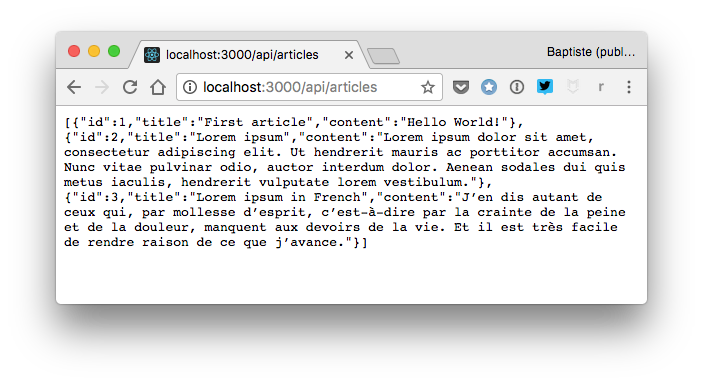
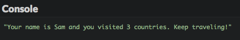
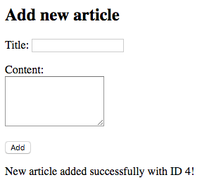

# Crear un servidor web

Es hora de poner tu conocimiento de Node.js en práctica y crear un servidor web realista en JavaScript. A esto con frecuencia se le llama **programación del lado del servidor**.

> Construirás exactamente el servidor que fue usado en los capítulos anteriores para ocuparse del desarrollo web del lado del cliente. Para probar tu código de servidor puedes retroceder a los ejemplos de código de los capítulos 22 y 23 y solo cambiar al inicio la URL del servidor de `https://thejsway-server.herokuapp.com` a la URL de tu propio servidor (que sería `http://localhost:3000` si tu servidor se ejecuta en tu máquina local).

## TL;DR

* La plataforma Node.js es muy apropiada para crear **servidores web** en JavaScript, con o sin ayuda de un framework.

* Un **framework** ofrece una forma convencional para diseñar y estructurar una aplicación. **Express** es una elección común para construir un servidor web con Node.

* Para poder responder a las solicitudes, una aplicación Express define **rutas** (puntos de acceso asociados a las URLs) y escucha las solicitudes HTTP entrantes.

* Los principales métodos Express son `get()` para gestionar una solicitud `GET`, `post()` para gestionar una solicitud `POST` y `use()` para definir un **programa intermedio** (código que se ejecuta durante el ciclo solicitud/respuesta).

* Un formulario entrante o datos JSON pueden ser gestionados a través de paquetes especializados como **multer** y **body-parser**.

* JavaScript puede ser usado tanto del lado del cliente (navegador) como del lado del servidor de una aplicación web. Esto te da la facultad de crear **aplicaciones web** completas.

## Usar un framework 

En los capítulos anteriores vimos que  Node.js es una plataforma para construir aplicaciones JavaScript fuera del navegador. Como tal, Node es muy apropiado para crear **servidores web** en JavaScript.

> Como recordatorio un servidor web es una máquina construida especialmente para publicar recursos en la web.

### Acerca de los frameworks

Es enteramente posible construir un servidor web desde cero con Node, pero adoptaremos un enfoque diferente y usaremos un framework para esto.

En programación, un **framework** ofrece una forma convencional de diseñar y estructurar una aplicación. Normalmente se encarga de muchos detalles de bajo nivel para que el desarrollador pueda concentrarse en tareas de alto nivel relacionadas con el negocio.

### Elegir un framework

Entre muchos frameworks posibles para crear un servidor web en JavaScript, usaremos uno de los más conocidos: **Express**. Parafraseando su [sitio web](http://expressjs.com/), Express es "un framework minimalista y flexible de aplicaciones web Node.js que ofrece un conjunto robusto de características para aplicaciones web y móviles”.

En otras palabras, Express brinda una base sobre la cual puedes construir un servidor web fácil y rápidamente.

### Instalar Express

El framework Express está disponible como un paquete npm y su instalación es directa. Primero, necesitarás una aplicación Node existente con un archivo `package.json`. Ejecuta el siguiente comando en una terminal abierta en la carpeta de tu aplicación para instalar Express como una dependencia.

```console
npm install express
```

Como alternativa, puedes añadir directamente Express como una dependencia en tu archivo `package.json` y ejecutar el comando `npm install`.

```json
"dependencies": {
  "express": "^4.15.3"
},
```

## Responder a solicitudes

El principal trabajo de un servidor web es responder a las solicitudes HTTP. Aquí está el código JavaScript para un servidor web minimalista basado en Express que devuelve `"¡Hola desde Express!"` a una solicitud a la URL raíz.

```js
// Carga el paquete Express como un módulo
const express = require("express");

// Accede al servicio exportado
const app = express();

// Devuelve una cadena de caracteres para solicitudes a la URL raíz ("/")
app.get("/", (request, response) => {
  response.send("¡Hola desde Express!");
});

// Comienza a escuchar solicitudes entrantes
// Si process.env.PORT no está definido, se usa el puerto número 3000
const listener = app.listen(process.env.PORT || 3000, () => {
  console.log(`Tu aplicación está escuchando en el puerto ${listener.address().port}`);
});
```

Puedes iniciar tu servidor ya sea con `node index.js` o `npm start`, después escribe su URL raíz (<http://localhost:3000>  si tu navegador se ejecuta en tu máquina local) en un navegador. Deberías ver aparecer el texto `"¡Hola desde Express!"`.


Diseccionemos este ejemplo.

### Acceder a los servicios de Express 

Una vez que Express está instalado, puedes cargar su paquete en el archivo principal de tu aplicación y acceder a los servicios exportados que ofrece el framework. El principio del código del servidor hace justamente eso.

```js
// Carga el paquete Express como un módulo
const express = require("express");

// Accede al objeto principal Express
const app = express();
```

### Definir rutas

En la terminología del desarrollo web, una **ruta** es un punto de acceso a una aplicación. Está relacionada con la URL de la aplicación. La ruta `"/"` coincide con la raíz de la aplicación.

```js
// Devuelve una cadena de caracteres para solicitudes a la URL raíz ("/")
app.get("/", (request, response) => {
  response.send("¡Hola desde Express!");
});
```

Cuundo se hace una solicitud HTTP a la URL ruta, la función de respuesta asociada se ejecuta. Esta función toma como parámetros objetos que representan la solicitud y respuesta URL. Aquí, el cuerpo de la función envía una respuesta de texto con el contenido `"¡Hola desde Express!"`.

### Escuchar solicitudes

Para procesar solicitudes entrantes, un servidor web debe escuchar en un puerto en específico. Un **puerto** es un punto terminal de comunicación en una máquina.

El principal objeto de Express tiene un método `listen()` que toma como parámetros el puerto de escucha y una función de respuesta invocada para cada solicitud. La última parte del código del servidor invoca este método para empezar a escuchar.

```js
// Comienza a escuchar solicitudes entrantes
// Si process.env.PORT no está definido, se usa el puerto número 3000
const listener = app.listen(process.env.PORT || 3000, () => {
  console.log(`Tu aplicación está escuchando en el puerto ${listener.address().port}`);
});
```

## Crear una API

Tu servidor web es bastante limitado por ahora, encargándose solo de una ruta y devolviendo siempre la misma cadena de caracteres. Vamos a crear tu propia API publicando algunos datos en formato JSON. 

### Habilitando solicitudes AJAX 

En un capítulo previo, hablamos sobre solicitudes de origen múltiple (de un dominio a otro). Autorizarlas en tu servidor es obligatorio para aceptar invocaciones AJAX de los clientes.

La habilitación del intercambio de recursos de origen múltiple en un servidor web Express se hace agregando el siguiente código en el archivo principal de tu aplicación.

```js
// Habilitar CORS (ver https://enable-cors.org/server_expressjs.html)
app.use((req, res, next) => {
  res.header("Access-Control-Allow-Origin", "*");
  res.header(
    "Access-Control-Allow-Headers",
    "Origin, X-Requested-With, Content-Type, Accept"
  );
  next();
});
```

Este es un ejemplo de un **programa intermedio**: código que se ejecuta en algún punto entre la recepción de la solicitud HTTP y el envío de la respuesta HTTP. 

## Exponer información

Para corresponder a lo realizado del lado del cliente en un capítulo anterior, publicaremos algunos artículos de blog. La ruta de la API es `"/api/articles"`, y la respuesta asociada devuelve una lista de objetos JavaScript.

Este es el código que debe agregarse al servidor justo antes de la última parte (la que inicia el proceso de escucha).

```js
// Define una lista de artículos
const articulos = [
  { id: 1, titulo: "First article", contenido: "Hello World!" },
  {
    id: 2,
    titulo: "Lorem ipsum",
    contenido:
      "Lorem ipsum dolor sit amet, consectetur adipiscing elit. Ut hendrerit mauris ac porttitor accumsan. Nunc vitae pulvinar odio, auctor interdum dolor. Aenean sodales dui quis metus iaculis, hendrerit vulputate lorem vestibulum."
  },
  {
    id: 3,
    titulo: "Lorem ipsum in French",
    contenido:
      "J’en dis autant de ceux qui, par mollesse d’esprit, c’est-à-dire par la crainte de la peine et de la douleur, manquent aux devoirs de la vie. Et il est très facile de rendre raison de ce que j’avance."
  }
];

// Devuelve la lista de artículos en formato JSON
app.get("/api/articles", (request, response) => {
  response.json(articulos);
});
```

Cuando accedas a la ruta `"/api/articles"` (<http://localhost:3000/api/articles> si tu servidor se ejecuta localmente) con un navegador o una herramienta especializada como Postman or RESTClient, deberías ver la lista de artículos en formato JSON.



## Aceptar información

Hasta este momento, tu servidor web ofrece un servicio de *solo lectura* publica información pero no acepta ninguna… ¡hasta ahora!

Como viste en un capítulo anterior, la información enviada a un servidor web puede ser ya sea información de formulario o información JSON.

### Gestionar información de formularios

La información de un formulario viene encapsulada dentro de la solicitud HTTP `POST` enviada por el cliente al servidor. La primera tarea del servidor es extraer esta información de la solicitud. La forma más sencilla de hacer esto es usar un paquete npm especializado, como [multer](https://www.npmjs.com/package/multer). Instalalo con el comando `npm install multer` o directamente en las dependencias de tu aplicación.

```json
"dependencies": {
  ...
  "multer": "^1.3.0"
},
```

Una vez que **multer** está instalado, agrega el siguiente código en la parte inicial del principal archivo de tu servidor.

```js
// Carga el paquete multer como un módulo
const multer = require("multer");

// Accede al servicio exportado
const upload = multer();
```

La siguiente ruta acepta información de un formulario enviado a la ruta `"/animals"`. Observa el uso de `app.post()` en lugar de `app.get()` para gestionar las solicitudes HTTP `POST`, y la incorporación de `upload.array()` como segundo parámetro para agregar un objeto `body` que contiene los campos del formulario al objeto `request`.

```js
// Gestionar envíos de datos de formulario a la ruta "/animals" 
app.post("/animals", upload.array(), (request, response) => {
  const nombre = request.body.nombre;
  const voto = request.body.masFuerte;
  response.send(`Hola ${nombre}, tú votaste por el: ${voto}`);
});
```

Los valores de las variables `nombre` y `voto` son extraídos del cuerpo de la solicitud, y se construye una cadena de caracteres que se envía de vuelta al cliente.


### Gestionar información JSON 

El manejo de información JSON entrante requiere interpretarla a partir de la solicitud `POST` recibida. Usar un paquete npm como [body-parser](https://www.npmjs.com/package/body-parser) es la solución más sencilla. Instalalo con el comando `npm install body-parser` o directamente en las dependencias de tu aplicación.

```json
"dependencies": {
  ...
  "body-parser": "^1.17.2"
},
```

Después, agrega el siguiente código en la parte final del archivo principal de tu servidor.

```js
// Carga el paquete body-parser como un módulo
const bodyParser = require("body-parser");

// Accede al servicio de interpretación JSON
const jsonParser = bodyParser.json();
```

El siguiente código gestiona las solicitudes `POST` hacia la ruta `"/api/cars"`. La información JSON es interpretada por `jsonParser` y definida como el cuerpo de la solicitud.

```js
// Gestiona el envío de una matriz de carros JSON
app.post("/api/cars", jsonParser, (request, response) => {
  const carros = request.body;
  response.send(`Me enviaste una lista de carros: ${JSON.stringify(carros)}`);
});
```


## Publicar páginas web

Finalmente aprendamos cómo entregar contenido HTML para que tu servidor pueda tener pleno sentido.

Por ejemplo, las solicitudes HTTP `GET` hacia la ruta `"/hello"` deberían mostrar una página web básica. Una forma simplista de hacerlo sería simplemente devolver una cadena de caracteres HTML.

```js
// Devuelve contenido HTML para las solicitudes hacía "/hello"
app.get("/hello", (request, response) => {
  const contenidoHtml = `<!doctype html>
    <html>
    <head>
      <meta charset="utf-8">
      <title>Página web para saludar</title>
    </head>
    <body>
      Hello!
    </body>
    </html>`;
  response.send(contenidoHtml);
});
```

Sin embargo, las cosas se nos saldrían rápidamente de las manos a medida que la complejidad de la página web crezca. Una mejor solución es definir el contenido HTML en un archivo externo almacenado en una subcarpeta especifica, y devolver ese archivo como resultado de la solicitud.

Por ejemplo, crea una subcarpeta llamada `visitas` y adentro  un archivo llamado `saludo.html`. Inserta el siguiente contenido en el archivo HTML. 

```html
<!doctype html>
<html>

<head>
    <meta charset="utf-8">
    <title>Página web para saludar</title>
</head>

<body>
    <h2>Página web para saludar</h2>
    <div id="contenido">¡Hola!</div>
</body>

</html>
```

Después, actualiza la respuesta de la ruta `"/hello"` para enviar el archivo HTML como respuesta de la solicitud.

```js
// Devuelve una página web para las solicitudes hacia "/hello"
app.get("/hello", (request, response) => {
  response.sendFile(`${__dirname}/visitas/saludo.html`);
});
```

Al apuntar al dirigir tu navegador hacia la URL `"/hello"` (<http://localhost:3000/hello> si tu servidor se ejecuta localmente) ahora debería desplegar la página web. 


La mayoría de las páginas web necesitarán cargar recursos del lado del cliente tales como imágenes, archivos CSS y JavaScript. Una práctica común es poner estos recursos en una carpeta especifica.

Por ejemplo crea la subcarpeta `publico` y adentro el archivo JavaScript `hello.js` con el siguiente contenido.

```js
// Actualiza el elemento DOM "contenido"
document.getElementById("contenido").textContent = "¡Hola desde JavaScript!";
```

Ahora deberías tener la siguiente estructura de carpetas para tu servidor.


Actualiza `saludo.html` para cargar este archivo JavaScript.

```html
<script src="/hello.js"></script>
```

Finalmente, debes decirle a Express que los recursos del cliente están ubicados en la subcarpeta `publico`, para que el servidor pueda ocuparlos directamente. Añade el siguiente código en la parte inicial del archivo principal de tu aplicación.

```js
// Ocupa directamente el contenido de la subcarpeta "publico"
app.use(express.static("public"));
```

Al acceder a la URL `"/hello"` se te muestra un resultado ligeramente distinto. El archivo `hello.js` fue cargado y ejecutado por el navegador, actualizando el contenido de la página web.


En este ejemplo, JavaScript fue usado tanto en la programación del lado del servidor (back-end) como del lado del cliente (front-end). Esta es una de sus fortalezas centrales: sabiendo únicamente un lenguaje de programación te da la facultad de crear aplicaciones **web completas**. ¿Está muy chido no?

## ¡Hora de programar!

### Color de camiseta

Añade la ruta `"/tshirt"` a tu servidor para gestionar los envíos de datos de un formulario que contiene un campo `talla` y otro de `color`, como en el ejemplo del capítulo 23. En la respuesta de la ruta, devuelve un mensaje de confirmación al cliente.


### Países visitados

Agrega la ruta `"/api/countries"` a tu servidor para administrar la información de un viajero recibida como datos JSON, igual que en el ejercicio del capítulo 23. En la respuesta de la ruta, devuelve un mensaje de confirmación al cliente.



### Artículo nuevo

Añade la ruta `"/articles"` a tu servidor. Esta ruta debería aceptar un artículo nuevo de blog como datos de formulario y agregarlo a la lista de artículos del servidor, como en el ejercicio del capítulo 23. El identificador del artículo nuevo debe ser igual al identificador superior de los artículos existentes más uno.

