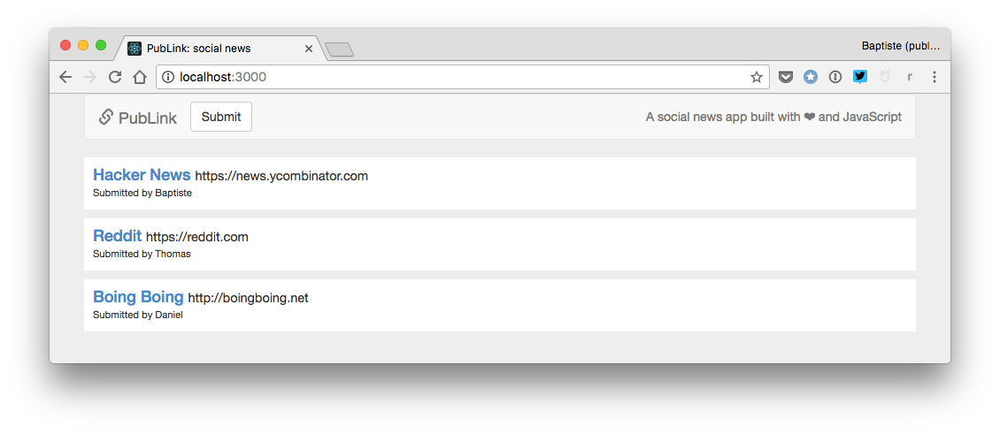
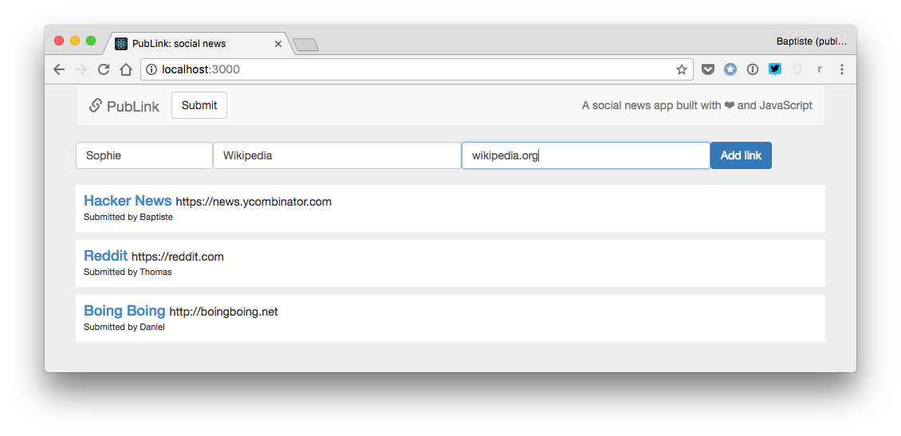

# Proyecto: una aplicación web de noticias sociales

Este proyecto final es la culminación del libro. Puedes ver el [resultado esperado](https://thejsway-publink.herokuapp.com). ¡Buena suerte!

## Objetivo

Este proyecto se basa en el programa de noticias sociales y páginas web que creaste previamente. Esta vez, el objetivo es hacer una aplicación de noticias sociales basada en un servidor Node.js.

## Normas operativas

* Un enlace es definido por su título, su URL y su autor (remitente).
* Si la URL de un enlace nuevo no empieza con "http://" o "https://", se le agrega "http://" automáticamente al inicio.
* La aplicación web muestra una lista de al menos tres enlaces ya existentes, obtenidos del servidor a través de una solicitud AJAX.
* Existe un botón para que el usuario envié un enlace nuevo. Cuando se hace clic en este, aparece un formulario debajo de la lista de enlaces para introducir las propiedades del enlace nuevo (autor, título y URL).
* En este formulario, todos los campos del enlace son obligatorios.

* Cuando el enlace nuevo es validado por el usuario, es enviado al servidor como datos de formulario. Si la operación es exitosa, el servidor devuelve el enlace nuevo como datos JSON. El enlace nuevo es añadido al inicio de la lista de enlaces, sustituyendo al formulario. Un mensaje indica el logro de la operación, después desaparece luego de dos segundos.

## Normas técnicas

* El servidor debe usar un módulo definido por el usuario que exporte el código relacionado con el enlace.
* Deberías reusar cualquier código útil de los proyectos anteriores.
* Todo el código debe estar correctamente indentado.
* Los nombres deben ser elegidos atinadamente y adherirse a la convención camelCase.
* La duplicación de código debe ser evitada.

## Resultado esperado

Aquí hay algunas capturas de pantalla del resultado esperado.

