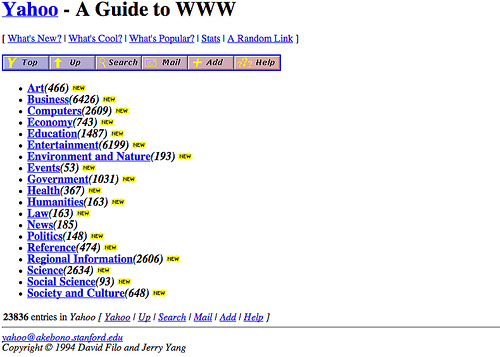
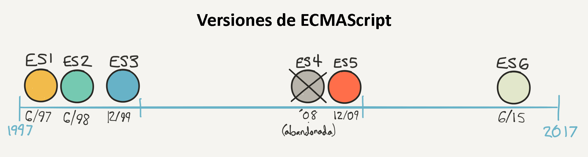

# Introducción a JavaScript

## TL;DR

* Originalmente creado para animar páginas web, el lenguaje JavaScript ahora puede ser usado casi en cualquier lado, desde servidores hasta aplicaciones móviles y dispositivos conectados

* JavaScript se está volviendo esencial para muchos desarrolladores de software. Es una excelente elección como primer lenguaje para aprender programación.

* Fue estandarizado bajo el nombre de **ECMAScript** y es mejorado continuamente desde entonces.

La versión de JavaScript usada en este libro es **ES2015**, también conocida como **ES6**. Aunque reciente, ahora es perfectamente soportada por la mayoría de los entornos

## Historia de JavaScript

JavaScript es antes que nada el lenguaje de programación de la web. Fue inventado en 1995 por [Brendan Eich](https://en.wikipedia.org/wiki/Brendan_Eich), quien en ese tiempo trabajaba para [Netscape](https://en.wikipedia.org/wiki/Netscape_Communications), que creó el primer navegador web popular (el antepasado de Firefox).

I> Un **navegador** es el programa que usas para visitar páginas web y usar aplicaciones web.

W> JavaScript no debería ser confundido con Java, ¡otro lenguaje inventado en el mismo tiempo! Ambos comparten una sintaxis similar pero sus casos de aplicación y "filosofías" son muy diferentes.

La idea detrás de JavaScript era crear un lenguaje simple para hacer páginas web dinámicas e interactivas, puesto que, en ese entonces las páginas eran muy sencillas.

Los creadores de la web comenzaron enriquecer gradualmente sus páginas añadiendo código JavaScript. Para que este código funcionará el navegador web receptor (el programa usado para navegar la web) tenía que ser capaz de procesar JavaScript. Este lenguaje ha sido integrado progresivamente dentro de los navegadores, y ahora todos los navegadores son capaces de soportarlo.

Debido a la explosión de la web y la aparición de la web 2.0 (basada en páginas enriquecidas e interactivas), JavaScript se ha vuelto cada vez más popular. Los diseñadores de navegadores web han optimizado la velocidad de ejecución de JavaScript, lo cual significa que ahora es un lenguaje muy rápido.

Esto llevó al surgimiento de la plataforma [Node.js](https://nodejs.org), la cual te permite crear aplicaciones JavaScript fuera del navegador. Gracias a un programa llamado [MongoDB](https://www.mongodb.com), JavaScript ha entrado incluso al mundo de las bases de datos (programas cuyo rol es almacenar información).

Finalmente, la popularidad de los teléfonos inteligentes y tabletas con distintos sistemas (iOS, Android, Windows Phone) ha llevado al surgimiento de las denominadas herramientas de desarrollo multiplataforma. Estas te permiten escribir una aplicación móvil única que es compatible con estos sistemas. ¡Estás herramientas están casi siempre basadas en… JavaScript!

## JavaScript: un lenguaje esencial

En resumen, JavaScript está en todas partes. Se asienta sobre un ecosistema rico de **componentes** (pequeños *ladrillos* de software que fácilmente puedes conectar a tu proyecto) y una comunidad activa de desarrolladores. Saberlo té abrirá las puertas de la programación web del lado del servidor (conocida como desarrollo front-end), desarrollo del lado del servidor (backend), y desarrollo móvil. Un número creciente de personas ven a JavaScript como la tecnología más importante en el desarrollo de software actualmente.

A la vez ubicuo y aun así relativamente fácil de aprender, JavaScript también es una [gran elección](https://medium.freecodecamp.com/what-programming-language-should-i-learn-first-%CA%87d%C4%B1%C9%B9%C9%94s%C9%90%CA%8C%C9%90%C9%BE-%C9%B9%C7%9D%CA%8Dsu%C9%90-19a33b0a467d#.3yu73z1px) como primer lenguaje para aprender programación.

## Versión usada en este libro

JavaScript fue estandarizado en 1997 bajo el nombre de [ECMAScript](https://es.wikipedia.org/wiki/ECMAScript). Desde entonces, el lenguaje ha sido sometido a varios ciclos de mejora para arreglar algunas molestias y soportar nuevas características.

Este libro usa la versión estandarizada más reciente de JavaScript, llamada **ES2015** o a veces **ES6**. Está versión aporta muchas novedades interesantes. Ahora es perfectamente soportada por la mayoría de entornos y plataformas, comenzando con los navegadores web (más detalles en esta tabla de compatibilidad [tabla de compatibilidad](http://kangax.github.io/compat-table/es6/)).
