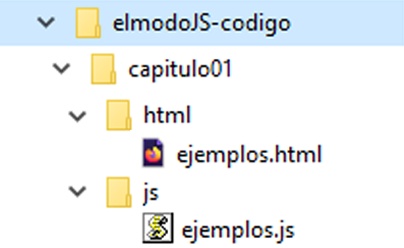
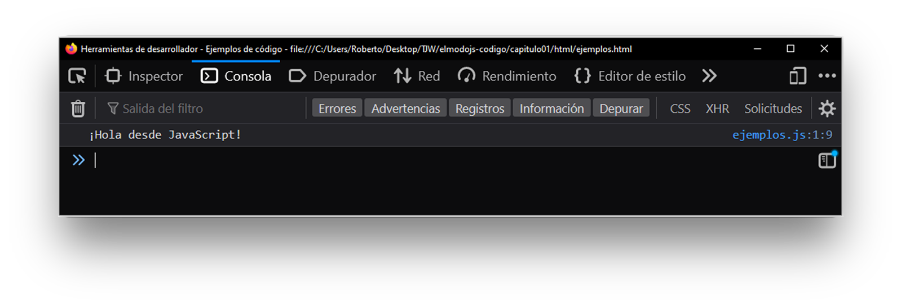

# Configuración del entorno

## Prerrequisito: un navegador moderno

Este libro está destinado a una versión reciente del lenguaje JavaScript. Más concretamente, necesitarás un navegador capaz de ejecutar código escrito en la especificación ES2015 (ES6) del lenguaje.

Un **navegador** es el programa que usas para visitar páginas web y usar aplicaciones web. Revisa esta [tabla de compatibilidad](https://kangax.github.io/compat-table/es6/) para más detalles sobre el soporte de ES2015 entre los navegadores.

La mejor apuesta es elegir ya sea Google Chrome o Mozilla Firefox, dos navegadores “imperecederos” (que se actualizan automáticamente) con un excelente soporte de ES2015 en sus versiones recientes. Entre otros navegadores compatibles se incluyen Opera y Microsoft Edge (el navegador predeterminado de Windows 10). En cambio, todas las versiones de Internet Explorer tendrán problemas con código ES2015, mantente alejado de estas.

## Solución A: escribir código en línea

Tal vez seas un poco del tipo impaciente, o quizás prefieras no configurar tu máquina local ahora mismo. Afortunadamente una de las bellezas de JavaScript es que puede ejecutarse en casi cualquier navegador. Todo lo que necesitas adicionalmente es una conexión de internet activa.

Escribir código en línea requiere un **entorno virtual de JavaScript**, un servicio donde puedes escribir código JavaScript y visualizar su resultado inmediatamente.

### Para los capítulos del 1 al 23: CodePen

Para seguir el hilo de estos capítulos, necesitarás un entorno de programación del **lado del cliente** capaz de ejecutar código HTML, CSS y JavaScript. Hay varios entornos virtuales del lado del cliente en línea. Personalmente mi favorito es [CodePen](http://codepen.io), pero hay otras alternativas cómo [JSFiddle](https://jsfiddle.net/) y [JS Bin](http://jsbin.com/).


Sí eliges usar CodePen, realmente deberías comenzar visitando [Welcome to CodePen](https://codepen.io/hello/). Te introduce a la plataforma de una forma muy amigable y te proporciona todo lo que necesitas para iniciar.


Adicionalmente hay algunos artículos útiles en la documentación de CodePen sobre el [auto completado](https://blog.codepen.io/documentation/editor/autocomplete/), [consola](https://blog.codepen.io/documentation/editor/console/), [ autoguardado de proyecto](https://blog.codepen.io/documentation/editor/autosave/), [atajos de teclado](https://blog.codepen.io/documentation/editor/key-bindings/) y [actualización automática](https://blog.codepen.io/documentation/editor/auto-updating-previews/). Aunque no es obligatorio, dominar CodePen te hará mucho más productivo mientras estudias este libro.

T> Te recomiendo activar el autoguardado y desactivar la actualización automática para todos tus Pens (nombre que asigna la plataforma CodePen a tus proyectos) relacionados con el libro. A menudo será necesario visualizar la consola de CodePen para ver los resultados producidos por el código.

Deberías usar un Pen (no necesariamente guardado) para probar cada ejemplo de código que contiene este libro. También deberías dedicar un Pen específico y guardado para cada ejercicio y proyecto que inspeccionarás.

> Por cuestiones de rendimiento, la consola de CodePen no siempre muestra la misma cantidad de información que la consola "real" del navegador.

### Del capítulo 24 en adelante: Glitch

A partir del capítulo 24, será necesario un entorno virtual del **lado del servidor** para crear aplicaciones Node.js. La opción prominente es [Glitch](https://glitch.com), una plataforma para construir rápidamente aplicaciones web basadas en Node. Glitch emula una configuración local de Node y automatiza aspectos como la ejecución de código, él manejo de paquetes, el hospedaje y la implementación. También puedes remezclar (clonar) cualquier aplicación Glitch para personalizarla según tus necesidades.


Puedes aprender más acerca de glitch [aquí](https://glitch.com/about/) y comenzar remezclando [este proyecto](https://glitch.com/edit/#!/thejsway-starterapp).

## Solución B: construir un entorno de desarrollo local

Configurar tu equipo local conlleva un poco de trabajo, pero te proporcionará un entorno personalizado y eficaz. Está también es tu única opción si necesitas trabajar sin internet.

Los siguientes pasos te ayudarán a escribir código eficazmente en tu equipo.

### Instala un editor de código

En el fondo, programar es escribir código como texto en una serie de archivos. Para programar realmente, necesitarás un editor de código en tu equipo. Aquí hay algunos de ellos:

* [Visual Studio Code](https://code.visualstudio.com/) (mi editor predilecto)
* [Brackets](http://brackets.io/)
* [Atom](https://atom.io/)
* [Sublime Text](https://www.sublimetext.com/)

### Instala Node.js y npm

La plataforma **Node.js** es necesaria a partir del capítulo 24 en adelante. El gestor de paquetes **npm** se instala automáticamente junto con Node.

Para configurar Node en tu equipo local, descarga la última versión [aquí](https://nodejs.org), ejecuta el archivo descargado y sigue las instrucciones.

> Algunos ejemplos en este libro necesitan Node 8 o una versión posterior.

La forma más fácil de probar que node está instalado es ejecutar el comando `node --version` en tu terminal/línea de comandos, y ver si devuelve una cadena de caracteres con la versión.

```console
node --version
```

### Instala un organizador de código y un linter

A través de los años, han sido creadas muchas herramientas para facilitar la vida de un desarrollador JavaScript. En concreto, son de gran interés dos tipos de herramientas para cualquier profesional JavaScript:

* Un **organizador de código** te libera del agobio de tener que organizar tu código manualmente y mejora la coherencia. [Prettier](https://github.com/prettier/prettier) es la norma actual.
* Un **linter** puede mejorar considerablemente la calidad de tu código, detectando errores y promoviendo buenas prácticas. [ESLint](http://eslint.org) es una elección popular.

La manera más sencilla de instalar ESLint y Prettier es agregandolas como extensiones (a veces llamadas add-ons) a tu editor de código. Para VS Code usa estos enlaces:

* [Extensión Prettier](https://marketplace.visualstudio.com/items?itemName=esbenp.prettier-vscode).
* [Extensión ESLint](https://marketplace.visualstudio.com/items?itemName=dbaeumer.vscode-eslint).

Sigue las instrucciones proporcionadas en su documentación para configurarlas. 

> La configuración de ESLint se discute en el siguiente capítulo.

### Organiza tu código

Es importante establecer tu carpeta principal y estructura de archivos antes de realmente empezar a escribir código. De esa forma, tu proyecto estará organizado, y estarás partiendo con buenos hábitos de programación.

Crea una carpeta en tu unidad de almacenamiento dedicada a escribir código siguiendo este libro. El nombre de la carpeta no importa, `elmodoJS-codigo` funcionará bien. Todos los archivos locales que crees posteriormente deberían estar almacenados en subcarpetas de esta carpeta raíz. La solución más lógica es crear una subcarpeta para cada capítulo del libro.

Puedes ya sea descargar una [estructura de carpetas predefinida](https://raw.githubusercontent.com/bpesquet/thejsway/master/resources/code-skeleton.zip) o seguir los siguientes párrafos para crear está estructura de carpetas manualmente.

#### Para los capítulos del 1 al 23


En estos capítulos, ejecutarás tu código JavaScript en el navegador. Los archivos serán almacenados según su tipo: archivos HTML (aquellos con una extensión `.html`) en una subcarpeta `html`, archivos CSS (`.css`) en una subcarpeta `css` y archivos JavaScript (`.js`) en una subcarpeta `js`. Cada capítulo está organizado en una serie de carpetas de la siguiente manera.



Para cada ejemplo y ejercicio de un capítulo, crea un archivo HTML en la subcarpeta `html` de la carpeta del capítulo. En estos archivos HTML, `<script>` cargara el código JavaScript asociado.

```html
<!doctype html>
<html>

<head>
    <meta charset="utf-8">
    <title>Ejemplos de código</title>
</head>

<body>
    <!-- El código HTML va aquí -->

    <script src="../js/ejemplos.js"></script>
</body>

</html>
```

Está etiqueta `<script>` le solicita al navegador cargar el archivo JavaScript `ejemplos.js`, ubicado en la ruta `../js/ejemplos.js`.  Los dos puntos (`..`) al inicio de la ruta indican que vas a retroceder un nivel en la estructura del directorio con relación al mismo archivo HTML antes de buscar un archivo llamado `ejemplos.js` en la subcarpeta `js`.

Después, abre el archivo HTML en tu navegador para ejecutar el código JavaScript almacenado en el archivo `.js`. Su resultado se mostrará en la consola del navegador (ver más abajo).

#### Del capítulo 24 en adelante

En estos capítulos, crearas aplicaciones Node.js para ejecutar tu código JavaScript. Cada aplicación Node debe estar en su propia carpeta y es descrita por un archivo `package.json` ubicado en la raíz de esta carpeta. Se pueden usar subdirectorios para almacenar archivos específicos:

* `node_modules` (creada automáticamente) para dependencias externas.
* `public` para los recursos del cliente cargados por el navegador, como archivos CSS y JavaScript.
* `views` para archivos HTML.
* `modules` para módulos internos.

### Usa las herramientas del desarrollador de tu navegador

Los navegadores modernos incluyen **herramientas del desarrollador** para ayudar con el desarrollo web. Cada navegador difiere en qué herramientas exactamente proveer, pero hay más similitudes que diferencias entre ellas.

Estas herramientas regularmente incluyen una **consola JavaScript** (para mostrar resultados JS y escribir comandos), un **inspector de página** (para examinar la estructura de una página) ¡y muchas más!



Revisa los siguientes enlaces para descubrir más acerca de las herramientas del desarrollador de un navegador:

* [Khan Academy - Inspecting HTML and CSS](https://www.khanacademy.org/computing/computer-programming/html-css/web-development-tools/a/using-the-browser-developer-tools).
* [OpenClassrooms - Optimize your website with DevTools](https://openclassrooms.com/courses/optimize-your-website-with-devtools).
* [Chrome DevTools Overview](https://developer.chrome.com/devtools).
* [Firefox Developer Tools](https://developer.mozilla.org/en-US/docs/Tools).
